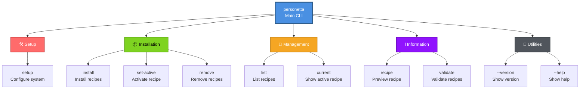
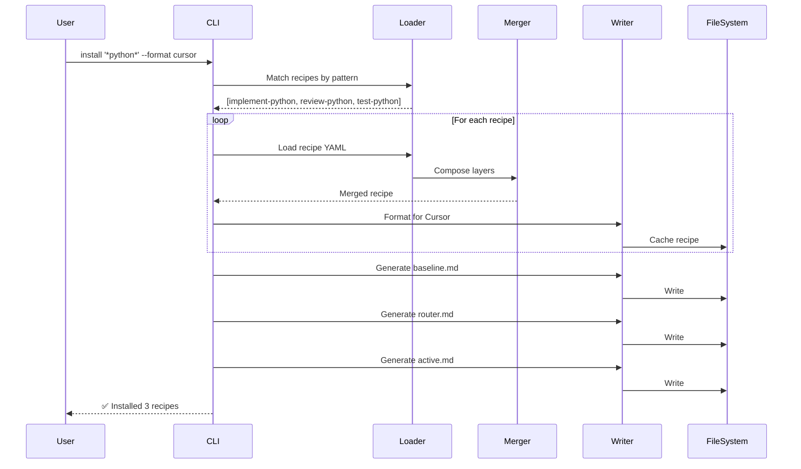
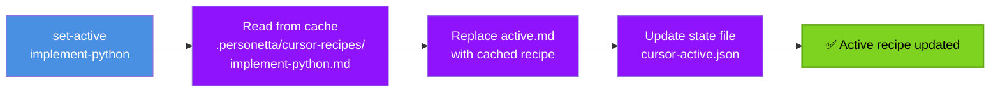
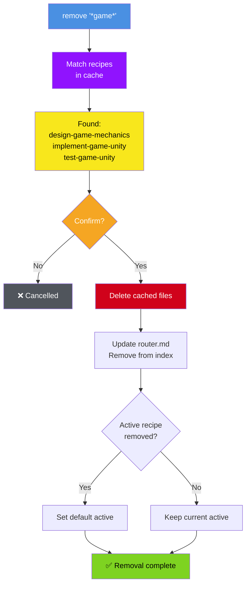

# CLI Reference

Complete command-line reference for Personetta. All commands, options, and usage examples.

---

## Table of Contents

- [Command Overview](#command-overview)
- [Setup Commands](#setup-commands)
- [Installation Commands](#installation-commands)
- [Recipe Management Commands](#recipe-management-commands)
- [Utility Commands](#utility-commands)
- [Global Options](#global-options)
- [Environment Variables](#environment-variables)

---

## Command Overview



---

## Setup Commands

### `setup`

Configure your system to make the `personetta` command available globally. This is the **first command you should run** after installing personetta from the Azure Artifacts feed.

**Syntax:**
```bash
personetta setup [options]
```

**Optional:**
- `--extract-only` - Extract setup script without running it
- `--output <path>` - Output path for extracted script
- `--from-feed` - Force feed installation mode
- `--from-local` - Force local repository mode
- `--pat <token>` - Azure DevOps Personal Access Token
- `--skip-profile` - Don't modify PowerShell profile
- `--skip-path-check` - Skip PATH validation (not recommended)

**Examples:**

```bash
# Basic setup (most common)
personetta setup

# Setup with Azure DevOps PAT
personetta setup --pat 'your-pat-here'

# Extract setup script for manual inspection
personetta setup --extract-only

# Extract to specific location
personetta setup --extract-only --output C:\Scripts\Setup-Personetta.ps1

# Skip PowerShell profile modifications
personetta setup --skip-profile

# Skip PATH check (shows multiple warnings!)
personetta setup --skip-path-check
```

**What it does:**

1. ✓ Extracts bundled `Setup-Personetta.ps1` from package
2. ✓ Detects installation environment (venv, user, or system)
3. ✓ Configures pip to use Azure Artifacts feed (if needed)
4. ✓ Installs or updates personetta package
5. ✓ Locates Python Scripts directory
6. ✓ Adds Scripts directory to PATH
7. ✓ Configures PowerShell profile with helper functions
8. ✓ Verifies `personetta` command works

**Output:**
```
Extracting setup script...
✓ Setup-Personetta.ps1 extracted

Running setup...

===========================================
  Personetta Setup
===========================================

Detecting environment...
✓ Not in virtual environment
✓ Will install for user (--user flag)

Configuring pip...
✓ Feed already configured

Installing personetta...
✓ personetta 0.1.0 installed

Configuring PATH...
✓ Scripts directory: C:\Users\YourName\AppData\Roaming\Python\Python311\Scripts
✓ Added to User PATH

Configuring PowerShell profile...
✓ Profile configured

===========================================
  Setup Complete!
===========================================

Next steps:
1. Close and reopen your terminal
2. Test: personetta --version

Profile functions available:
- Initialize-Personetta : Add Scripts to PATH for session
- Invoke-Personetta     : Run personetta via Python module
- pn                   : Short alias for Invoke-Personetta
```

**Feed vs Local Repository:**

This command is primarily for **feed users** who installed via `pip install personetta` from Azure Artifacts.

**Local repository users** should run the setup script directly:
```powershell
.\scripts\Setup-Personetta.ps1
```

Both approaches provide identical functionality and the same user experience.

**Troubleshooting:**

If setup encounters issues, run the diagnostic test suite:
```powershell
# After extracting with --extract-only
.\tests\Test-SetupScript.ps1
```

See also:
- [Making personetta Available Everywhere](global-command-setup.md)
- [Setup Test Suite Documentation](../tests/setup-tests.md)
- [Troubleshooting Guide](troubleshooting.md)

---

## Installation Commands

### `install`

Install recipes matching glob patterns to a target location.

**Syntax:**
```bash
personetta install '<pattern>' [<pattern2>...] --format <tool> [options]
```

**Required:**
- `<pattern>` - Glob pattern(s) to match recipe names
- `--format <tool>` - Target tool (`cursor`, `copilot`, `claude`, `cline`)

**Optional:**
- `--target <location>` - Install location (`global` [default], `project`)
- `--dry-run` - Preview without making changes
- `--verbose` - Show detailed output
- `--force` - Force reinstall even if up-to-date

**Examples:**

```bash
# Install all recipes globally for Cursor
personetta install '*' --format cursor

# Install Python-related recipes only
personetta install '*python*' --format cursor

# Install multiple patterns
personetta install 'implement-*' 'test-*' --format cursor

# Install to current project
personetta install '*' --format cursor --target project

# Preview installation
personetta install '*python*' --format cursor --dry-run

# Verbose output
personetta install '*' --format cursor --verbose

# Force reinstall
personetta install '*' --format cursor --force
```

**What it does:**



**Output:**
```
Loading recipes matching: *python*
Found 3 recipes:
  - implement-python
  - review-python
  - test-python

Composing layers...
Writing to ~/.cursor/rules/
  ✓ personetta-baseline.md
  ✓ personetta-router.md
  ✓ personetta-active.md
  ✓ .personetta/cursor-recipes/ (3 files)

✅ Installed 3 recipes for cursor
Active recipe: implement-python
```

---

### `set-active`

Switch the active recipe for a tool. The target tool is **auto-detected** from
the host agent (Cursor, Claude Code, or GitHub Copilot) when `--format` is
omitted, so a Personetta skill activates the persona for the agent it runs in.

**Syntax:**
```bash
personetta set-active <recipe> [--format <tool>] [options]
```

**Required:**
- `<recipe>` - Recipe name to activate

**Optional:**
- `--format <tool>` - Target tool (`cursor`, `copilot`, `claude`, `cline`); defaults to the auto-detected host agent
- `--target <location>` - Target location (`global` [default], `project`)
- `--whatif` - Dry-run; show what would change without writing

**Format resolution (when `--format` is omitted):** Personetta resolves the
target in order — (1) the explicit `--format` flag; (2) the **host agent**, via
the environment markers each agent sets on its subprocesses (`CURSOR_AGENT`,
`CLAUDECODE`, `COPILOT_AGENT`/`AI_AGENT`) — ideal for skills running in a chat;
(3) the **`FAB_DEFAULT_FORMAT`** environment variable; (4) the **sole installed
format** when only one tool has recipes installed. If it is still ambiguous
(plain terminal, multiple tools installed, no default set), the command exits
with an error asking for an explicit `--format`.

**Examples:**

```bash
# Activate for the current host agent (auto-detected)
personetta set-active implement-python

# Force a specific tool
personetta set-active review-csharp --format copilot

# Activate in project-local install
personetta set-active test-python --format cursor --target project

# Preview without writing
personetta set-active implement-python --whatif
```

**What it does:**



**Output:**
```
Reading cached recipe: implement-python
Updating active file: ~/.cursor/rules/personetta-active.md
Updating state: ~/.personetta/cursor-active.json

✅ Active recipe: implement-python
⚠️  Reload your AI tool to apply changes
```

---

### `remove`

Remove installed recipes matching glob patterns.

**Syntax:**
```bash
personetta remove '<pattern>' [<pattern2>...] --format <tool> [options]
```

**Required:**
- `<pattern>` - Glob pattern(s) to match recipe names
- `--format <tool>` - Target tool

**Optional:**
- `--target <location>` - Target location (`global` [default], `project`)
- `--confirm` - Skip confirmation prompt
- `--dry-run` - Preview without making changes
- `--verbose` - Show detailed output

**Examples:**

```bash
# Remove all game-related recipes
personetta remove '*game*' --format cursor

# Remove multiple patterns
personetta remove 'design-*' 'document-*' --format cursor

# Skip confirmation
personetta remove '*game*' --format cursor --confirm

# Preview removal
personetta remove '*' --format cursor --dry-run
```

**What it does:**



**Output:**
```
Matching recipes: *game*
Found 3 recipes to remove:
  - design-game-mechanics
  - implement-game-unity
  - test-game-unity

⚠️  This will remove 3 recipes. Continue? (y/N): y

Removing cached files...
  ✓ .personetta/cursor-recipes/design-game-mechanics.md
  ✓ .personetta/cursor-recipes/implement-game-unity.md
  ✓ .personetta/cursor-recipes/test-game-unity.md

Updating router.md...
Checking active recipe... (not affected)

✅ Removed 3 recipes
```

---

## Recipe Management Commands

### `list`

List available recipes, optionally filtered by patterns.

**Syntax:**
```bash
personetta list ['<pattern>'] [<pattern2>...]
```

**Optional:**
- `<pattern>` - Glob pattern(s) to filter recipes

**Examples:**

```bash
# List all recipes
personetta list

# List Python-related recipes
personetta list '*python*'

# List multiple patterns
personetta list 'implement-*' 'test-*'

# List game-related recipes
personetta list '*game*'
```

**Output:**
```
Available recipes (34 total):

Design Recipes (3):
  design-csharp          Architect C# backend systems
  design-python          Architect Python backend systems
  design-powershell      Architect PowerShell infrastructure

Implementation Recipes (9):
  implement-csharp       Implement C# backend code
  implement-python       Implement Python backend code
  implement-powershell   Implement PowerShell scripts
  implement-game-unity   Implement Unity game code
  ...

Review Recipes (6):
  review-csharp          Review C# code for quality
  review-python          Review Python code for quality
  ...

Test Recipes (8):
  test-csharp            Write xUnit tests for C#
  test-python            Write pytest tests for Python
  ...

Game Development (4):
  design-game-mechanics  Design game mechanics
  design-game-levels     Design level progression
  implement-game-unity   Implement in Unity
  test-game-unity        Test gameplay
```

---

### `current`

Show the currently active recipe.

**Syntax:**
```bash
personetta current [--format <tool>] [options]
```

**Optional:**
- `--format <tool>` - Target tool (auto-detects the host agent if omitted)
- `--target <location>` - Target location (`global` [default], `project`)

**Format resolution:** identical to `set-active` — explicit `--format`, then
host agent, then `FAB_DEFAULT_FORMAT`, then the sole installed format, else an
error. Reads only the state file under `~/.personetta/<format>-active.json`, so
no repository is required.

**Examples:**

```bash
# Show current recipe (auto-detect tool)
personetta current

# Show for specific tool
personetta current --format cursor
```

**Output (normal):**
```
Active cursor recipe: implement-python
```

When no recipe is active for the resolved format, the command reports that and
suggests `personetta install '*' --format <tool>`.

---

## Utility Commands

### `recipe`

Preview the composed output of a recipe without installing.

**Syntax:**
```bash
personetta recipe <name> --format <tool> [options]
```

**Required:**
- `<name>` - Recipe name
- `--format <tool>` - Output format

**Optional:**
- `--output <file>` - Write to file instead of stdout
- `--verbose` - Show composition details

**Examples:**

```bash
# Preview recipe for Cursor
personetta recipe implement-python --format cursor

# Preview for Copilot
personetta recipe implement-python --format copilot

# Save to file
personetta recipe implement-python --format cursor --output preview.md

# Show composition steps
personetta recipe implement-python --format cursor --verbose
```

**Output:**
```
# Implement Python

Implement Python backend code with emphasis on readability, security,
performance, and maintainability.

## You Should

- Use existing tools and libraries before writing custom code
- Write tests alongside implementation code
...

(Full composed recipe output)
```

---

### `validate`

Validate every role and recipe YAML file against the JSON schemas.

**Syntax:**
```bash
personetta validate
```

**Output (success):**
```
All files valid.
```

**Output (errors):**
```
data/recipes/my-recipe.yaml:
  - Missing required field: 'description'
  - Invalid compose path: 'base/nonexistent/layer'

1 error(s) in 1 file(s).
```

Exit code is `0` on success, `1` if any file has errors.

---

### `verify`

Verify that the Personetta install itself is healthy. Checks the package
version, the resolved interpreter and `PATH` shim, that bundled recipe data
loaded, and the user-home cache state for each format.

**Syntax:**

```bash
personetta verify
```

**Example output:**

```
Personetta verify
=================
Installation
------------
[ OK ] personetta 2.0.8
[ OK ] Python 3.13.1
       interpreter: /usr/local/bin/python3
       package:     /usr/local/lib/python3.13/site-packages/generator
[ OK ] 'personetta' on PATH at /usr/local/bin/personetta

Recipe data
-----------
[ OK ] 34 recipe file(s) under /usr/local/lib/python3.13/site-packages/data/recipes

User cache (~/.personetta)
--------------------------
[ OK ] /home/me/.personetta
       cursor   active: design-csharp    cached: 13
       copilot  active: implement-python    cached: 12
       claude   active: design-python    cached: 12
       cline    no active persona

OK
```

Exit code is `0` if everything is healthy, `1` if any check is `[FAIL]`.
`[WARN]` lines are informational and do not affect the exit code.

Run `verify` first when the command behaves unexpectedly — it is the fastest
way to spot a wrong interpreter, a missing `PATH` entry, or a stale active
persona that points at a recipe no longer in the cache.

---

## Provisions Commands

### `provision`

Apply **provisions** — optional, non-persona capabilities installed alongside
roles (a status line, plugins, rf-managed behaviors). Provisions are tool-aware:
each lists which tools it `targets`, and a tool that cannot host a given
provision is reported as `unsupported` (with a reason), never silently skipped.
Everything ships **disabled** (deploy-dark); you opt in explicitly.

See [docs/provisions.md](provisions.md) for the full guide.

```bash
personetta provision list                      # show provisions + bundles and their state
personetta provision enable status-line        # flip on in ~/.personetta/provisions.yaml
personetta provision apply                      # apply all enabled provisions/bundles
personetta provision apply status-line          # apply a single named provision
personetta provision apply --bundle economy     # apply a whole bundle in install order
personetta provision disable status-line
```

**Actions** (positional): `list`, `apply`, `enable`, `disable`.

**Options:**

| Option | Description |
|--------|-------------|
| `name` (positional) | Provision name for `apply`/`enable`/`disable` of a single provision |
| `--bundle` / `-b` | Operate on a named bundle instead of a single provision |
| `--dry-run` | Preview changes without writing (applies to `apply`) |
| `--target` / `-t` | Install root: `global` (default) or `project [path]` |

`enable`/`disable` write the user override file `~/.personetta/provisions.yaml`
(merged over the shipped defaults, user wins). `apply` is idempotent — re-running
reports `already-satisfied` and writes nothing. `install` also runs a deploy-dark
provisions pass, applying any enabled provision that targets the installed tool.

---

## Ingest Commands

### `ingest`

Scan an external source for conventions/skills and emit a **proposal report**. It is
**report-only and proposal-first** — it fetches from a registered source, diffs
candidates against existing Personetta roles/recipes, maps new items to a suggested Personetta home,
and prints a report for human review. It never writes Personetta content.

See [docs/ingest.md](ingest.md) for the full guide and [docs/recipe-naming.md](recipe-naming.md)
for the naming grammar applied to any new recipes.

```bash
personetta ingest                       # list registered sources
personetta ingest dotnet/skills         # scan a source, print the proposal
personetta ingest superpowers --out build/ingest/superpowers-proposal.md
personetta ingest dotnet/skills --threshold 0.6
```

**Options:**

| Option | Description |
|--------|-------------|
| `source` (positional) | Source registry key or `owner/repo` (omit to list sources) |
| `--threshold` | Overlap similarity cutoff, 0.0–1.0 (default 0.5) |
| `--out` / `-o` | Also write the proposal report to this file path |
| `--token` | GitHub token for the API (defaults to `$GITHUB_TOKEN`) |

Sources are registered in `data/tooling/ingest-sources.yaml`.

### `discover`

Scan community **index** sources (e.g. `awesome-claude-code`) for candidate
skills/plugins and **flag which already exist in Personetta**. Report-only — it installs
nothing and is the front-of-funnel for the *discover → decide → ingest/provision →
catalog* workflow.

See [docs/discovery.md](discovery.md) for the full guide.

```bash
personetta discover                              # scan all registered index sources
personetta discover --source awesome-claude-code # scan one source
personetta discover --out build/discovery.md
```

**Options:**

| Option | Description |
|--------|-------------|
| `--source` / `-s` | Index source key or `owner/repo` (default: all `index`-kind sources) |
| `--threshold` | Overlap similarity cutoff, 0.0–1.0 (default 0.5) |
| `--out` / `-o` | Also write the discovery report to this file path |
| `--token` | GitHub token for the API (defaults to `$GITHUB_TOKEN`) |

---

## Global Options

These options work with most commands:

### `--help` / `-h`

Show command help.

```bash
personetta --help
personetta install --help
personetta set-active --help
```

### `--version` / `-v`

Show version information.

```bash
personetta --version
# Output: personetta version 1.1.0
```

### `--verbose`

Show detailed output for debugging.

```bash
personetta install '*' --format cursor --verbose
```

**Shows:**
- File operations
- Merge operations
- Schema validation
- Error stack traces

### `--dry-run`

Preview changes without writing files.

```bash
personetta install '*python*' --format cursor --dry-run
```

**Shows:**
- Which files would be created
- Which recipes would be installed
- No actual file operations

---

## Environment Variables

### `PERSONETTA_SKIP_CURSOR_USER_SYNC`

Skip syncing to Cursor's User Rules storage.

```bash
# Windows PowerShell
$env:PERSONETTA_SKIP_CURSOR_USER_SYNC = "1"
personetta install '*' --format cursor

# Linux/Mac
export PERSONETTA_SKIP_CURSOR_USER_SYNC=1
personetta install '*' --format cursor
```

**Use when:**
- Cursor DB is locked
- You manage User Rules separately
- You only want file-based rules

### `PERSONETTA_SKIP_CURSOR_SKILLS`

Skip copying skills to `~/.cursor/skills/`.

```bash
# Windows PowerShell
$env:PERSONETTA_SKIP_CURSOR_SKILLS = "1"
personetta install '*' --format cursor

# Linux/Mac
export PERSONETTA_SKIP_CURSOR_SKILLS=1
personetta install '*' --format cursor
```

### `PERSONETTA_SKIP_CLAUDE_SKILLS`

Skip copying skills to `~/.claude/skills/`.

```bash
# Windows PowerShell
$env:PERSONETTA_SKIP_CLAUDE_SKILLS = "1"
personetta install '*' --format claude

# Linux/Mac
export PERSONETTA_SKIP_CLAUDE_SKILLS=1
personetta install '*' --format claude
```

---

## Command Cheat Sheet

```bash
# Installation
personetta install '*' --format cursor                    # Install all
personetta install '*python*' --format cursor             # Install subset
personetta set-active implement-python --format cursor    # Switch recipe
personetta remove '*game*' --format cursor                # Remove recipes

# Information
personetta list                                           # List all
personetta list '*python*'                                # List filtered
personetta current                                        # Show active
personetta current --format cursor --verbose              # Show details

# Utilities
personetta recipe implement-python --format cursor        # Preview
personetta validate                                       # Validate all
personetta validate --recipe implement-python             # Validate one
personetta --version                                      # Show version

# Options
--dry-run                                                 # Preview only
--verbose                                                 # Detailed output
--target project                                          # Project install
--force                                                   # Force operation
```

---

## Exit Codes

| Code | Meaning |
|------|---------|
| `0` | Success |
| `1` | General error |
| `2` | Command-line syntax error |
| `3` | Validation error |
| `4` | File I/O error |
| `5` | Recipe not found |

**Use in scripts:**

```bash
#!/bin/bash

personetta install '*' --format cursor
if [ $? -eq 0 ]; then
    echo "Installation successful"
    personetta set-active implement-python --format cursor
else
    echo "Installation failed"
    exit 1
fi
```

---

## Next Steps

- **Learn concepts** - [Core Concepts](concepts.md)
- **Create recipes** - [Recipe Guide](recipe-guide.md)
- **See examples** - [Examples & Cookbook](examples.md)
- **Troubleshoot** - [Troubleshooting](troubleshooting.md)

---

**Questions?** See [User Guide](user-guide.md) | [GitHub Issues](https://github.com/your-org/personetta/issues)
