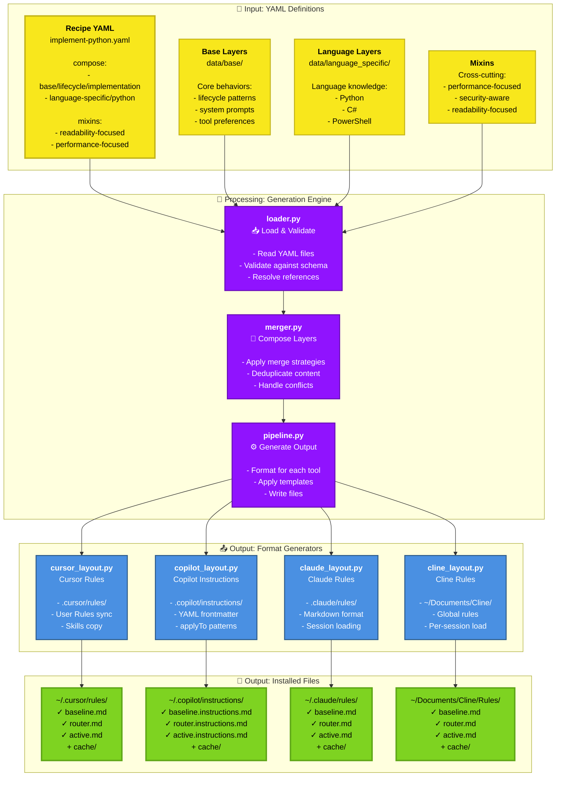
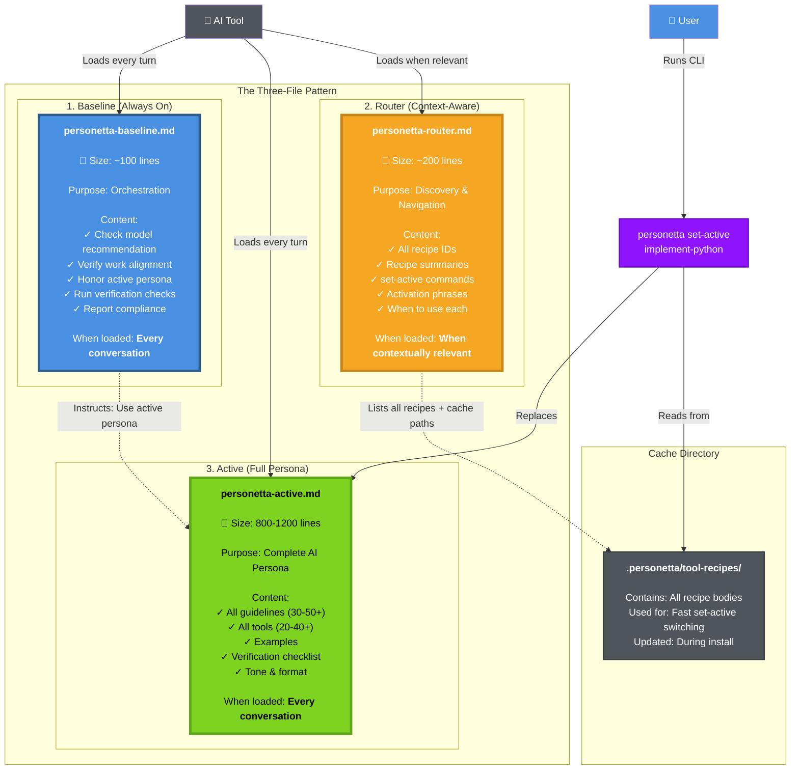
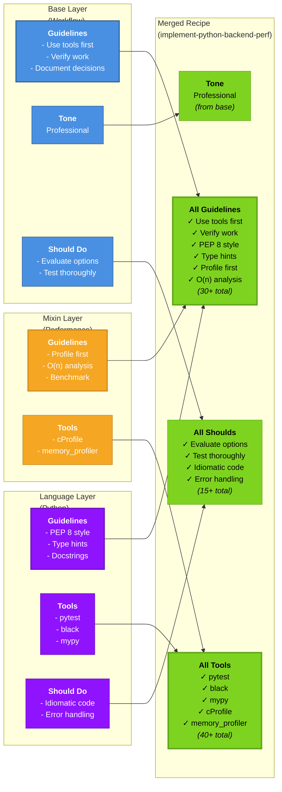
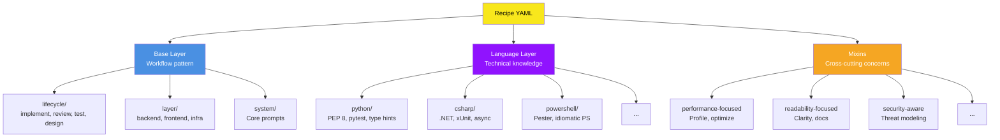
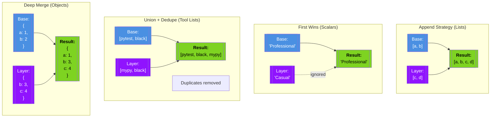
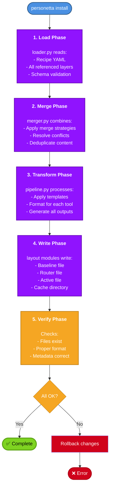
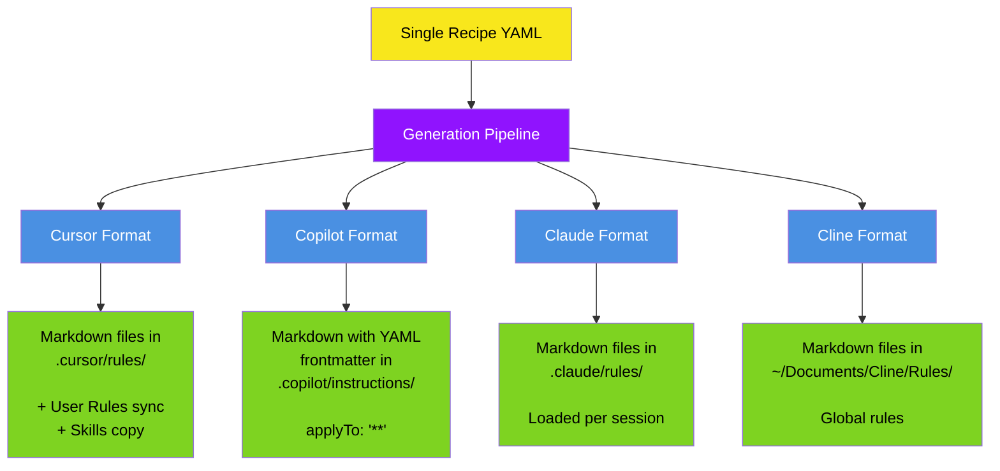
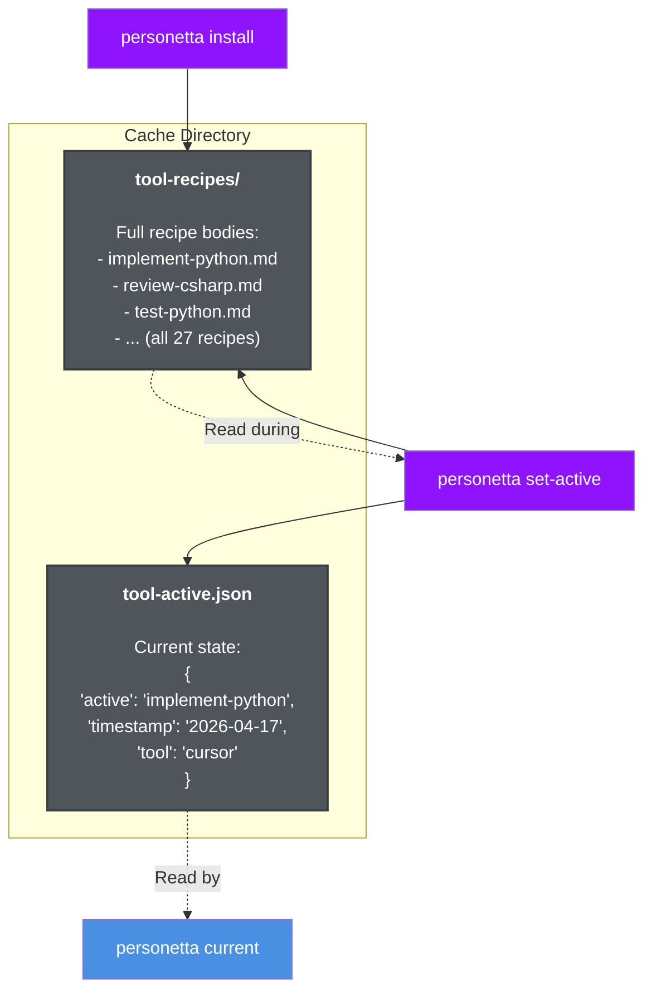

# Core Concepts

This guide explains how Personetta works under the hood. Understanding these concepts will help you use Personetta effectively and extend it when needed.

---

## Table of Contents

- [System Architecture](#system-architecture)
- [The Three-File Pattern](#the-three-file-pattern)
- [Recipe Composition](#recipe-composition)
- [Layers and Mixins](#layers-and-mixins)
- [Merge Strategies](#merge-strategies)
- [The Generation Pipeline](#the-generation-pipeline)
- [Multi-Tool Support](#multi-tool-support)
- [Cache and State](#cache-and-state)

---

## System Architecture

Personetta transforms YAML recipes into tool-specific configuration files. Here's the complete flow:



### Key Insights

1. **YAML as Source of Truth** (🟡 Yellow) - All recipes start as human-editable YAML files
2. **Composable Layers** - Recipes reference base layers, language knowledge, and mixins
3. **Tool-Agnostic Core** (🟣 Purple) - The merger doesn't know about specific AI tools
4. **Format-Specific Output** (🔵 Blue) - Each tool gets its own specialized generator
5. **Consistent Structure** (🟢 Green) - All tools get the same three-file pattern + cache

---

## The Three-File Pattern

This is **the most important concept** in Personetta. Every tool gets exactly three files plus a cache directory:



### Why This Pattern?

**Problem:** Loading ALL recipes simultaneously wastes context and confuses the AI.

**Solution:** 
- **Baseline** provides thin orchestration (always loaded, minimal tokens)
- **Router** enables discovery without loading full content (loaded when needed)
- **Active** carries ONE complete persona (always loaded)
- **Cache** enables instant switching without regeneration

### Context Efficiency

| Approach | Tokens Used | Result |
|----------|-------------|--------|
| ❌ Load all 27 recipes | ~30,000 tokens | Confused AI, wasted context |
| ❌ Make user choose every time | ~100 tokens | Poor UX, no defaults |
| ✅ Three-file pattern | ~1,500 tokens | Clear role, fast switching |

---

## Recipe Composition

Recipes are built from composable layers. This is how a single recipe YAML becomes a complete AI persona:



### Composition Benefits

1. **Reusability** - Base layers used across multiple recipes
2. **Maintainability** - Update one layer, all recipes using it benefit
3. **Consistency** - Common patterns stay consistent
4. **Flexibility** - Mix and match to create new personas

---

## Layers and Mixins

Personetta has three types of composable elements:

### 1. Base Layers (`data/base/`)

**Purpose:** Workflow patterns and lifecycle stages

**Categories:**
- **lifecycle/** - Implementation, review, test, design workflows
- **layer/** - Backend developer, frontend developer, infrastructure
- **system/** - Core system prompts
- **mixins/** - Cross-cutting concerns (bundled with base)

**Example:**
```yaml
# data/base/lifecycle/implementation-developer.yaml
name: implementation-developer
guidelines:
  - "Use existing tools and libraries before writing custom code"
  - "Write tests alongside implementation code"
  - "Document non-obvious decisions with comments"
should:
  - "Implement features completely and correctly"
  - "Handle error cases explicitly"
  - "Follow established patterns in the codebase"
```

### 2. Language-Specific Layers (`data/language_specific/`)

**Purpose:** Language and framework knowledge

**Categories:**
- **python/** - PEP 8, type hints, pytest, etc.
- **csharp/** - .NET conventions, xUnit, async/await
- **powershell/** - PowerShell best practices, Pester
- **javascript/** - ESNext, Jest, npm
- **tsql/** - SQL Server, query optimization

**Example:**
```yaml
# data/language_specific/python/python-developer.yaml
name: python-developer
guidelines:
  - "Follow PEP 8 style guide for Python code"
  - "Use type hints for function parameters and return values"
  - "Write docstrings for all public functions and classes"
tools:
  - name: pytest
    when: "Testing Python code"
  - name: black
    when: "Auto-formatting Python code"
  - name: mypy
    when: "Type checking Python code"
```

### 3. Mixins (`compose.mixins` in recipe)

**Purpose:** Cross-cutting concerns that apply regardless of workflow or language

**Available:**
- `readability-focused` - Code clarity and documentation
- `performance-focused` - Optimization and profiling
- `security-aware` - Security best practices
- `maintainability-focused` - Long-term code health
- `scalability-focused` - Horizontal scaling patterns

**Example:**
```yaml
# In recipe YAML
compose:
  - base/lifecycle/implementation-developer
  - language-specific/python/python-developer
mixins:
  - readability-focused
  - performance-focused
```

### Layer Hierarchy



---

## Merge Strategies

When layers combine, Personetta uses different strategies for different field types:



### Merge Strategy Rules

Defined in `data/config/merge-config.yaml`:

| Field Type | Strategy | Example |
|------------|----------|---------|
| **guidelines** | Append + dedupe | All guidelines from all layers |
| **should** / **should_not** | Append + dedupe | All requirements from all layers |
| **tools** | Union + dedupe by name | Combines tool lists, removes duplicates |
| **examples** | Append | All examples preserved |
| **verification** | Append + dedupe | All verification items |
| **tone** | First wins | Base layer's tone used |
| **output_format** | First wins | Base layer's format used |
| **description** | First wins (recipe) | Recipe's description is primary |

### Why These Strategies?

- **Append for guidelines** - More guidelines = more complete persona
- **First wins for tone** - Avoid conflicting personality traits
- **Union for tools** - All tools available, no conflicts
- **Dedupe everywhere** - Avoid repeating the same guideline

---

## The Generation Pipeline

The pipeline orchestrates the entire generation process:



### Phase Details

**1. Load Phase (`loader.py`)**
- Reads recipe YAML from `data/recipes/`
- Resolves `compose` references to base layers
- Resolves `mixins` references
- Validates against JSON schema
- Returns a raw composition tree

**2. Merge Phase (`merger.py`)**
- Applies merge strategies from `merge-config.yaml`
- Handles conflicts (first-wins, append, union)
- Deduplicates guidelines, tools, examples
- Produces a single merged dictionary

**3. Transform Phase (`pipeline.py`)**
- Applies output format templates
- Calls format-specific generators
- Generates baseline content (same for all tools)
- Generates router content (lists all recipes)
- Generates active content (full recipe)

**4. Write Phase (`*_layout.py` modules)**
- `cursor_layout.py` → `~/.cursor/rules/`
- `copilot_layout.py` → `~/.copilot/instructions/`
- `claude_layout.py` → `~/.claude/rules/`
- `cline_layout.py` → `~/Documents/Cline/Rules/`
- Also writes cache and state files

**5. Verify Phase**
- Checks files exist
- Validates file formats
- Ensures cache is complete
- Reports success or rolls back

---

## Multi-Tool Support

Personetta generates tool-specific formats from the same source recipes:



### Tool-Specific Differences

| Aspect | Cursor | Copilot | Claude | Cline |
|--------|--------|---------|--------|-------|
| **File format** | Markdown | Markdown + YAML frontmatter | Markdown | Markdown |
| **Location** | `.cursor/rules/` | `.copilot/instructions/` | `.claude/rules/` | `~/Documents/Cline/Rules/` |
| **Always-on mechanism** | `alwaysApply: true` | `applyTo: "**"` | Loaded per session | Global rules directory |
| **Extra features** | User Rules sync, Skills | Frontmatter metadata | Session memory | - |
| **File extensions** | `.md` | `.instructions.md` | `.md` | `.md` |

---

## Cache and State

Personetta maintains cache and state for fast operations:



### Cache Benefits

1. **Fast Switching** - `set-active` just copies from cache (instant)
2. **No Regeneration** - Don't reprocess YAML unless recipe changed
3. **State Tracking** - Know what's currently active
4. **Offline Work** - No need to reread YAML files

### Cache Invalidation

Cache is regenerated during:
- `personetta install '*'` - Regenerates all cached recipes
- Recipe YAML file modification - Next install detects changes
- Schema changes - Forces full rebuild

---

## Summary

**Key Takeaways:**

1. **Three-File Pattern** is the core architecture (baseline + router + active)
2. **Composition** enables reusable, maintainable recipes
3. **Merge Strategies** handle conflicts intelligently
4. **Generation Pipeline** is tool-agnostic until the very end
5. **Cache** makes switching instant

---

## Next Steps

- **Create your own recipe** - See [Recipe Guide](recipe-guide.md)
- **Understand file layouts** - See [User Guide](user-guide.md)
- **Extend Personetta** - See [Extending Guide](extending.md)
- **Visual reference** - See [All Diagrams](diagrams.md)

---

**Questions?** See [Troubleshooting](troubleshooting.md) | [GitHub Issues](https://github.com/your-org/personetta/issues)
