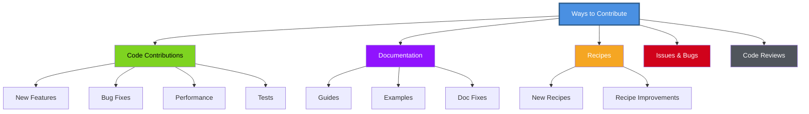
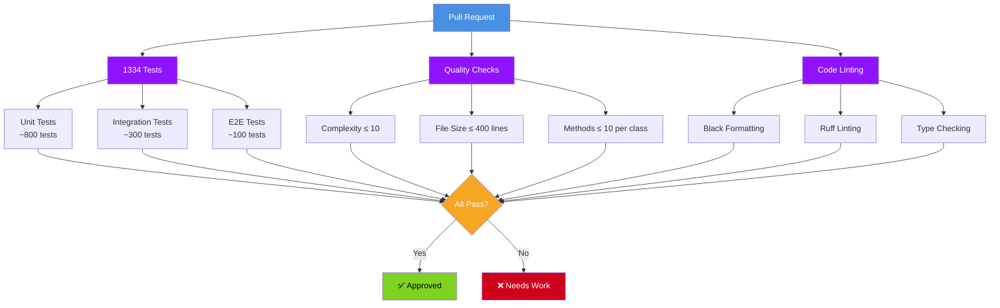

# Contributing to Personetta

Thank you for contributing to Personetta! This guide covers the contribution process, standards, and community guidelines.

---

## Table of Contents

- [Code of Conduct](#code-of-conduct)
- [How to Contribute](#how-to-contribute)
- [Pull Request Process](#pull-request-process)
- [Quality Standards](#quality-standards)
- [Review Process](#review-process)
- [Community](#community)

---

## Code of Conduct

### Our Pledge

We are committed to providing a welcoming and inclusive experience for everyone.

### Expected Behavior

- ✅ Be respectful and inclusive
- ✅ Welcome newcomers and help them get started
- ✅ Give and receive constructive feedback gracefully
- ✅ Focus on what's best for the community
- ✅ Show empathy towards other community members

### Unacceptable Behavior

- ❌ Harassment, discrimination, or exclusionary behavior
- ❌ Trolling, insulting comments, or personal attacks
- ❌ Publishing others' private information
- ❌ Other conduct inappropriate in a professional setting

### Enforcement

Violations may result in temporary or permanent ban from the project. Report issues to [maintainer@example.com].

---

## How to Contribute

### Types of Contributions



### Before You Start

1. **Check existing issues** - Someone might already be working on it
2. **Open an issue** - Discuss significant changes before coding
3. **Read the docs** - Understand the architecture and patterns

---

## Pull Request Process

### 1. Fork and Clone

```bash
# Fork the repository on GitHub
# Then clone your fork

git clone https://github.com/YOUR-USERNAME/personetta.git
cd personetta

# Add upstream remote
git remote add upstream https://github.com/ORIGINAL-OWNER/personetta.git
```

### 2. Create Feature Branch

```bash
# Update main
git checkout main
git pull upstream main

# Create feature branch
git checkout -b feature/my-awesome-feature

# Or for bug fixes
git checkout -b fix/issue-123
```

### Branch Naming Convention

- `feature/description` - New features
- `fix/description` - Bug fixes
- `docs/description` - Documentation
- `test/description` - Test additions
- `refactor/description` - Code refactoring

### 3. Make Changes

```bash
# Make your changes
# Follow code quality standards (see below)

# Run tests frequently
pytest tests/

# Run quality checks
pytest tests/quality/
```

### 4. Commit Changes

```bash
# Stage changes
git add .

# Commit with descriptive message
git commit -m "Add: Brief description of change"
```

**Commit Message Format:**

```
<type>: <description>

[optional body]

[optional footer]
```

**Types:**
- `Add:` - New feature
- `Fix:` - Bug fix
- `Update:` - Modify existing feature
- `Remove:` - Remove feature
- `Docs:` - Documentation only
- `Test:` - Add or modify tests
- `Refactor:` - Code restructuring
- `Style:` - Formatting changes
- `Chore:` - Maintenance tasks

**Examples:**

```bash
# Good commits
git commit -m "Add: JSON output formatter"
git commit -m "Fix: Issue #123 - Recipe validation error"
git commit -m "Docs: Add example for custom recipes"
git commit -m "Test: Add unit tests for merger.py"

# Bad commits (too vague)
git commit -m "Fixed stuff"
git commit -m "Updates"
git commit -m "WIP"
```

**AI assistants and commit attribution:**

Using a coding assistant is fine. Crediting it as a contributor is not.

Most agents (Claude Code, Copilot, Cursor, and friends) append a
`Co-Authored-By:` trailer by default. GitHub resolves that trailer to a real
account, which puts the assistant in this repository's Contributors panel. Keep
those trailers out of your commits — `Co-Authored-By:` is for people.

Enable the bundled hook once per clone and it is handled for you:

```bash
git config core.hooksPath .githooks
```

`.githooks/commit-msg` strips assistant trailers and "Generated with ..."
footers while leaving human co-authors and ordinary prose untouched.

### 5. Push and Create PR

```bash
# Push to your fork
git push origin feature/my-awesome-feature

# Go to GitHub and create Pull Request
# Fill out the PR template
```

### Pull Request Template

```markdown
## Description
Brief description of changes.

## Type of Change
- [ ] Bug fix
- [ ] New feature
- [ ] Documentation update
- [ ] Refactoring
- [ ] Performance improvement

## Testing
- [ ] Unit tests added/updated
- [ ] Integration tests added/updated
- [ ] Manual testing completed

## Checklist
- [ ] Code follows style guidelines
- [ ] Quality checks pass
- [ ] Documentation updated
- [ ] Tests pass
- [ ] No merge conflicts

## Related Issues
Closes #123
```

---

## Quality Standards

### Automated Checks

All PRs must pass:



### Running Checks Locally

```bash
# All tests
pytest tests/

# Quality checks
pytest tests/quality/

# Code formatting
black src/generator/ --check

# Linting
ruff check src/generator/

# Type checking
mypy src/generator/

# Coverage
pytest --cov=src/generator --cov-report=html tests/
```

### Quality Requirements

| Check | Requirement | Why |
|-------|-------------|-----|
| **Test Coverage** | ≥ 90% | Ensure reliability |
| **Cyclomatic Complexity** | ≤ 10 | Maintain readability |
| **File Size** | ≤ 400 lines | Keep modules focused |
| **Function Size** | ≤ 25 lines | Easy to understand |
| **Methods per Class** | ≤ 10 | Single Responsibility |

### Code Style

```python
# ✅ Good: Type hints, docstrings, clear naming

def load_recipe(name: str) -> dict[str, Any]:
    """Load a recipe by name.
    
    Args:
        name: Recipe name without extension
        
    Returns:
        Recipe dictionary
        
    Raises:
        FileNotFoundError: If recipe doesn't exist
    """
    path = get_recipe_path(name)
    return read_yaml(path)


# ❌ Bad: No types, no docs, unclear

def load(n):
    p = get_path(n)
    return read(p)
```

---

## Review Process

### Review Timeline

```mermaid
gantt
    title Pull Request Review Timeline
    dateFormat HH:mm
    axisFormat %H:%M
    
    section PR Lifecycle
    Submit PR           :milestone, m1, 00:00, 0h
    Automated Checks    :a1, 00:00, 01:00
    Initial Review      :a2, after a1, 02:00
    Address Feedback    :a3, after a2, 04:00
    Final Review        :a4, after a3, 01:00
    Merge              :milestone, m2, after a4, 0h
    
    section Typical Timeline
    Same Day Response   :done, 00:00, 24:00
    2-3 Days Total     :crit, 00:00, 72:00
```



### What Reviewers Look For

✅ **Code Quality**
- Follows existing patterns
- Well-documented
- Includes tests
- Passes quality checks

✅ **Functionality**
- Solves stated problem
- No unintended side effects
- Edge cases handled

✅ **Maintainability**
- Clear naming
- Reasonable complexity
- Appropriate abstractions

### Addressing Feedback

```bash
# Make requested changes
# Commit with descriptive message
git add .
git commit -m "Fix: Address review feedback - improve error handling"

# Push to update PR
git push origin feature/my-awesome-feature

# Respond to reviewer comments on GitHub
# Mark conversations as resolved when addressed
```

### When Changes Are Requested

1. **Read carefully** - Understand the concern
2. **Ask questions** - If feedback is unclear
3. **Make changes** - Address each point
4. **Explain** - Comment why you made specific choices
5. **Test** - Verify changes work
6. **Update** - Push changes and notify reviewer

---

## Community

### Getting Help

**Questions about contributing:**
- Open a GitHub Discussion
- Tag your question appropriately
- Be specific about what you need help with

**Found a bug:**
- Search existing issues first
- Open a new issue with reproduction steps
- Include your environment details

**Want to add a feature:**
- Open an issue first to discuss
- Describe the use case
- Get maintainer buy-in before coding

### Communication Channels

- **GitHub Issues** - Bug reports, feature requests
- **GitHub Discussions** - Questions, ideas, general discussion
- **Pull Requests** - Code contributions

### Recognition

Contributors are recognized in:
- CONTRIBUTORS.md file
- Release notes
- Project README

---

## Special Contribution Types

### Adding New Recipes

**Low barrier to entry** - Great first contribution!

```yaml
# data/recipes/my-recipe.yaml

name: my-recipe
description: What this recipe does

compose:
  - base/lifecycle/appropriate-pattern
  - language_specific/language/language-developer

mixins:
  - relevant-mixin

guidelines:
  - "Specific guideline"
  - "Another guideline"
```

Then:
1. Validate: `personetta validate --recipe my-recipe`
2. Test manually
3. Submit PR with documentation

### Documentation Improvements

**Always welcome!**

- Fix typos or unclear wording
- Add examples
- Improve diagrams
- Add troubleshooting tips

Documentation PRs are fast-tracked for merge.

### Bug Fixes

**High priority!**

1. Reproduce the bug
2. Add failing test
3. Fix the bug
4. Verify test passes
5. Submit PR with test + fix

---

## Release Contributions

### Becoming a Maintainer

Active contributors may be invited to become maintainers. Maintainers:

- Review and merge PRs
- Triage issues
- Shape project direction
- Cut releases

**Path to maintainership:**
1. Multiple quality contributions
2. Demonstrated understanding of codebase
3. Active participation in discussions
4. Alignment with project values

---

## License

By contributing, you agree that your contributions will be licensed under the same license as the project (see LICENSE file).

---

## Questions?

- Open a GitHub Discussion
- Check [Developer Guide](developer-guide.md)
- See [Extending Guide](extending.md)

**Thank you for contributing to Personetta! 🎉**
