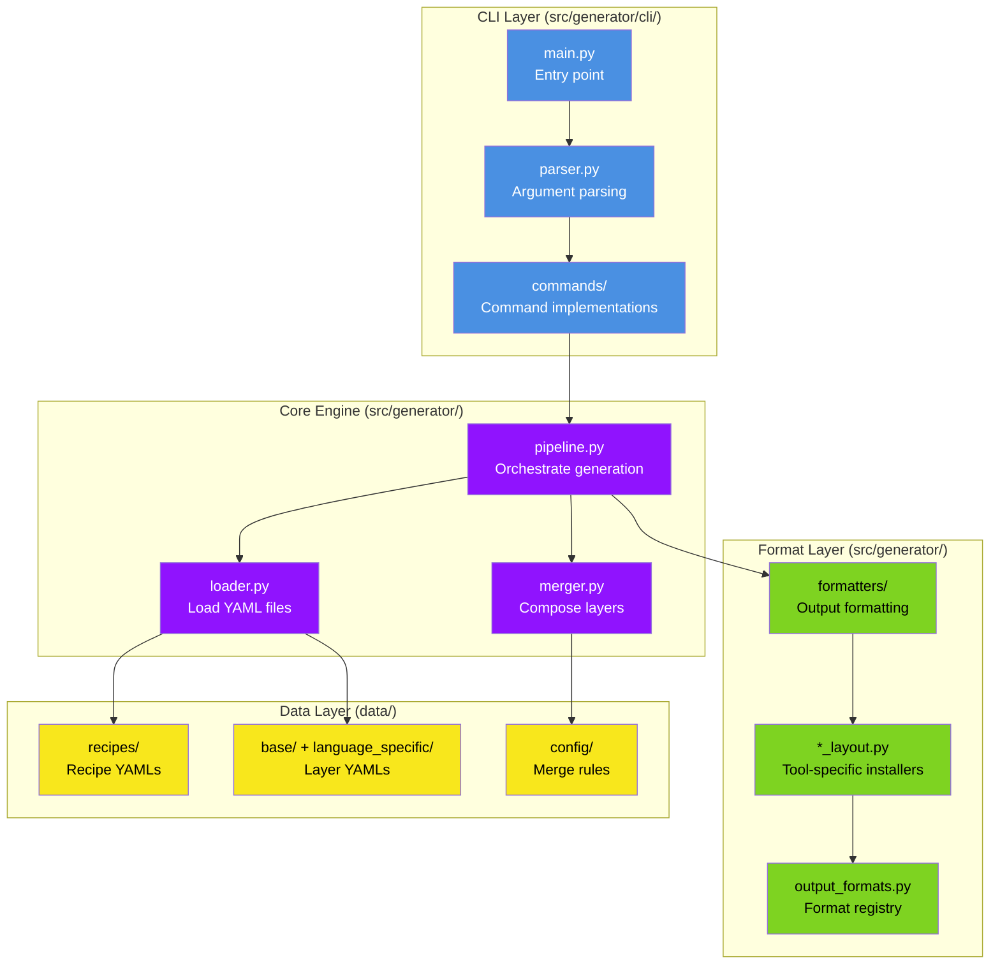
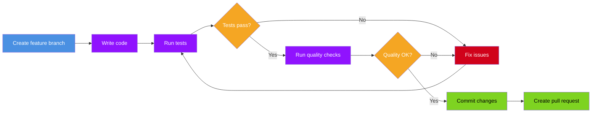
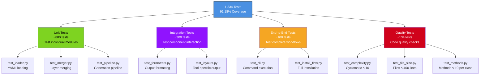

# Developer Guide

Guide for contributors to Personetta. Learn the codebase, development workflow, and how to add features.

---

## Table of Contents

- [Development Setup](#development-setup)
- [Project Structure](#project-structure)
- [Development Workflow](#development-workflow)
- [Testing](#testing)
- [Code Quality](#code-quality)
- [Adding Features](#adding-features)
- [Release Process](#release-process)

---

## Development Setup

### Prerequisites

- Python 3.11 or higher
- Git
- (Optional) Visual Studio Code with Python extension

### Initial Setup

```bash
# 1. Clone the repository
git clone https://github.com/your-org/personetta.git
cd personetta

# 2. Create virtual environment
python -m venv .venv

# 3. Activate virtual environment
# Windows
.venv\Scripts\activate
# Linux/Mac
source .venv/bin/activate

# 4. Install in development mode
pip install -e ".[dev]"

# 5. Verify installation
personetta --version
pytest --version

# 6. Run tests to verify setup
pytest tests/
```

**Expected output:**
```
======================== test session starts ========================
collected 1334 items

tests/unit/test_loader.py .......
tests/unit/test_merger.py .........
tests/integration/test_pipeline.py ....
...

=================== 1334 passed in 45.2s ========================
```

---

## Project Structure

### Directory Layout

```
personetta/
├── src/                                    # Source code
│   └── generator/                          # Core package
│       ├── cli/                            # Command-line interface
│       │   ├── commands/                   # Individual commands
│       │   │   ├── install.py              # Install command
│       │   │   ├── set_active.py           # Set-active command
│       │   │   ├── remove.py               # Remove command
│       │   │   └── ...                     # 10 more commands
│       │   ├── main.py                     # CLI entry point
│       │   └── parser.py                   # Argument parsing
│       ├── formatters/                     # Output formatters
│       │   ├── standalone_prompt.py        # Plain text output
│       │   ├── system.py                   # System YAML format
│       │   └── ...                         # Format-specific
│       ├── merge/                          # Composition logic
│       ├── cursor_layout.py                # Cursor installer
│       ├── copilot_layout.py               # Copilot installer
│       ├── claude_layout.py                # Claude installer
│       ├── cline_layout.py                 # Cline installer
│       ├── loader.py                       # YAML loading
│       ├── merger.py                       # Layer merging
│       ├── pipeline.py                     # Generation pipeline
│       └── output_formats.py               # Format registry
├── data/                                   # Recipe data
│   ├── base/                               # Base layers
│   │   ├── lifecycle/                      # Workflow patterns
│   │   ├── layer/                          # Domain patterns
│   │   └── mixins/                         # Cross-cutting
│   ├── language_specific/                  # Language layers
│   │   ├── python/
│   │   ├── csharp/
│   │   └── ...
│   ├── recipes/                            # Complete recipes
│   │   ├── implement-python.yaml
│   │   └── ...                             # 34 recipes
│   ├── config/                             # Configuration
│   │   └── merge-config.yaml               # Merge strategies
│   ├── schemas/                            # JSON schemas
│   │   ├── recipe.schema.json
│   │   └── layer.schema.json
│   └── templates/                          # Output templates
├── tests/                                  # Test suite
│   ├── unit/                               # Unit tests
│   ├── integration/                        # Integration tests
│   ├── e2e/                                # End-to-end tests
│   ├── quality/                            # Quality checks
│   ├── Test-SetupScript.ps1                # Setup script tests
│   ├── setup-tests.md               # Setup test documentation
│   └── conftest.py                         # Pytest fixtures
├── docs/                                   # Documentation
├── scripts/                                # Utility scripts
├── pyproject.toml                          # Package config
└── README.md
```

### Module Responsibilities



---

## Development Workflow

### Making Changes



### Standard Workflow

```bash
# 1. Create feature branch
git checkout -b feature/my-new-feature

# 2. Make changes
# Edit files...

# 3. Run tests frequently
pytest tests/unit/test_my_module.py

# 4. Run full test suite
pytest tests/

# 5. Check code quality
pytest tests/quality/

# 6. Format code (if needed)
black src/generator/
ruff check src/generator/ --fix

# 7. Commit
git add .
git commit -m "Add: Description of changes"

# 8. Push and create PR
git push origin feature/my-new-feature
```

---

## Testing

### Test Structure

Personetta has 1,334 tests organized by category:



### Running Tests

```bash
# Run all tests
pytest tests/

# Run specific category
pytest tests/unit/
pytest tests/integration/
pytest tests/e2e/
pytest tests/quality/

# Run specific file
pytest tests/unit/test_loader.py

# Test setup and installation (PowerShell)
.\tests\Test-SetupScript.ps1        # All tests
.\tests\Test-SetupScript.ps1 -Quick  # Quick validation

# Run specific test
pytest tests/unit/test_loader.py::test_load_valid_recipe

# Run with coverage
pytest --cov=src/generator --cov-report=html tests/

# Run in parallel (faster)
pytest -n auto tests/

# Run with verbose output
pytest -v tests/
```

### Writing Tests

**Unit test example:**

```python
# tests/unit/test_loader.py

import pytest
from generator.loader import RecipeLoader

def test_load_valid_recipe():
    """Test loading a valid recipe YAML file."""
    loader = RecipeLoader()
    recipe = loader.load_recipe("implement-python")
    
    assert recipe["name"] == "implement-python"
    assert "description" in recipe
    assert "compose" in recipe
    assert len(recipe["compose"]) > 0

def test_load_nonexistent_recipe():
    """Test loading a non-existent recipe raises error."""
    loader = RecipeLoader()
    
    with pytest.raises(FileNotFoundError):
        loader.load_recipe("nonexistent-recipe")
```

**Integration test example:**

```python
# tests/integration/test_pipeline.py

def test_complete_generation_flow():
    """Test complete flow from YAML to output."""
    from generator.pipeline import Pipeline
    
    pipeline = Pipeline()
    output = pipeline.generate(
        recipe="implement-python",
        format="cursor"
    )
    
    assert "implement-python" in output
    assert "Python" in output
    assert len(output) > 1000  # Should be substantial
```

---

## Code Quality

### Automated Quality Guards

All enforced via `pytest tests/quality/`:

| Check | Limit | Purpose |
|-------|-------|---------|
| **Cyclomatic Complexity** | ≤ 10 | PRIMARY SRP guard |
| **Methods per Class** | ≤ 10 | Class complexity |
| **File Size** | ≤ 400 lines | Module size |
| **Function Size** | ≤ 25 lines | Function complexity |
| **Imports per Module** | ≤ 10 | Coupling |

### Running Quality Checks

```bash
# All quality checks
pytest tests/quality/

# Specific checks
pytest tests/quality/test_complexity.py
pytest tests/quality/test_file_size.py
pytest tests/quality/test_methods.py

# Check before commit
pytest tests/quality/ --verbose
```

### Code Style

```bash
# Format code
black src/generator/

# Check formatting
black src/generator/ --check

# Lint code
ruff check src/generator/

# Auto-fix linting issues
ruff check src/generator/ --fix

# Type checking
mypy src/generator/
```

---

## Adding Features

### Adding a New Command

See [Extending Guide](extending.md#adding-a-new-command) for detailed walkthrough.

**Quick reference:**

```bash
# 1. Create command file
touch src/generator/cli/commands/my_command.py

# 2. Implement command
# See existing commands for structure

# 3. Register in parser
# Edit src/generator/cli/parser.py

# 4. Add tests
touch tests/unit/cli/test_my_command.py

# 5. Test
pytest tests/unit/cli/test_my_command.py
```

### Adding a New Tool Format

See [Extending Guide](extending.md#adding-a-new-tool-format) for detailed walkthrough.

**Quick reference:**

```bash
# 1. Create layout module
touch src/generator/my_tool_layout.py

# 2. Create formatter (if needed)
touch src/generator/formatters/my_tool.py

# 3. Register format
# Edit src/generator/output_formats.py

# 4. Add tests
touch tests/integration/test_my_tool_layout.py

# 5. Test
pytest tests/integration/test_my_tool_layout.py
```

### Adding a New Recipe

See [Recipe Guide](recipe-guide.md#creating-your-first-recipe) for detailed walkthrough.

**Quick reference:**

```bash
# 1. Create recipe YAML
touch data/recipes/my-recipe.yaml

# 2. Edit with required fields
# name, description, compose

# 3. Validate
personetta validate --recipe my-recipe

# 4. Test
personetta recipe my-recipe --format cursor
personetta install 'my-recipe' --format cursor

# 5. Add to test suite (optional)
# Edit tests/integration/test_recipes.py
```

---

## Release Process

### Version Numbering

Follow [Semantic Versioning](https://semver.org/):

- **Major** (X.0.0): Breaking changes
- **Minor** (0.X.0): New features, backward compatible
- **Patch** (0.0.X): Bug fixes

### Release Checklist

```bash
# 1. Update version
# Edit pyproject.toml: version = "X.Y.Z"

# 2. Run full test suite
pytest tests/

# 3. Check quality
pytest tests/quality/

# 4. Update CHANGELOG.md
# Document all changes

# 5. Commit version bump
git add pyproject.toml CHANGELOG.md
git commit -m "Bump version to X.Y.Z"

# 6. Tag release
git tag -a vX.Y.Z -m "Release vX.Y.Z"

# 7. Push
git push origin main --tags

# 8. Build package
python -m build

# 9. Upload to PyPI (if applicable)
python -m twine upload dist/*
```

---

## Debugging

### Common Development Issues

#### Import Errors

```bash
# Symptom: ImportError when running tests

# Solution: Reinstall in development mode
pip install -e ".[dev]"
```

#### Test Failures After Changes

```bash
# Run specific failing test with verbose output
pytest -v tests/unit/test_my_module.py::test_my_function

# Check test coverage
pytest --cov=src/generator --cov-report=term-missing tests/
```

#### Quality Check Failures

```bash
# Check what's failing
pytest tests/quality/ -v

# Common fixes:
# - Complexity too high: Refactor function
# - File too large: Split into modules
# - Too many imports: Review dependencies
```

---

## Best Practices

### 1. Write Tests First (TDD)

```python
# 1. Write failing test
def test_new_feature():
    result = my_new_function()
    assert result == expected

# 2. Implement feature
def my_new_function():
    return expected

# 3. Test passes
pytest tests/unit/test_my_module.py::test_new_feature
```

### 2. Keep Functions Small

```python
# ✅ Good: Small, focused function
def load_recipe(name: str) -> dict:
    """Load a single recipe by name."""
    path = get_recipe_path(name)
    return read_yaml(path)

# ❌ Bad: Function doing too much
def load_and_merge_and_format_recipe(name: str, format: str) -> str:
    # Loading...
    # Merging...
    # Formatting...
    # (25+ lines)
```

### 3. Use Type Hints

```python
# ✅ Good: Clear types
def merge_layers(
    base: dict[str, Any],
    overlay: dict[str, Any],
    strategy: str
) -> dict[str, Any]:
    """Merge two layers using specified strategy."""
    pass

# ❌ Bad: No types
def merge_layers(base, overlay, strategy):
    pass
```

### 4. Document Public APIs

```python
# ✅ Good: Clear documentation
def compose_recipe(
    recipe_name: str,
    format: str = "cursor"
) -> str:
    """Compose a recipe into output format.
    
    Args:
        recipe_name: Name of recipe to compose
        format: Target output format
        
    Returns:
        Formatted recipe content
        
    Raises:
        RecipeNotFoundError: If recipe doesn't exist
        ValidationError: If recipe invalid
    """
    pass
```

---

## Resources

### Internal Documentation

- [Core Concepts](concepts.md) - How Personetta works
- [Architecture](architecture.md) - Design decisions
- [Extending Guide](extending.md) - Detailed extension instructions

### External Resources

- [Python Packaging Guide](https://packaging.python.org/)
- [pytest Documentation](https://docs.pytest.org/)
- [Black Code Formatter](https://black.readthedocs.io/)
- [Ruff Linter](https://docs.astral.sh/ruff/)

---

## Getting Help

### Questions During Development

1. **Check existing code** - See how similar features are implemented
2. **Read tests** - Tests show expected behavior
3. **Run with --verbose** - See detailed operation logs
4. **Ask in Issues** - Open a discussion issue

### Contributing

See [Contributing Guide](contributing.md) for:
- Code of conduct
- PR process
- Review guidelines
- Community standards

---

**Ready to contribute?** See [Extending Guide](extending.md) for step-by-step instructions!
