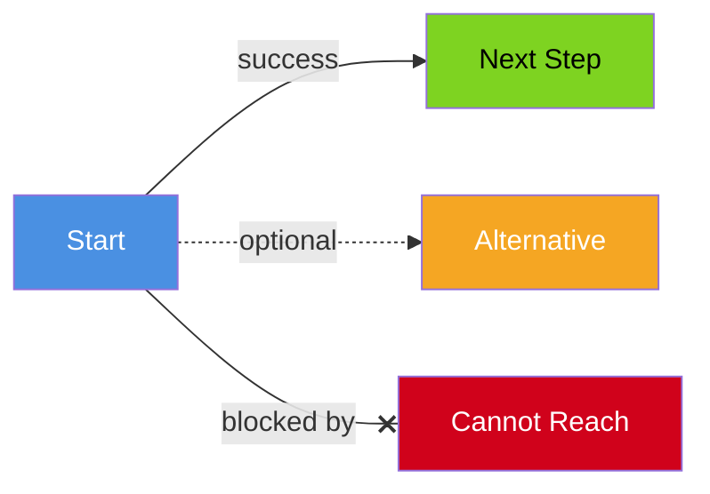
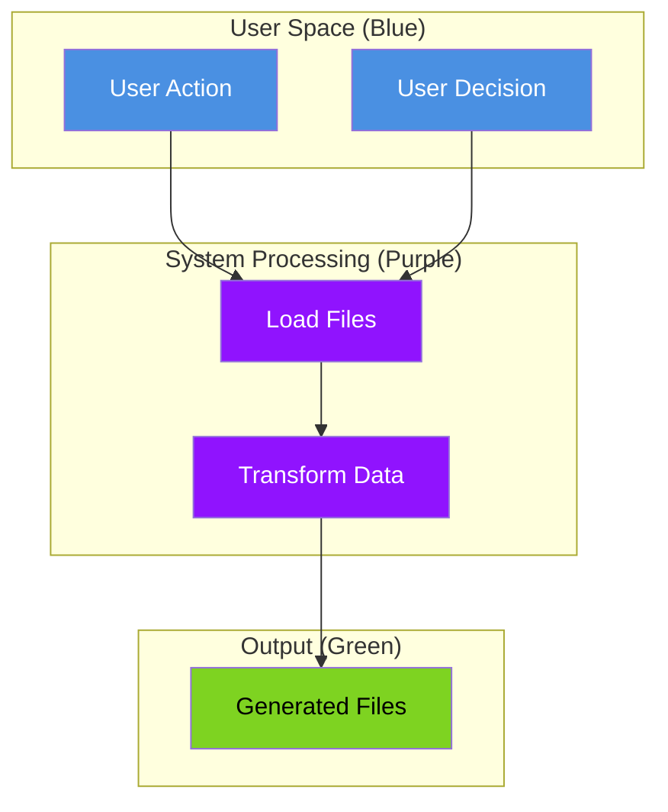
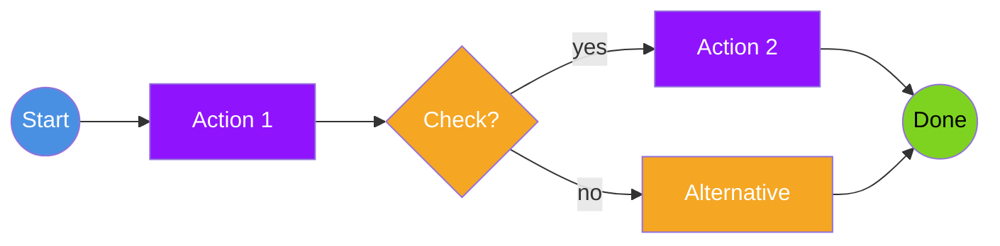
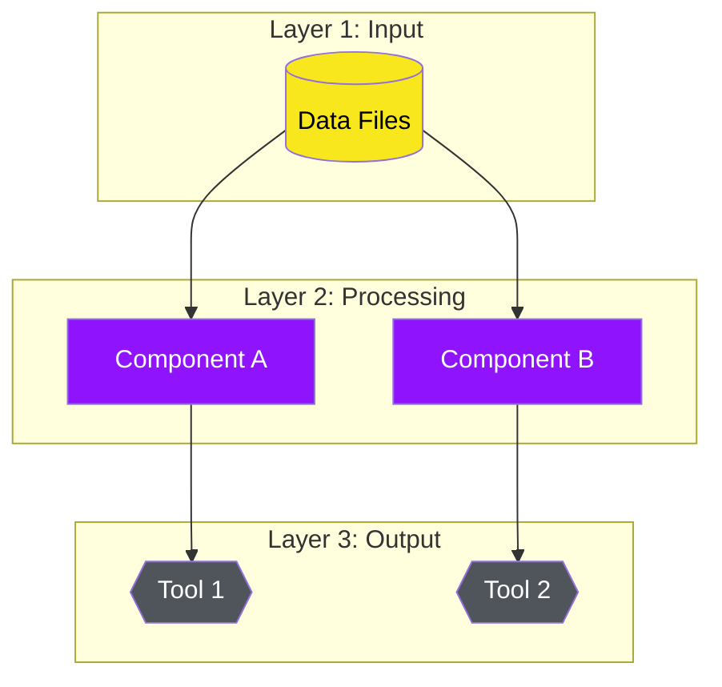
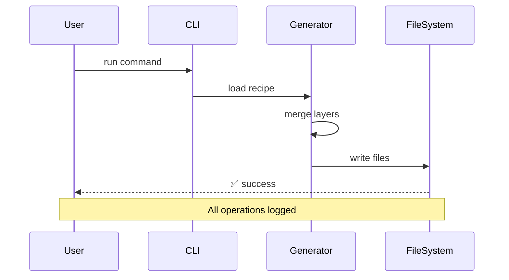
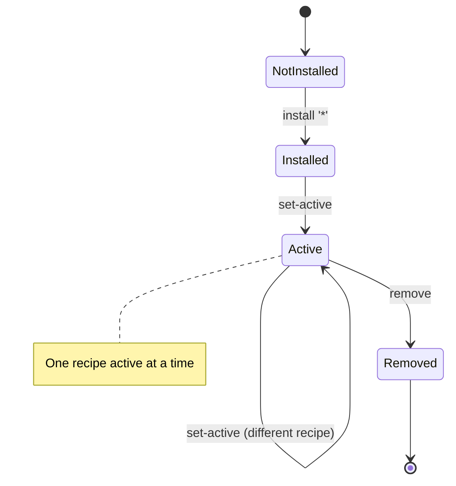
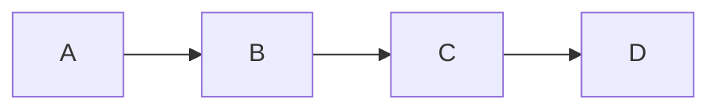

# Personetta Diagram Style Guide

**Version:** 1.0  
**Last Updated:** April 17, 2026

This guide defines the visual language for all diagrams in Personetta documentation. Consistent use of colors, shapes, and conventions makes complex concepts easier to understand.

---

## 🎨 Color Palette

All diagrams use this consistent color scheme:

### Primary Colors

| Color | Hex | Usage | Example |
|-------|-----|-------|---------|
| 🔵 **Blue** | `#4A90E2` | User actions, inputs, external interactions | "User runs command", "You install", "Input YAML" |
| 🟢 **Green** | `#7ED321` | Success states, outputs, ready states, final results | "Files generated", "Installation complete", "Ready to use" |
| 🟠 **Orange** | `#F5A623` | Decisions, branches, warnings, alternative paths | "Choose format", "If X then Y", "Optional step" |
| 🔴 **Red** | `#D0021B` | Errors, blockers, critical issues, stop conditions | "Build failed", "Missing file", "Invalid config" |
| 🟣 **Purple** | `#9013FE` | Internal processing, transformations, system logic | "Merge layers", "Generate output", "Validate schema" |
| ⚫ **Gray** | `#50555C` | Infrastructure, support systems, tools | "File system", "GitHub Copilot", "VS Code" |
| 🟡 **Yellow** | `#F8E71C` | Configuration, data files, YAML sources | "Recipe YAML", "Config file", "Data input" |

### Usage Guidelines

- **Text on dark backgrounds:** Use white (`#FFFFFF`) or light gray (`#F5F5F5`)
- **Text on light backgrounds:** Use dark gray (`#333333`) or black (`#000000`)
- **Borders:** Use 2-3 shades darker than fill color
- **Lines/Arrows:** Use gray (`#50555C`) for neutral connections, color-match for semantic flow

---

## 📐 Shape Language

Shapes convey semantic meaning at a glance:

### Core Shapes

```mermaid
graph TB
    subgraph "Shape Meanings"
        A[Rounded Rectangle<br/>User-Facing Elements]
        B[Rectangle<br/>System Processes]
        C[(Cylinder<br/>Data Storage/Files)]
        D{Diamond<br/>Decision Points}
        E{{Hexagon<br/>Tools/External Systems}}
    end
    
    style A fill:#4A90E2,stroke:#2E5C8A,color:#fff,rx:15,ry:15
    style B fill:#9013FE,stroke:#6A0FB8,color:#fff
    style C fill:#F8E71C,stroke:#C4B519,color:#000
    style D fill:#F5A623,stroke:#C4851C,color:#fff
    E fill:#50555C,stroke:#3A3F44,color:#fff
```

### Shape Reference

| Shape | Mermaid Syntax | Meaning | Example |
|-------|----------------|---------|---------|
| **Rounded Rectangle** | `[Text]` | User actions, UI elements, commands | `[Install Package]`, `[Run Command]` |
| **Rectangle** | `[Text]` with sharp corners | Internal processes, functions | `[Validate Schema]`, `[Merge Layers]` |
| **Cylinder** | `[(Text)]` | Files, databases, persistent storage | `[(recipe.yaml)]`, `[(Cache)]` |
| **Diamond** | `{Text}` | Decisions, conditionals | `{Valid?}`, `{Global or Project?}` |
| **Hexagon** | `{{Text}}` | External tools, systems | `{{Cursor}}`, `{{GitHub Copilot}}` |
| **Circle** | `((Text))` | Start/end points, milestones | `((Start))`, `((Complete))` |
| **Parallelogram** | `[/Text/]` or `[\Text\]` | Input/output operations | `[/User Input/]`, `[\File Output\]` |

---

## 📏 Size Conventions

Size indicates importance, scope, or complexity:

- **Large nodes:** Major concepts, primary paths, key components
- **Medium nodes:** Supporting concepts, secondary paths
- **Small nodes:** Details, optional elements, edge cases

### Size in Mermaid

Control visual hierarchy through:
1. **Node width:** More text = wider nodes (use `<br/>` for line breaks)
2. **Subgraphs:** Group related concepts with borders
3. **Layout:** Important nodes at top/center

---

## ➡️ Arrow Styles

Arrows show relationships and flow:

| Arrow | Syntax | Meaning |
|-------|--------|---------|
| → | `-->` | Standard flow, sequence, "leads to" |
| ⇒ | `==>` | Strong/emphasized flow, critical path |
| ⤏ | `-.->` | Optional flow, alternative path |
| ↔ | `<-->` | Bidirectional, mutual relationship |
| ⊸ | `--x` | Blocked, prevented, cannot proceed |

### Arrow Labels

Add context with labels:



---

## 📦 Subgraphs and Grouping

Use subgraphs to show logical boundaries:



### Subgraph Usage

- **Color subgraph titles** to match contents
- **Use for:** Logical groupings, system boundaries, phases/stages
- **Avoid:** Over-nesting (max 2 levels)

---

## 🎭 Diagram Types and Templates

### Flow Diagram (Process Flow)

**Use for:** Sequential processes, workflows, pipelines

**Template:**


### Architecture Diagram (System Structure)

**Use for:** Component relationships, system layout

**Template:**


### Sequence Diagram (Interactions)

**Use for:** Time-based interactions, message passing

**Template:**


### State Diagram (States and Transitions)

**Use for:** Lifecycle states, mode transitions

**Template:**


---

## 📝 Annotation Conventions

### Callouts and Notes

```mermaid
graph LR
    A[Component] --> B[Next Step]
    
    note "💡 Important detail"
    
    style A fill:#4A90E2,color:#fff
    style B fill:#7ED321,color:#000
```

### Icons in Labels

Use emoji for quick visual recognition:

- 📦 Package/Installation
- 🔧 Configuration
- 📁 Files/Directories
- ⚙️ Processing
- ✅ Success
- ❌ Error
- ⚠️ Warning
- 💡 Tip/Note
- 🚀 Performance
- 🔒 Security
- 👤 User
- 🤖 AI/Tool

---

## ✅ Quality Checklist

Before publishing a diagram, verify:

- [ ] **Colors** match the style guide (blue=user, purple=process, green=output, etc.)
- [ ] **Shapes** convey correct semantic meaning
- [ ] **Labels** are concise but descriptive
- [ ] **Flow** direction is logical (usually left-to-right or top-to-bottom)
- [ ] **Contrast** is sufficient for readability
- [ ] **Complexity** is appropriate (split complex diagrams into multiple views)
- [ ] **Context** is clear (title, legend if needed)
- [ ] **Consistency** with other diagrams in the same document

---

## 🎯 Examples of Good vs. Bad

### ❌ Bad Example

**Problems:** No colors, no context, generic labels, unclear purpose

### ✅ Good Example

**Strengths:** Clear colors, descriptive labels, icons for context, semantic shapes, shows complete flow

---

## 🔧 Tools and Workflow

### Recommended Tools

1. **Mermaid** (primary)
   - Embedded in markdown
   - Version controllable
   - Renders on GitHub

2. **draw.io** (complex diagrams)
   - Save as `.drawio` in `docs/diagrams/sources/`
   - Export PNG for embedding
   - Use for diagrams Mermaid can't handle

### File Organization

```
docs/
├── diagrams/
│   ├── sources/           # .drawio source files
│   ├── exports/           # Exported PNGs
│   └── templates/         # Reusable templates
└── [doc-name].md          # Mermaid diagrams embedded inline
```

---

## 📚 Further Reading

- [Mermaid Documentation](https://mermaid.js.org/)
- [draw.io User Guide](https://www.diagrams.net/doc/)
- [Visual Design Principles](https://www.nngroup.com/articles/visual-hierarchy/)

---

**Questions or suggestions?** Open an issue or PR to evolve this style guide.
