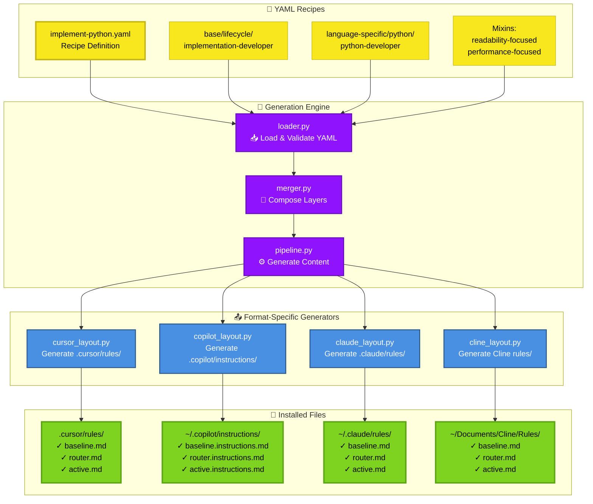
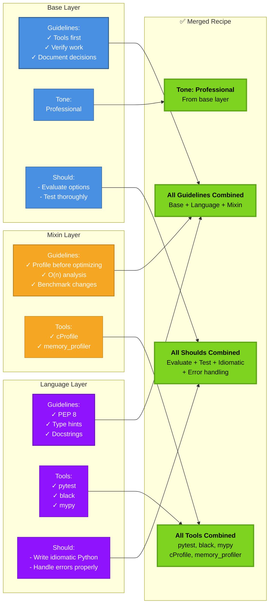
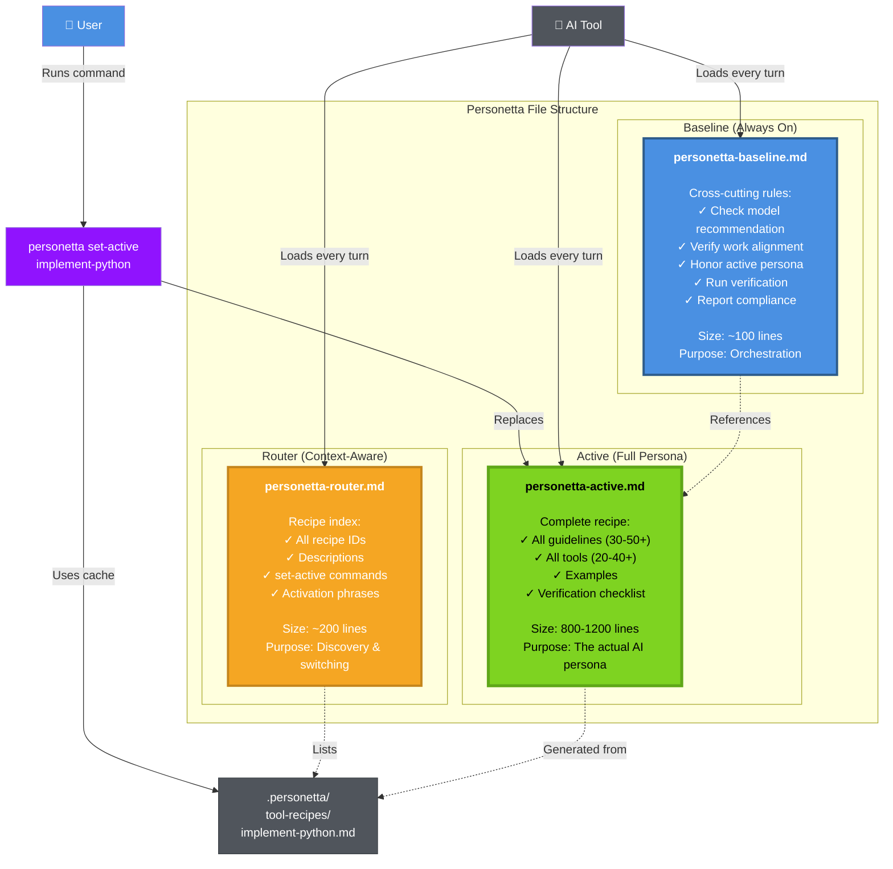
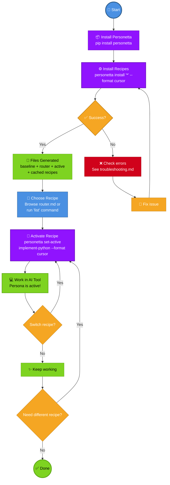
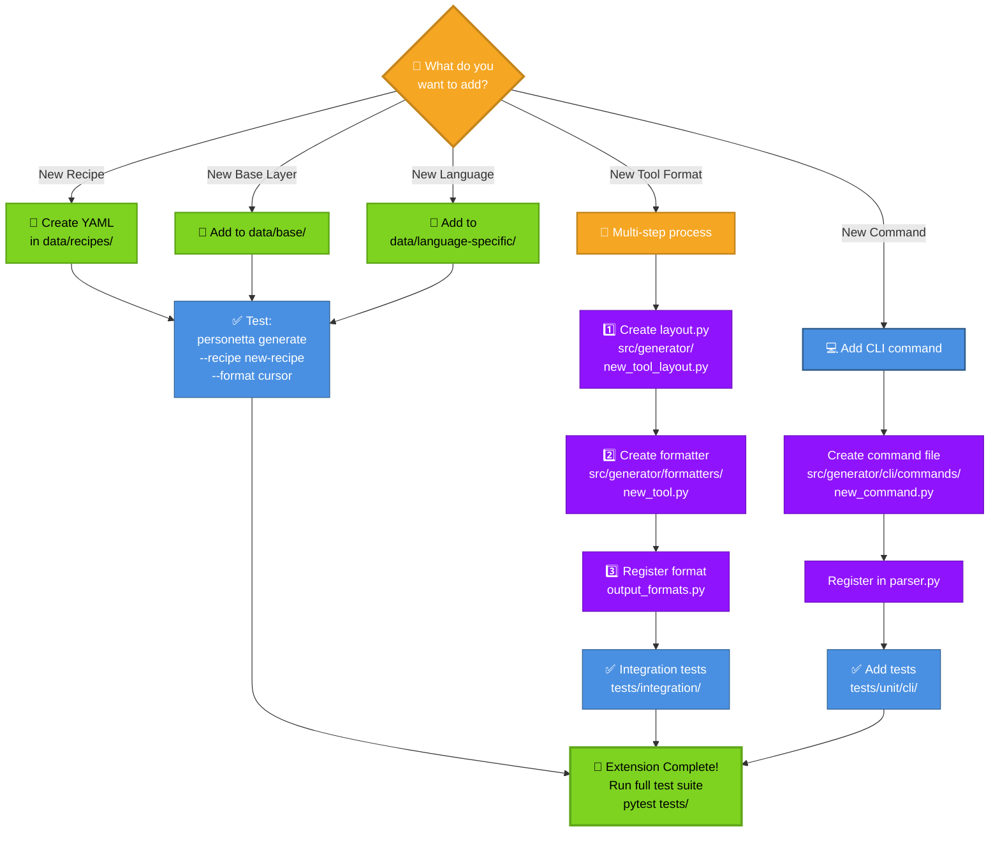
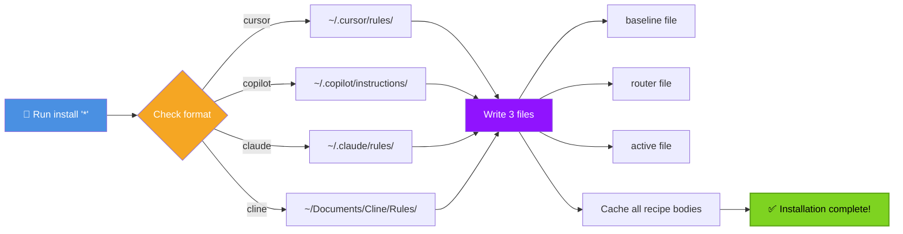
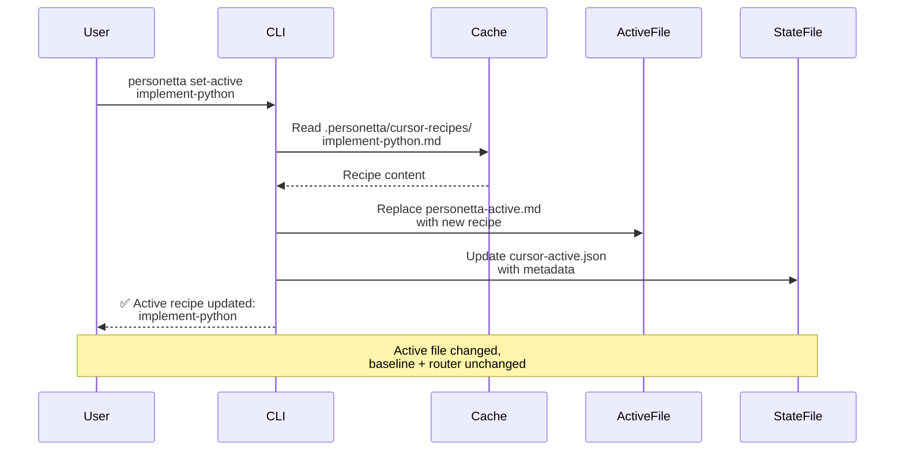
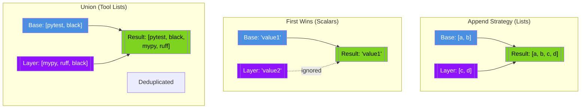
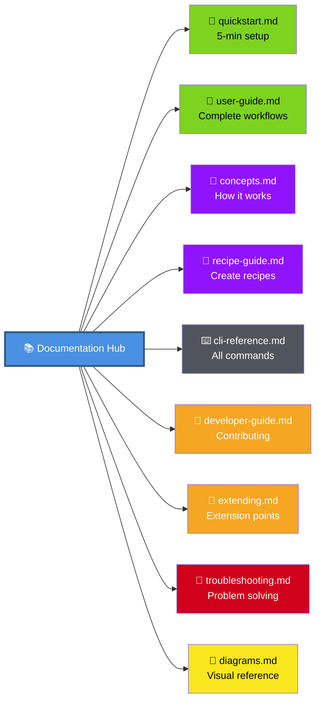

# Personetta Diagrams Gallery

**Visual Reference:** All diagrams used across Personetta documentation

This gallery provides a central reference for all major diagrams. Each diagram links to the documentation where it's explained in detail.

---

## 🏗️ Hero Diagrams

These are the core diagrams that appear across multiple documentation files:

### 1. System Architecture Overview

**Where used:** [concepts.md](concepts.md), [developer-guide.md](developer-guide.md)

**What it shows:** The complete flow from YAML recipes through the generation engine to installed files in different tools.

**Key concepts:**
- 🟡 **Yellow**: Input YAML files - your recipe definitions
- 🟣 **Purple**: Internal processing - the generation engine
- 🔵 **Blue**: Format-specific output generators
- 🟢 **Green**: Final installed files ready to use

---

### 2. Recipe Composition Model

**Where used:** [concepts.md](concepts.md), [recipe-guide.md](recipe-guide.md)

**What it shows:** How base layers, language-specific knowledge, and mixins combine to create a complete recipe.

**Merge strategy:**
- **Guidelines:** Append all (deduplicated)
- **Tools:** Union of all tools
- **Tone:** First non-empty value wins
- **Shoulds:** Append all

---

### 3. The Three-File Pattern

**Where used:** [concepts.md](concepts.md), [user-guide.md](user-guide.md)

**What it shows:** The baseline + router + active file pattern that makes Personetta work.

**Why three files?**
- **Baseline:** Small, always-on orchestration logic (context efficiency)
- **Router:** Recipe discovery without loading everything (selective context)
- **Active:** Full recipe loaded when relevant (complete persona)

**Key insight:** Only ONE full recipe loaded at a time, but ALL recipes discoverable.

---

### 4. Complete User Workflow

**Where used:** [user-guide.md](user-guide.md), [quickstart.md](quickstart.md)

**What it shows:** The complete user journey from installation to daily use.

**Time to productivity:** ~5 minutes from installation to working with your first recipe.

---

### 5. Extension Points Map

**Where used:** [extending.md](extending.md), [developer-guide.md](developer-guide.md)

**What it shows:** Where and how developers can extend Personetta.

**Difficulty levels:**
- 🟢 **Green:** Easy - just YAML editing (recipes, base layers, language support)
- 🔵 **Blue:** Moderate - Python code + tests (CLI commands)
- 🟠 **Orange:** Advanced - Multi-file changes + integration (new tool formats)

---

## 📊 Flow Diagrams

### Installation Flow

### Set-Active Flow

---

## 🎨 Composition Diagrams

### Merge Strategies Visualized

---

## 🗺️ Navigation Diagram

---

## 📐 Legend

### Color Meanings

| Color | Meaning | Example |
|-------|---------|---------|
| 🔵 Blue | User actions, inputs | User runs command |
| 🟢 Green | Success, outputs, ready states | Installation complete |
| 🟠 Orange | Decisions, alternatives | Choose option |
| 🔴 Red | Errors, blockers | Build failed |
| 🟣 Purple | Processing, transformations | Merge layers |
| ⚫ Gray | Infrastructure, tools | File system |
| 🟡 Yellow | Configuration, data | YAML files |

### Shape Meanings

- **Rounded Rectangle** → User-facing elements
- **Rectangle** → System processes  
- **Diamond** → Decision points
- **Cylinder** → Data/files
- **Hexagon** → External tools
- **Circle** → Start/end points

---

## 📚 Related Documentation

- [Diagram Style Guide](diagram-style-guide.md) - Visual design system
- [Diagram Templates](diagrams/templates/) - Reusable templates
- [Concepts](concepts.md) - Core concepts explained
- [Architecture](architecture.md) - Technical architecture

---

**Missing a diagram?** Open an issue or PR to add it!
