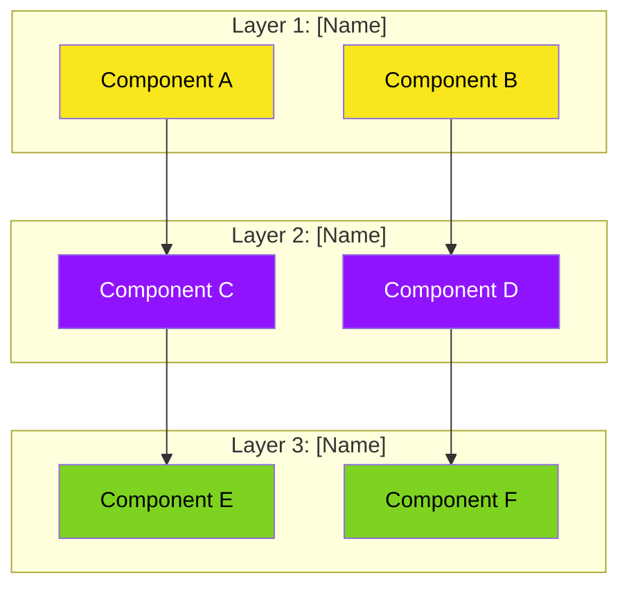

# Architecture Diagram Template

Use this template for system architecture and component relationship diagrams.

## Template

## Customization Guide

1. **Layers:** Replace `Layer 1/2/3` with actual layer names (e.g., "Input", "Processing", "Output")
2. **Components:** Rename `Component A/B/C` to actual component names
3. **Colors:** 
   - Yellow (`#F8E71C`) for input/data
   - Purple (`#9013FE`) for processing
   - Green (`#7ED321`) for output/results
   - Gray (`#50555C`) for infrastructure
4. **Arrows:** Add labels with `-->|label text|` if flow needs clarification
5. **Icons:** Add emoji to component labels for visual cues

## When to Use

- Showing system structure
- Illustrating component relationships
- Explaining data flow through layers
- Documenting module dependencies
