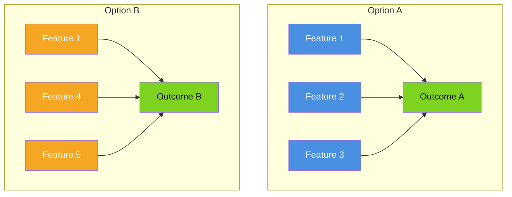
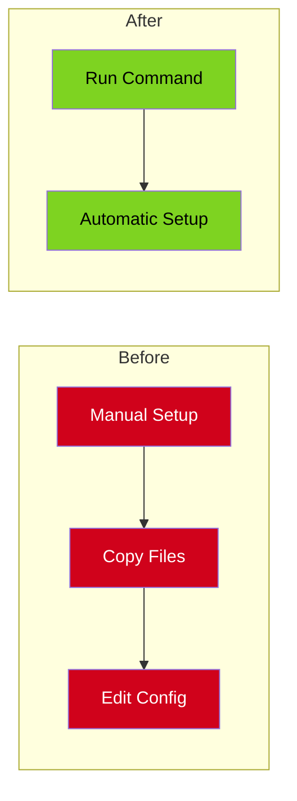
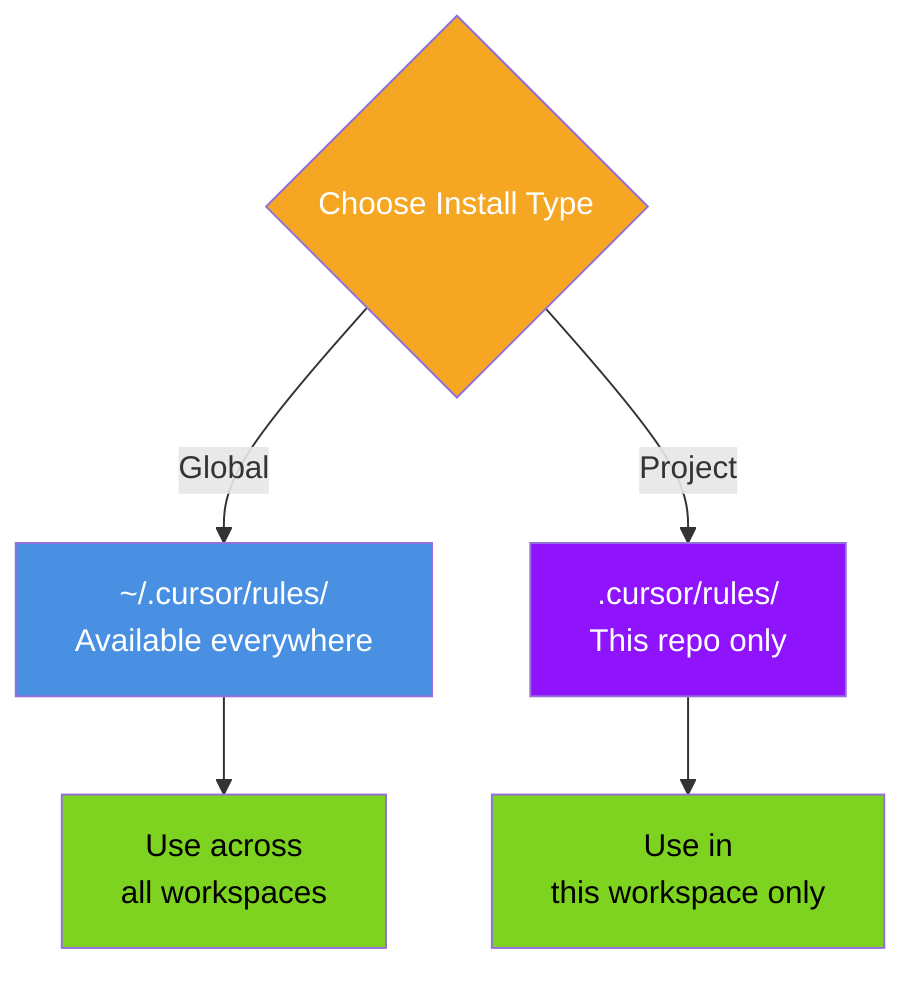

# Comparison Diagram Template

Use this template for side-by-side comparisons and before/after scenarios.

## Template

## Customization Guide

1. **Labels:** Replace "Option A/B" with actual comparison subjects
2. **Features:** List the distinguishing characteristics
3. **Colors:** Use consistent colors for each option throughout docs
4. **Outcomes:** Show what each option leads to
5. **Add notes:** Use Mermaid notes to highlight key differences

## Variations

### Before/After

### Global vs Project

## When to Use

- Comparing different approaches
- Showing global vs project installation
- Illustrating before/after improvements
- Contrasting tool formats
