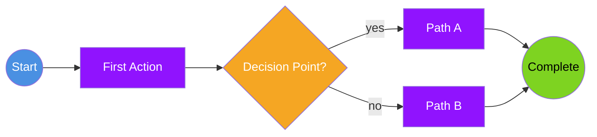
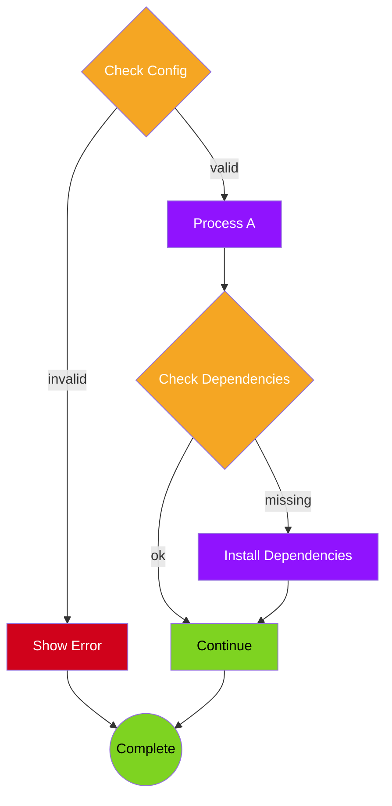

# Flow Diagram Template

Use this template for sequential processes, workflows, and decision trees.

## Template

## Customization Guide

1. **Direction:** Change `LR` (left-right) to `TB` (top-bottom), `RL`, or `BT` as needed
2. **Actions:** Replace with actual process steps
3. **Decisions:** Add more diamond nodes `{text}` for branching logic
4. **Colors:**
   - Blue (`#4A90E2`) for user actions
   - Purple (`#9013FE`) for system processes
   - Orange (`#F5A623`) for decisions
   - Green (`#7ED321`) for success/completion
   - Red (`#D0021B`) for errors/failures
5. **Labels:** Add text to arrows with `-->|label text|`

## Variations

### Simple Linear Flow

### Complex Decision Tree

## When to Use

- Documenting step-by-step processes
- Showing decision logic
- Illustrating user workflows
- Explaining command execution flow
