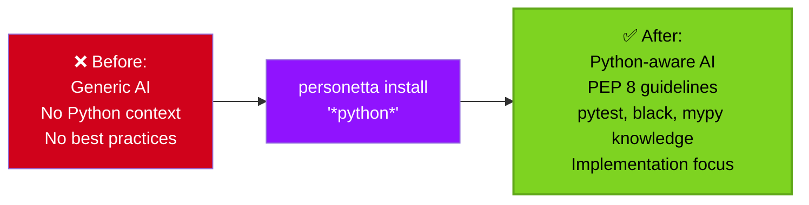
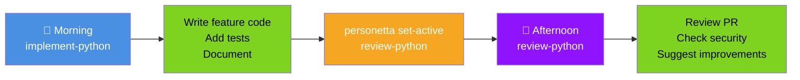
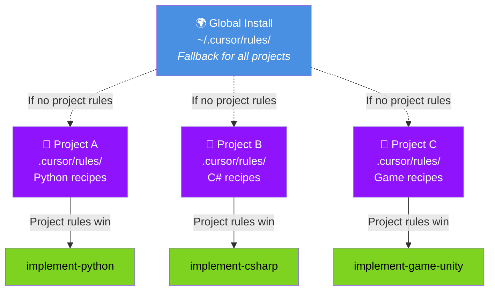
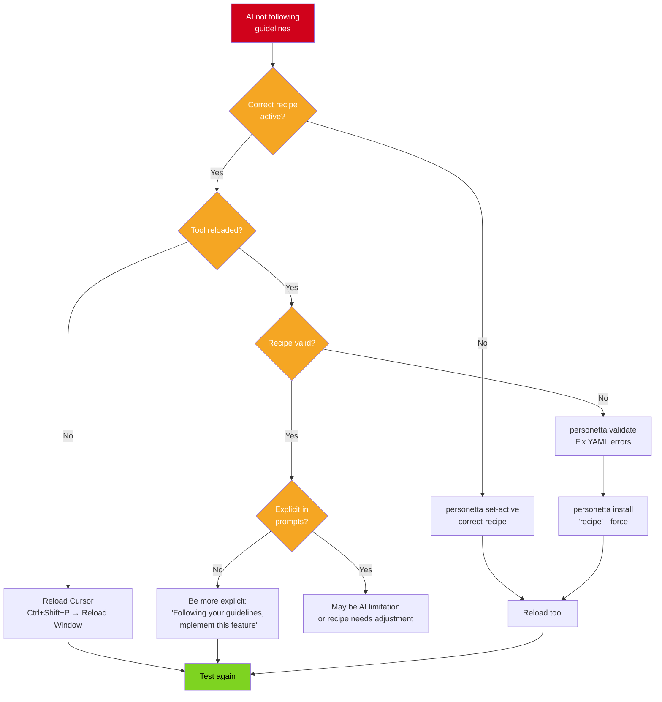

# Examples & Cookbook

Real-world scenarios showing how to use Personetta effectively. Each example includes context, solution, and expected results.

---

## Table of Contents

- [Getting Started Examples](#getting-started-examples)
- [Daily Workflow Examples](#daily-workflow-examples)
- [Custom Recipe Examples](#custom-recipe-examples)
- [Team Collaboration Examples](#team-collaboration-examples)
- [Troubleshooting Examples](#troubleshooting-examples)

---

## Getting Started Examples

### Example 1: First-Time Setup for Python Development

**Scenario:** You're a Python developer using Cursor and want to get Personetta working.

**Solution:**

```bash
# 1. Install Personetta
pip install personetta

# 2. Install Python-related recipes
personetta install '*python*' --format cursor

# 3. Activate implementation recipe
personetta set-active implement-python --format cursor

# 4. Reload Cursor
# Press Ctrl+Shift+P → "Reload Window"
```

**What you get:**



**Verify it works:**
```
Ask your AI: "I need to create a REST API in Python. What should I use?"

Expected response type:
- Mentions FastAPI or Flask (common frameworks)
- Suggests pytest for testing
- Mentions type hints
- Recommends project structure
```

---

### Example 2: Switching Between Implementation and Review

**Scenario:** You're implementing a feature in the morning, then reviewing a colleague's PR in the afternoon.

**Solution:**

```bash
# Morning: Implement feature
personetta set-active implement-python --format cursor

# Work on your feature...
# AI helps with implementation, testing, documentation

# Afternoon: Review PR
personetta set-active review-python --format cursor

# Review colleague's code
# AI helps spot bugs, security issues, readability problems
```

**Visual workflow:**



**Key insight:** Switching recipes takes < 1 second. Do it as often as your task changes!

---

## Daily Workflow Examples

### Example 3: Full-Stack Developer's Day

**Scenario:** You work on both backend (Python) and frontend (JavaScript) in the same day.

**Solution:**

```bash
# Setup (once)
personetta install '*python*' '*javascript*' --format cursor

# Morning: Backend API work
personetta set-active implement-python --format cursor
# Write API endpoints, add database models, write tests

# Lunch break

# Afternoon: Frontend integration
personetta set-active implement-javascript --format cursor
# Build UI components, connect to API, add client-side validation

# Late afternoon: Write tests
personetta set-active test-javascript --format cursor
# Write Jest tests for components

# Before leaving: Review backend PR
personetta set-active review-python --format cursor
# Review teammate's API changes
```

**Time saved:** ~2 hours per day from context-appropriate AI assistance.

---

### Example 4: Technical Lead's Day

**Scenario:** You spend time on architecture, code review, and mentoring.

**Solution:**

```bash
# Setup
personetta install 'design-*' 'review-*' --format cursor

# Morning: Architecture planning
personetta set-active design-python --format cursor
# Design new microservice, create API contracts, document decisions

# Mid-morning: Design review meeting
# (Keep design-python active)
# AI helps evaluate trade-offs during discussion

# Afternoon: Code reviews
personetta set-active review-python --format cursor
# Review 3 PRs from team members

# Late afternoon: Architecture documentation
personetta set-active design-python --format cursor
# Document architecture decisions made today
```

---

### Example 5: Security-Focused Review

**Scenario:** You're doing a security audit of backend code.

**Solution:**

```bash
# Install security-aware review recipe
personetta install 'review-*-secure' --format cursor

# Activate security-focused review
personetta set-active review-python-backend-secure --format cursor

# Now review code with security focus
# AI will emphasize:
# - Input validation
# - SQL injection risks
# - Authentication/authorization
# - Secrets management
# - Dependency vulnerabilities
```

**Example interaction:**
```
You: "Review this database query function"

AI (with security recipe):
"⚠️ Security concerns:
1. Query uses string concatenation - SQL injection risk
2. No input validation on user-supplied parameter
3. No rate limiting on database calls
4. Error messages expose database structure

Recommendations:
- Use parameterized queries
- Validate/sanitize inputs
- Add rate limiting
- Generic error messages to client"
```

---

## Custom Recipe Examples

### Example 6: Creating a Microservices Recipe

**Scenario:** Your team builds microservices and needs a specialized recipe.

**Solution:**

```yaml
# data/recipes/implement-python-microservice.yaml

name: implement-python-microservice
description: >
  Implement Python microservices with focus on API contracts,
  observability, and resilience patterns.

compose:
  - base/lifecycle/implementation-developer
  - base/layer/backend-developer
  - language-specific/python/python-developer

mixins:
  - readability-focused
  - scalability-focused
  - maintainability-focused

# Add microservice-specific guidelines
guidelines:
  - "Design API contracts first before implementation"
  - "Include health check endpoint (GET /health)"
  - "Implement circuit breakers for external dependencies"
  - "Use structured logging with correlation IDs"
  - "Add OpenAPI/Swagger documentation"
  - "Implement graceful shutdown handling"

tools:
  - name: "FastAPI"
    when: "Building REST APIs in Python"
  - name: "Prometheus"
    when: "Exposing metrics"
  - name: "OpenTelemetry"
    when: "Distributed tracing"

examples:
  - input: "Create a new microservice endpoint"
    output: "Defines API contract, implements handler, adds tests, documents in OpenAPI"

verification:
  - "Health check endpoint responds with 200"
  - "OpenAPI docs accessible at /docs"
  - "Prometheus metrics at /metrics"
  - "Integration tests pass"
```

**Install and use:**

```bash
# Validate your recipe
personetta validate --recipe implement-python-microservice

# Install it
personetta install 'implement-python-microservice' --format cursor

# Activate it
personetta set-active implement-python-microservice --format cursor
```

---

### Example 7: Creating a Game Development Recipe

**Scenario:** You're building a Unity game and want AI help with game mechanics.

**Solution:**

```yaml
# data/recipes/implement-game-unity.yaml

name: implement-game-unity
description: >
  Implement Unity game code with focus on performance,
  gameplay feel, and maintainable architecture.

compose:
  - base/lifecycle/implementation-developer
  - language-specific/csharp/csharp-developer

mixins:
  - performance-focused
  - readability-focused

guidelines:
  - "Use object pooling for frequently spawned objects"
  - "Avoid expensive operations in Update() - use coroutines"
  - "Cache component references in Start() or Awake()"
  - "Use ScriptableObjects for game data"
  - "Implement state machines for character behavior"
  - "Profile with Unity Profiler before optimizing"

tools:
  - name: "Unity Profiler"
    when: "Finding performance bottlenecks"
  - name: "Unity Test Framework"
    when: "Writing gameplay tests"

examples:
  - input: "Create an enemy spawner"
    output: "Uses object pooling, configurable via ScriptableObject, includes debug visualization"

verification:
  - "Profiler shows <1ms in Update()"
  - "No garbage allocation in hot paths"
  - "ScriptableObjects for all game data"
```

---

### Example 8: Team-Specific Recipe with Custom Tools

**Scenario:** Your team uses custom internal tools that AI should know about.

**Solution:**

```yaml
# data/recipes/implement-python-mycompany.yaml

name: implement-python-mycompany
description: >
  Python implementation following MyCompany conventions
  and using internal tools.

compose:
  - base/lifecycle/implementation-developer
  - base/layer/backend-developer
  - language-specific/python/python-developer

mixins:
  - readability-focused

# Company-specific guidelines
guidelines:
  - "Use company-logger for all logging"
  - "Follow the service-repository pattern"
  - "Put business logic in services/ directory"
  - "Put data access in repositories/ directory"
  - "Use company-auth for authentication"
  - "Follow API versioning: /api/v1/..."

# Company-specific tools
tools:
  - name: "company-cli"
    when: "Deploying services"
    example: "company-cli deploy --env staging"
  
  - name: "company-logger"
    when: "Structured logging"
    example: "from company_logger import get_logger; logger = get_logger(__name__)"
  
  - name: "company-auth"
    when: "Authentication/authorization"
    example: "from company_auth import require_auth; @require_auth(['read:users'])"

# Company-specific examples
examples:
  - input: "Create a new service"
    output: "Creates service class in services/, repository in repositories/, adds company-logger, uses company-auth"

# Company-specific verification
verification:
  - "Follows service-repository pattern"
  - "Uses company-logger for all logging"
  - "Authentication via company-auth"
  - "API versioned under /api/v1/"
```

---

## Team Collaboration Examples

### Example 9: Sharing Recipes via Git

**Scenario:** Your team wants to share Personetta recipes in a project repository.

**Solution:**

```bash
# 1. Create project-specific recipe
cat > data/recipes/my-project-api.yaml << 'EOF'
name: my-project-api
description: API development for MyProject

compose:
  - base/lifecycle/implementation-developer
  - base/layer/backend-developer
  - language-specific/python/python-developer

mixins:
  - readability-focused
  - security-aware

guidelines:
  - "Use the project's error handling decorator"
  - "Follow project's logging format"
EOF

# 2. Install to project (not global)
cd /path/to/project
personetta install 'my-project-api' --format cursor --target project

# 3. Commit to git
git add .cursor/rules/
git add data/recipes/my-project-api.yaml
git commit -m "Add Personetta recipes for team"
git push

# 4. Team members pull and activate
git pull
# Files in .cursor/rules/ are automatically picked up by Cursor
```

**Benefits:**
- Team shares same AI guidelines
- Consistent code style and patterns
- New members get context immediately
- Version controlled with code

---

### Example 10: Different Recipes for Different Projects

**Scenario:** You work on multiple projects with different tech stacks.

**Solution:**

```bash
# Project A: Python backend
cd ~/projects/project-a
personetta install '*python*' --format cursor --target project
personetta set-active implement-python --format cursor --target project

# Project B: C# microservices
cd ~/projects/project-b
personetta install '*csharp*' --format cursor --target project
personetta set-active implement-csharp --format cursor --target project

# Project C: Game development
cd ~/projects/game-project
personetta install '*game*' --format cursor --target project
personetta set-active implement-game-unity --format cursor --target project

# Now each project has its own recipes
# Cursor automatically uses the right ones based on which project is open!
```

**Visual:**



---

## Troubleshooting Examples

### Example 11: Recipe Not Working as Expected

**Scenario:** You activated a recipe but AI isn't following the guidelines.

**Diagnosis:**

```bash
# 1. Check which recipe is actually active
personetta current --format cursor

# 2. Preview the recipe content
personetta recipe implement-python --format cursor | head -100

# 3. Check the actual installed file
cat ~/.cursor/rules/personetta-active.md | head -50

# 4. Validate the recipe
personetta validate --recipe implement-python
```

**Common issues & fixes:**



---

### Example 12: Cleaning Up Old Installations

**Scenario:** You have old Recipe Forge files and want a fresh start.

**Solution:**

```bash
# 1. Remove all Personetta files
rm -rf ~/.cursor/rules/personetta-*
rm -rf ~/.personetta/

# 2. Fresh install
personetta install '*' --format cursor

# 3. Activate your preferred recipe
personetta set-active implement-python --format cursor

# 4. Reload Cursor
# Ctrl+Shift+P → "Reload Window"
```

---

### Example 13: Recipe Composition Not Working

**Scenario:** Your custom recipe doesn't include expected guidelines from base layers.

**Diagnosis:**

```bash
# Preview composed recipe
personetta recipe my-custom-recipe --format cursor --verbose

# Check base layer paths
# Make sure they exist:
ls data/base/lifecycle/
ls data/language_specific/python/

# Validate recipe
personetta validate --recipe my-custom-recipe --verbose
```

**Common mistakes:**

```yaml
# ❌ Wrong: Incorrect path
compose:
  - base/implementation-developer  # Missing 'lifecycle/'

# ✅ Correct: Full path
compose:
  - base/lifecycle/implementation-developer

# ❌ Wrong: Typo in mixin name
mixins:
  - performance-focus  # Should be 'performance-focused'

# ✅ Correct: Exact mixin name
mixins:
  - performance-focused
```

---

## Pro Tips

### Tip 1: Quick Recipe Switching with Aliases

```bash
# Add to ~/.bashrc or ~/.zshrc
alias pn-impl='personetta set-active implement-python --format cursor'
alias pn-review='personetta set-active review-python --format cursor'
alias pn-test='personetta set-active test-python --format cursor'
alias pn-design='personetta set-active design-python --format cursor'

# Now switch instantly:
pn-impl    # Switch to implementation
pn-review  # Switch to review
```

### Tip 2: Project-Specific Setup Script

```bash
#!/bin/bash
# setup-personetta.sh

# Install project recipes
personetta install 'implement-python' 'review-python' 'test-python' \
    --format cursor --target project

# Set default
personetta set-active implement-python --format cursor --target project

echo "✅ Personetta configured for this project"
echo "Run 'pn-review' to switch to review mode"
```

### Tip 3: Check Before Switching

```bash
# Show current before switching
personetta current && echo "Switching to review..." && \
personetta set-active review-python --format cursor
```

---

## Next Steps

- **Create your first recipe** - [Recipe Guide](recipe-guide.md)
- **Understand the system** - [Core Concepts](concepts.md)
- **See all commands** - [CLI Reference](cli-reference.md)
- **Troubleshoot issues** - [Troubleshooting](troubleshooting.md)

---

**Have a scenario to add?** Contribute examples via [GitHub Issues](https://github.com/your-org/personetta/issues)
