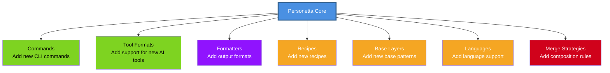
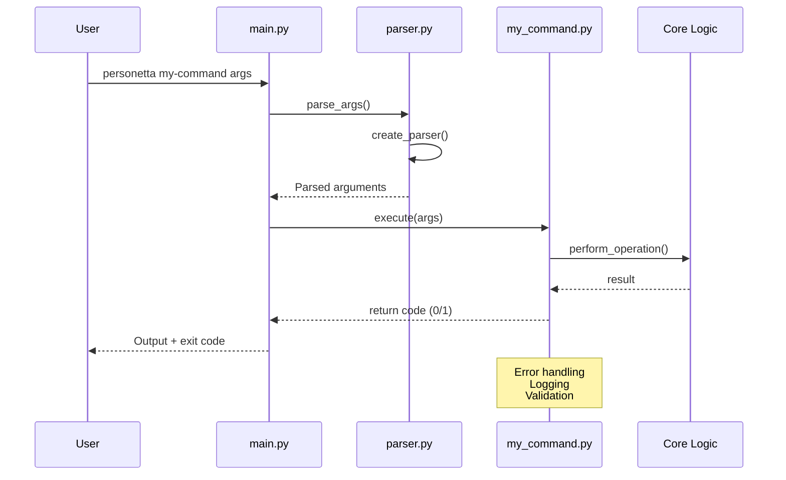
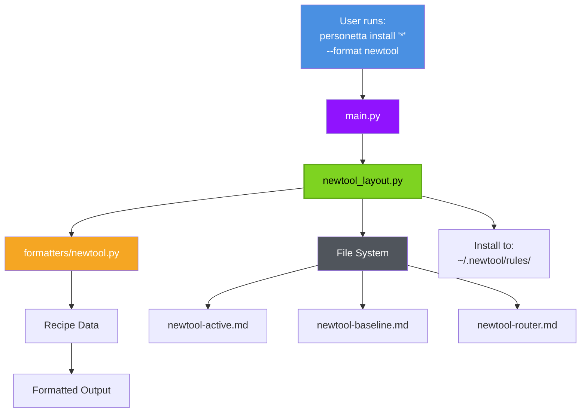

# Extending Personetta

Detailed guide to extending Personetta with new commands, tool formats, recipes, and features.

---

## Table of Contents

- [Extension Points Overview](#extension-points-overview)
- [Adding a New Command](#adding-a-new-command)
- [Adding a New Tool Format](#adding-a-new-tool-format)
- [Adding a New Formatter](#adding-a-new-formatter)
- [Adding Base Layers](#adding-base-layers)
- [Adding Language Support](#adding-language-support)
- [Modifying Merge Strategies](#modifying-merge-strategies)

---

## Extension Points Overview

Personetta is designed for extensibility at multiple layers:



**Difficulty levels:**
- 🟢 **Easy**: Recipes, base layers (YAML editing)
- 🟡 **Medium**: Commands, formatters (Python coding)
- 🔴 **Advanced**: Tool formats, merge strategies (architecture changes)

---

## Adding a New Command

**Difficulty:** 🟡 Medium  
**Time:** 30-60 minutes  
**Skills:** Python, CLI design

### Use Case

Add a new command like `personetta backup` or `personetta export`.

### Step-by-Step Guide

#### 1. Create Command Module

```bash
# Create new file
touch src/generator/cli/commands/my_command.py
```

#### 2. Implement Command Function

```python
# src/generator/cli/commands/my_command.py

"""My command description."""

from pathlib import Path
from typing import Optional
import logging

logger = logging.getLogger(__name__)


def execute(
    # Add command-specific arguments
    arg1: str,
    arg2: Optional[int] = None,
    verbose: bool = False
) -> int:
    """Execute my command.
    
    Args:
        arg1: Description of arg1
        arg2: Description of arg2
        verbose: Enable verbose output
        
    Returns:
        0 on success, 1 on error
        
    Raises:
        ValueError: If arguments invalid
    """
    try:
        # Setup logging
        if verbose:
            logging.basicConfig(level=logging.DEBUG)
        
        logger.info(f"Executing my_command with {arg1}")
        
        # Command logic here
        result = perform_operation(arg1, arg2)
        
        # Output
        print(f"Success: {result}")
        return 0
        
    except Exception as e:
        logger.error(f"Error executing my_command: {e}")
        if verbose:
            raise
        return 1


def perform_operation(arg1: str, arg2: Optional[int]) -> str:
    """Core logic for the command."""
    # Implementation here
    return f"Processed {arg1}"
```

#### 3. Register in CLI Parser

```python
# src/generator/cli/parser.py

def create_parser() -> argparse.ArgumentParser:
    """Create the CLI parser."""
    parser = argparse.ArgumentParser(
        prog="personetta",
        description="Composable AI coding assistant recipes"
    )
    
    subparsers = parser.add_subparsers(dest="command", help="Commands")
    
    # ... existing commands ...
    
    # Add your new command
    my_cmd = subparsers.add_parser(
        "my-command",
        help="Description of my command"
    )
    my_cmd.add_argument(
        "arg1",
        help="Description of arg1"
    )
    my_cmd.add_argument(
        "--arg2",
        type=int,
        help="Description of arg2"
    )
    my_cmd.add_argument(
        "-v", "--verbose",
        action="store_true",
        help="Enable verbose output"
    )
    
    return parser
```

#### 4. Wire Up in Main

```python
# src/generator/cli/main.py

from generator.cli.commands import (
    install,
    set_active,
    remove,
    # ... existing imports ...
    my_command,  # Add your import
)

def main() -> int:
    """Main entry point."""
    args = parser.parse_args()
    
    if args.command == "install":
        return install.execute(...)
    # ... existing commands ...
    elif args.command == "my-command":
        return my_command.execute(
            arg1=args.arg1,
            arg2=args.arg2,
            verbose=args.verbose
        )
    else:
        parser.print_help()
        return 1
```

#### 5. Add Tests

```python
# tests/unit/cli/test_my_command.py

import pytest
from generator.cli.commands import my_command


def test_execute_success():
    """Test successful execution."""
    result = my_command.execute(arg1="test")
    assert result == 0


def test_execute_with_arg2():
    """Test with optional argument."""
    result = my_command.execute(arg1="test", arg2=42)
    assert result == 0


def test_execute_invalid_args():
    """Test with invalid arguments."""
    with pytest.raises(ValueError):
        my_command.execute(arg1="")


def test_verbose_mode(capsys):
    """Test verbose output."""
    my_command.execute(arg1="test", verbose=True)
    captured = capsys.readouterr()
    assert "Executing my_command" in captured.out
```

#### 6. Test and Verify

```bash
# Run unit tests
pytest tests/unit/cli/test_my_command.py -v

# Test command manually
personetta my-command test-value --arg2 42 -v

# Run full test suite
pytest tests/
```

### Command Flow Diagram



---

## Adding a New Tool Format

**Difficulty:** 🔴 Advanced  
**Time:** 2-4 hours  
**Skills:** Python, file system operations, format specifications

### Use Case

Add support for a new AI coding assistant (e.g., Windsurf, Zed AI).

### Architecture Overview



### Step-by-Step Guide

#### 1. Create Layout Module

```bash
# Create layout file
touch src/generator/newtool_layout.py
```

```python
# src/generator/newtool_layout.py

"""NewTool-specific file layout and installation."""

from pathlib import Path
from typing import Optional
import logging

logger = logging.getLogger(__name__)


class NewToolLayout:
    """Manage NewTool file layout."""
    
    def __init__(self, target: str = "global"):
        """Initialize layout.
        
        Args:
            target: "global" or "project" or absolute path
        """
        self.target = target
        self.base_path = self._resolve_base_path()
    
    def _resolve_base_path(self) -> Path:
        """Resolve the base installation path."""
        if self.target == "global":
            # Global installation
            return Path.home() / ".newtool" / "rules"
        elif self.target == "project":
            # Project-local installation
            return Path.cwd() / ".newtool" / "rules"
        else:
            # Custom path
            return Path(self.target) / ".newtool" / "rules"
    
    def get_active_file_path(self) -> Path:
        """Get path for active recipe file."""
        return self.base_path / "newtool-active.md"
    
    def get_baseline_file_path(self) -> Path:
        """Get path for baseline file."""
        return self.base_path / "newtool-baseline.md"
    
    def get_router_file_path(self) -> Path:
        """Get path for router file."""
        return self.base_path / "newtool-router.md"
    
    def install(
        self,
        active_content: str,
        baseline_content: str,
        router_content: str
    ) -> bool:
        """Install files to NewTool directory.
        
        Args:
            active_content: Content for active recipe
            baseline_content: Content for baseline
            router_content: Content for router
            
        Returns:
            True on success, False on failure
        """
        try:
            # Create directory
            self.base_path.mkdir(parents=True, exist_ok=True)
            
            # Write files
            self.get_active_file_path().write_text(
                active_content, encoding="utf-8"
            )
            self.get_baseline_file_path().write_text(
                baseline_content, encoding="utf-8"
            )
            self.get_router_file_path().write_text(
                router_content, encoding="utf-8"
            )
            
            logger.info(f"Installed to {self.base_path}")
            return True
            
        except Exception as e:
            logger.error(f"Installation failed: {e}")
            return False
    
    def remove(self) -> bool:
        """Remove all NewTool files."""
        try:
            for path in [
                self.get_active_file_path(),
                self.get_baseline_file_path(),
                self.get_router_file_path()
            ]:
                if path.exists():
                    path.unlink()
            
            # Remove directory if empty
            if self.base_path.exists() and not any(self.base_path.iterdir()):
                self.base_path.rmdir()
            
            logger.info(f"Removed from {self.base_path}")
            return True
            
        except Exception as e:
            logger.error(f"Removal failed: {e}")
            return False
```

#### 2. Create Formatter (If Needed)

```bash
# Create formatter file
touch src/generator/formatters/newtool.py
```

```python
# src/generator/formatters/newtool.py

"""NewTool-specific output formatter."""

from typing import Any


def format_recipe(recipe: dict[str, Any]) -> str:
    """Format recipe for NewTool.
    
    Args:
        recipe: Recipe dictionary
        
    Returns:
        Formatted string in NewTool format
    """
    lines = []
    
    # Header
    lines.append(f"# {recipe['name']}")
    lines.append("")
    lines.append(recipe.get("description", ""))
    lines.append("")
    
    # Guidelines
    if "guidelines" in recipe:
        lines.append("## Guidelines")
        lines.append("")
        for guideline in recipe["guidelines"]:
            lines.append(f"- {guideline}")
        lines.append("")
    
    # Tools
    if "tools" in recipe:
        lines.append("## Preferred Tools")
        lines.append("")
        for tool in recipe["tools"]:
            lines.append(f"**{tool['name']}**: {tool.get('when', '')}")
        lines.append("")
    
    return "\n".join(lines)
```

#### 3. Register Format

```python
# src/generator/output_formats.py

from generator.formatters import (
    cursor,
    copilot,
    claude,
    cline,
    newtool,  # Add import
)

# Format registry
FORMATS = {
    "cursor": {
        "formatter": cursor.format_recipe,
        "layout": "generator.cursor_layout.CursorLayout"
    },
    # ... existing formats ...
    "newtool": {
        "formatter": newtool.format_recipe,
        "layout": "generator.newtool_layout.NewToolLayout"
    }
}


def get_formatter(format_name: str):
    """Get formatter for format."""
    if format_name not in FORMATS:
        raise ValueError(f"Unknown format: {format_name}")
    return FORMATS[format_name]["formatter"]


def get_layout_class(format_name: str):
    """Get layout class for format."""
    if format_name not in FORMATS:
        raise ValueError(f"Unknown format: {format_name}")
    
    # Dynamic import
    module_path, class_name = FORMATS[format_name]["layout"].rsplit(".", 1)
    module = __import__(module_path, fromlist=[class_name])
    return getattr(module, class_name)
```

#### 4. Add Tests

```python
# tests/integration/test_newtool_layout.py

import pytest
from pathlib import Path
from generator.newtool_layout import NewToolLayout


def test_global_install(tmp_path, monkeypatch):
    """Test global installation."""
    # Mock home directory
    monkeypatch.setattr(Path, "home", lambda: tmp_path)
    
    layout = NewToolLayout(target="global")
    
    success = layout.install(
        active_content="# Active",
        baseline_content="# Baseline",
        router_content="# Router"
    )
    
    assert success
    assert layout.get_active_file_path().exists()
    assert layout.get_baseline_file_path().exists()
    assert layout.get_router_file_path().exists()


def test_project_install(tmp_path, monkeypatch):
    """Test project-local installation."""
    # Mock current directory
    monkeypatch.setattr(Path, "cwd", lambda: tmp_path)
    
    layout = NewToolLayout(target="project")
    
    success = layout.install(
        active_content="# Active",
        baseline_content="# Baseline",
        router_content="# Router"
    )
    
    assert success
    assert (tmp_path / ".newtool" / "rules").exists()


def test_remove(tmp_path, monkeypatch):
    """Test file removal."""
    monkeypatch.setattr(Path, "home", lambda: tmp_path)
    
    layout = NewToolLayout(target="global")
    layout.install("# Active", "# Baseline", "# Router")
    
    success = layout.remove()
    
    assert success
    assert not layout.get_active_file_path().exists()
```

```python
# tests/integration/test_newtool_formatter.py

import pytest
from generator.formatters import newtool


def test_format_basic_recipe():
    """Test formatting basic recipe."""
    recipe = {
        "name": "test-recipe",
        "description": "Test description",
        "guidelines": ["Guideline 1", "Guideline 2"],
        "tools": [
            {"name": "Tool1", "when": "Use case 1"}
        ]
    }
    
    output = newtool.format_recipe(recipe)
    
    assert "# test-recipe" in output
    assert "Test description" in output
    assert "Guideline 1" in output
    assert "Tool1" in output
```

#### 5. Update Documentation

```bash
# Add to README.md
echo "- NewTool: \`~/.newtool/rules/\`" >> README.md

# Add to quickstart.md
# Document NewTool installation steps
```

#### 6. Test End-to-End

```bash
# Install for NewTool
personetta install '*python*' --format newtool

# Verify files created
ls ~/.newtool/rules/

# Expected output:
# newtool-active.md
# newtool-baseline.md
# newtool-router.md

# Set active
personetta set-active implement-python --format newtool

# Verify content
cat ~/.newtool/rules/newtool-active.md

# Remove
personetta remove --format newtool --all
```

---

## Adding a New Formatter

**Difficulty:** 🟡 Medium  
**Time:** 1-2 hours  
**Skills:** Python, text formatting

### Use Case

Add a new output format (e.g., JSON, TOML, custom markdown variant).

### Example: JSON Formatter

```python
# src/generator/formatters/json_format.py

"""JSON output formatter."""

import json
from typing import Any


def format_recipe(recipe: dict[str, Any]) -> str:
    """Format recipe as JSON.
    
    Args:
        recipe: Recipe dictionary
        
    Returns:
        JSON string
    """
    return json.dumps(recipe, indent=2, ensure_ascii=False)


def format_multiple_recipes(recipes: list[dict[str, Any]]) -> str:
    """Format multiple recipes as JSON array.
    
    Args:
        recipes: List of recipe dictionaries
        
    Returns:
        JSON array string
    """
    return json.dumps(recipes, indent=2, ensure_ascii=False)
```

Register in `output_formats.py`:

```python
FORMATS = {
    # ... existing formats ...
    "json": {
        "formatter": json_format.format_recipe,
        "layout": None  # No file layout for JSON
    }
}
```

---

## Adding Base Layers

**Difficulty:** 🟢 Easy  
**Time:** 15-30 minutes  
**Skills:** YAML editing

### Use Case

Add new base patterns for common workflows (e.g., "debugging-specialist", "performance-optimizer").

### Example: Debugging Specialist Layer

```yaml
# data/base/lifecycle/debugging-specialist.yaml

name: debugging-specialist
description: >
  Specialist in debugging, troubleshooting, and root cause analysis.
  Systematic problem-solving approach.

you-should:
  - "Reproduce the issue reliably before attempting fixes"
  - "Use scientific method: hypothesis, test, analyze, iterate"
  - "Check logs, stack traces, and error messages thoroughly"
  - "Use debuggers and profilers rather than print statements"
  - "Verify fixes don't introduce new issues"
  - "Document the root cause and solution"

you-should-not:
  - "Random trial-and-error changes"
  - "Debugging in production without safeguards"
  - "Ignoring error messages"
  - "Fixing symptoms instead of root causes"

guidelines:
  - "Add instrumentation before debugging - logs, metrics, traces"
  - "Isolate the problem - binary search for the breaking change"
  - "Simplify - remove complexity until issue disappears"
  - "Read the error message carefully - it usually tells you the problem"
  - "Use version control - bisect to find when issue was introduced"

tools:
  - name: "debugger"
    when: "Step-through debugging needed"
  
  - name: "profiler"
    when: "Performance issue investigation"
  
  - name: "logging framework"
    when: "Adding debug instrumentation"

examples:
  - input: "Application crashes intermittently"
    output: >
      1. Add detailed logging around suspected code
      2. Reproduce crash reliably
      3. Analyze logs and stack trace
      4. Form hypothesis
      5. Test hypothesis with minimal change
      6. Verify fix
      7. Add regression test

tone: Systematic and methodical

output-format: Step-by-step analysis
```

### Using the New Layer

```yaml
# data/recipes/debug-python.yaml

name: debug-python
description: Debug Python applications systematically

compose:
  - base/lifecycle/debugging-specialist
  - language_specific/python/python-developer

mixins:
  - readability-focused
```

---

## Adding Language Support

**Difficulty:** 🟢 Easy  
**Time:** 30-60 minutes  
**Skills:** YAML editing, language expertise

### Example: Adding Rust Support

```yaml
# data/language_specific/rust/rust-developer.yaml

name: rust-developer
description: >
  Rust programming with focus on memory safety,
  performance, and idiomatic code.

you-should:
  - "Embrace the borrow checker - it prevents bugs"
  - "Use cargo for all build and dependency management"
  - "Write comprehensive tests with cargo test"
  - "Document public APIs with doc comments"
  - "Use Result<T, E> for error handling"
  - "Prefer iterators over loops for collection operations"

you-should-not:
  - "Using unsafe unless absolutely necessary"
  - "Ignoring compiler warnings"
  - "Manual memory management via raw pointers"
  - "Panic in library code"

guidelines:
  - "Follow Rust naming conventions (snake_case for functions/variables)"
  - "Use clippy for linting: cargo clippy"
  - "Format with rustfmt: cargo fmt"
  - "Enable all warnings: #![warn(clippy::all)]"
  - "Prefer owned types in public APIs"
  - "Use lifetimes explicitly when needed"

tools:
  - name: "cargo"
    when: "Build, test, and dependency management"
  
  - name: "clippy"
    when: "Linting and code quality checks"
  
  - name: "rustfmt"
    when: "Code formatting"
  
  - name: "rust-analyzer"
    when: "IDE support and type checking"

examples:
  - input: "Create a library function"
    output: >
      pub fn process_data(input: &str) -> Result<String, Error> {
          // Implementation
      }
```

Create recipes using Rust:

```yaml
# data/recipes/implement-rust.yaml

name: implement-rust
description: Implement Rust applications with safety and performance

compose:
  - base/lifecycle/implementation-developer
  - language_specific/rust/rust-developer

mixins:
  - performance-focused
  - readability-focused
```

---

## Modifying Merge Strategies

**Difficulty:** 🔴 Advanced  
**Time:** 2-4 hours  
**Skills:** Python, YAML, merge logic

### Use Case

Change how layers are composed (e.g., new merge strategy for lists, custom conflict resolution).

### Current Merge Strategies

```yaml
# data/config/merge-config.yaml

# How to merge different field types
merge-strategies:
  lists:
    strategy: "append"  # Combine lists
    deduplicate: true   # Remove duplicates
  
  dicts:
    strategy: "deep-merge"  # Recursively merge
    conflict-resolution: "overlay-wins"  # Later wins
  
  strings:
    strategy: "replace"  # Later replaces earlier
```

### Example: Adding "Priority Merge" Strategy

**Scenario:** You want certain layers to always override others, regardless of order.

```python
# src/generator/merger.py

class RecipeMerger:
    """Merge recipe layers with various strategies."""
    
    def merge_with_priority(
        self,
        layers: list[dict],
        priorities: dict[str, int]
    ) -> dict:
        """Merge layers respecting priority levels.
        
        Args:
            layers: List of layer dictionaries
            priorities: Layer name -> priority mapping
                       Higher priority = higher precedence
        
        Returns:
            Merged dictionary
        """
        # Sort by priority
        sorted_layers = sorted(
            layers,
            key=lambda x: priorities.get(x.get("name", ""), 0)
        )
        
        # Merge in priority order
        result = {}
        for layer in sorted_layers:
            result = self._deep_merge(result, layer)
        
        return result
```

Update config:

```yaml
# data/config/merge-config.yaml

merge-strategies:
  # ... existing strategies ...
  
  priority:
    enabled: true
    priorities:
      # Higher number = higher priority
      security-aware: 100
      performance-focused: 50
      readability-focused: 25
```

---

## Testing Your Extensions

### Test Checklist

- [ ] Unit tests for new code
- [ ] Integration tests for workflows
- [ ] Quality checks pass
- [ ] Documentation updated
- [ ] Examples added
- [ ] Manual testing completed

### Running Tests

```bash
# Unit tests
pytest tests/unit/ -v

# Integration tests
pytest tests/integration/ -v

# Quality checks
pytest tests/quality/ -v

# Full suite
pytest tests/ -v

# With coverage
pytest --cov=src/generator tests/
```

---

## Best Practices for Extensions

### 1. Follow Existing Patterns

```python
# ✅ Good: Follow existing structure
class NewToolLayout:
    def __init__(self, target: str = "global"):
        self.target = target
        self.base_path = self._resolve_base_path()
    
    def _resolve_base_path(self) -> Path:
        # Same pattern as other layouts
        ...

# ❌ Bad: Completely different structure
class NewLayout:
    def __init__(self, x, y, z):
        # Different from all other layouts
        ...
```

### 2. Maintain Quality Standards

```python
# All code must pass:
# - Complexity ≤ 10
# - Function size ≤ 25 lines
# - File size ≤ 400 lines
# - Test coverage ≥ 90%
```

### 3. Document Thoroughly

```python
def my_new_function(arg: str) -> dict:
    """One-line summary.
    
    Longer description if needed.
    
    Args:
        arg: Description
        
    Returns:
        Description
        
    Raises:
        ValueError: When
    
    Example:
        >>> my_new_function("test")
        {'result': 'test'}
    """
    pass
```

---

## Getting Help

### Development Questions

1. **Check existing code** - Similar features show the pattern
2. **Read tests** - Tests document expected behavior
3. **Run with --verbose** - See detailed execution
4. **Open an issue** - Describe what you're trying to add

### Submitting Extensions

See [Contributing Guide](contributing.md) for:
- PR process
- Code review guidelines
- Acceptance criteria

---

**Ready to extend?** Start with adding a new recipe (easiest) or command (moderate complexity)!
