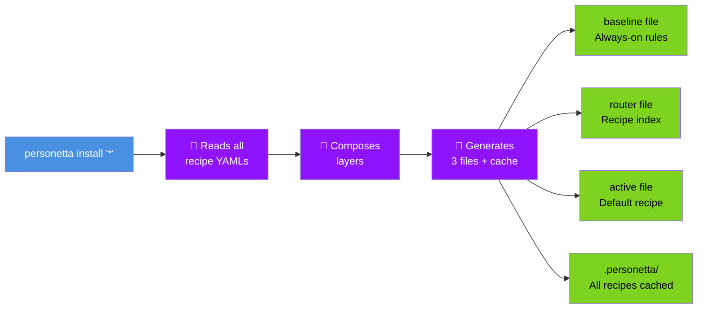
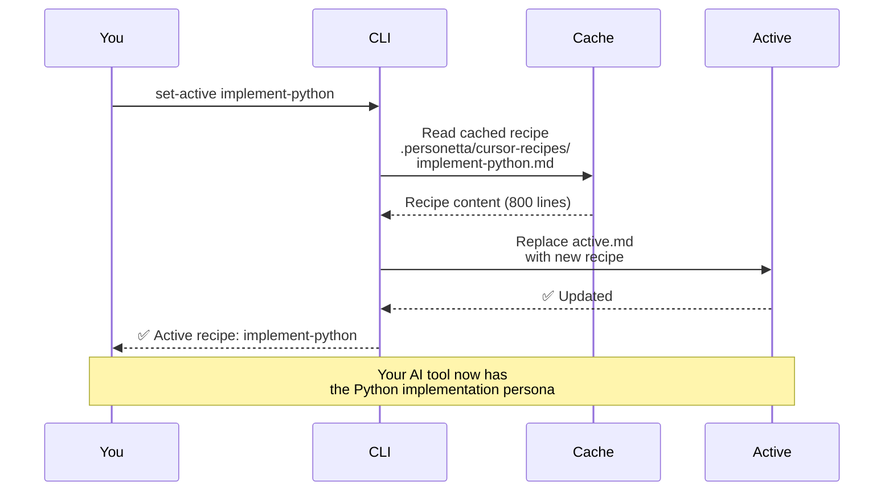
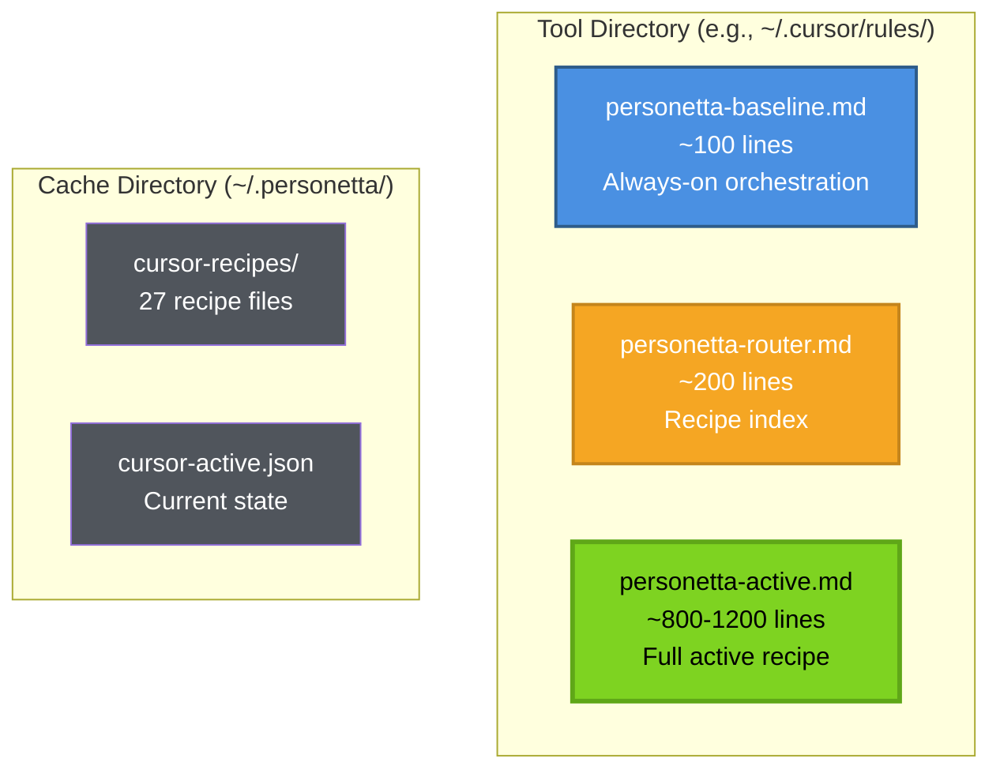

# Quick Start Guide

Get Personetta working in **5 minutes**. This guide walks you through installation, setup, and your first recipe activation.

---

## 🎯 5-Minute Setup Flow


**Estimated time:** 5 minutes  
**Prerequisites:** Python 3.11+ installed

---

## Step 1: Install Personetta (1 minute)

### Recommended: Install from PyPI

```bash
pip install personetta
```

Prefer an isolated install? [pipx](https://pipx.pypa.io/) keeps the CLI out of your project environments:

```bash
pipx install personetta
```

**Windows convenience setup** (PATH check + verification):

```powershell
.\scripts\Setup-Personetta.ps1
```

**Linux/macOS:**

```bash
./scripts/install-personetta.sh
```

Both scripts:
- ✓ Install (or upgrade) Personetta via pip/pipx
- ✓ Ensure global command access
- ✓ Are safe to run multiple times

### Alternative: Install from Source

```bash
# Clone and install
git clone https://github.com/EdwardAF-IT/Personetta.git
cd Personetta
pip install --user -e ".[dev]"
```

**Verify installation:**
```bash
personetta --version
```

**If command not found:**
```bash
# Option 1: Fix it
.\scripts\Setup-Personetta.ps1  # Then restart terminal

# Option 2: Use module form (always works)
python -m generator.cli.main --version

# See detailed guide:
# docs/global-command-setup.md
```

---

## Step 2: Generate Recipes for Your Tool (2 minutes)

Choose your AI coding assistant and run the install command:

### For Cursor

```bash
personetta install '*' --format cursor
```

### For GitHub Copilot

```bash
personetta install '*' --format copilot
```

### For Claude Code

```bash
personetta install '*' --format claude
```

### For Cline

```bash
personetta install '*' --format cline
```

**What this does:**



### Where Files Are Created

| Tool | Location |
|------|----------|
| **Cursor** | `~/.cursor/rules/` |
| **Copilot** | `~/.copilot/instructions/` |
| **Claude** | `~/.claude/rules/` |
| **Cline** | `~/Documents/Cline/Rules/` |

**Success message:**
```
✅ Installed 27 recipes for cursor
✅ Generated: baseline, router, active
✅ Active recipe: implement-python
```

---

## Step 3: Activate Your First Recipe (1 minute)

Browse available recipes:

```bash
personetta list
```

**Example output:**
```
Available recipes:

Design Recipes:
  - design-csharp          : Architect C# backend systems
  - design-python          : Architect Python backend systems
  - design-powershell      : Architect PowerShell infrastructure

Implementation Recipes:
  - implement-csharp       : Implement C# backend code
  - implement-python       : Implement Python backend code
  - implement-powershell   : Implement PowerShell scripts

Review Recipes:
  - review-csharp          : Review C# code for quality
  - review-python          : Review Python code for quality

Test Recipes:
  - test-csharp            : Write xUnit tests for C#
  - test-python            : Write pytest tests for Python
```

**Activate a recipe:**

```bash
# Example: Activate Python implementation recipe for Cursor
personetta set-active implement-python --format cursor
```

**What happens:**



---

## Step 4: Start Working! (1 minute)

### For Cursor

1. **Reload window** (if Cursor was already open)
   - Press `Ctrl+Shift+P` (Windows/Linux) or `Cmd+Shift+P` (Mac)
   - Type "Reload Window"
2. Open Cursor and start coding
3. The AI will follow your active recipe's guidelines

### For GitHub Copilot

1. **Reload VS Code** (if it was already open)
2. Start a chat with Copilot
3. The persona is automatically active

### For Claude Code / Cline

1. Restart your terminal
2. Start a new conversation
3. The recipe is loaded automatically

---

## 📂 What Got Created?

After installation, your file system looks like this:



**Key files:**
- **baseline.md** - Thin orchestration layer (always loaded)
- **router.md** - Index of all recipes (contextually loaded)
- **active.md** - Your currently active recipe (always loaded)
- **Cache directory** - Pre-generated recipes for fast switching

---

## 🔄 Switching Recipes

Want to switch to a different persona? Just run `set-active` again:

```bash
# Switch to C# implementation
personetta set-active implement-csharp --format cursor

# Switch to Python review
personetta set-active review-python --format cursor

# Switch to test writing
personetta set-active test-python --format cursor
```

**Switching is instant** - it just replaces the active file with a different cached recipe.

---

## ✅ Verification

Test that everything works:

### 1. Check Files Exist

**Cursor:**
```bash
ls ~/.cursor/rules/
```

**Copilot:**
```bash
ls ~/.copilot/instructions/
```

**Claude:**
```bash
ls ~/.claude/rules/
```

You should see:
- `personetta-baseline.*`
- `personetta-router.*`
- `personetta-active.*`

### 2. Check Active Recipe

```bash
personetta current
```

Should show your active recipe name.

### 3. Test in Your AI Tool

Open your AI coding assistant and ask:
> "What role are you playing? What guidelines are you following?"

The AI should describe the active recipe's persona.

---

## 🚨 Troubleshooting

### Command not found: personetta

**Solution:** Make sure Python's Scripts directory is in your PATH.

**Windows:**
```powershell
# Check if it's in PATH
$env:PATH -split ';' | Where-Object { $_ -like '*Python*Scripts*' }

# If not, add it temporarily
$env:PATH += ";$env:LOCALAPPDATA\Programs\Python\Python311\Scripts"
```

**Linux/Mac:**
```bash
# Add to PATH temporarily
export PATH="$HOME/.local/bin:$PATH"

# Or use full path
python -m generator.cli.main --help
```

### Installation failed or incomplete

**Check for errors:**
```bash
personetta install '*' --format cursor --verbose
```

**Common issues:**
- Python version < 3.11 (check with `python --version`)
- Missing dependencies (run `pip install -e ".[dev]"`)
- Permission issues (use appropriate user permissions)

### Active file not updating

**Force regeneration:**
```bash
# Remove existing files
rm -rf ~/.cursor/rules/personetta-*
rm -rf ~/.personetta/

# Reinstall
personetta install '*' --format cursor
```

### More help

See the full [Troubleshooting Guide](troubleshooting.md) for detailed solutions.

---

## 🎉 Next Steps

Now that you're set up:

1. **Explore recipes** - Try different personas for different tasks
   ```bash
   personetta list
   ```

2. **Learn the concepts** - Understand how Personetta works
   - Read [Core Concepts](concepts.md)
   - See [Visual Diagrams](diagrams.md)

3. **Customize recipes** - Create your own recipes
   - Read [Recipe Guide](recipe-guide.md)

4. **Read the full guide** - Complete workflows and advanced features
   - [User Guide](user-guide.md)

---

## 📊 Quick Reference

### Common Commands

| Command | Purpose |
|---------|---------|
| `personetta install '*' --format cursor` | Install all recipes |
| `personetta list` | Show available recipes |
| `personetta set-active <recipe> --format <tool>` | Switch active recipe |
| `personetta current` | Show current active recipe |
| `personetta remove '<pattern>' --format <tool>` | Remove recipes |
| `personetta validate` | Validate YAML files |

### Tool Format Flags

- `--format cursor` - For Cursor
- `--format copilot` - For GitHub Copilot
- `--format claude` - For Claude Code
- `--format cline` - For Cline

### Common Options

- `--target global` - Install to user home (default)
- `--target project` - Install to current project only
- `--verbose` - Show detailed output
- `--dry-run` - Preview without making changes

---

**Questions?** See [User Guide](user-guide.md) | [Troubleshooting](troubleshooting.md) | [GitHub Issues](https://github.com/EdwardAF-IT/Personetta/issues)
