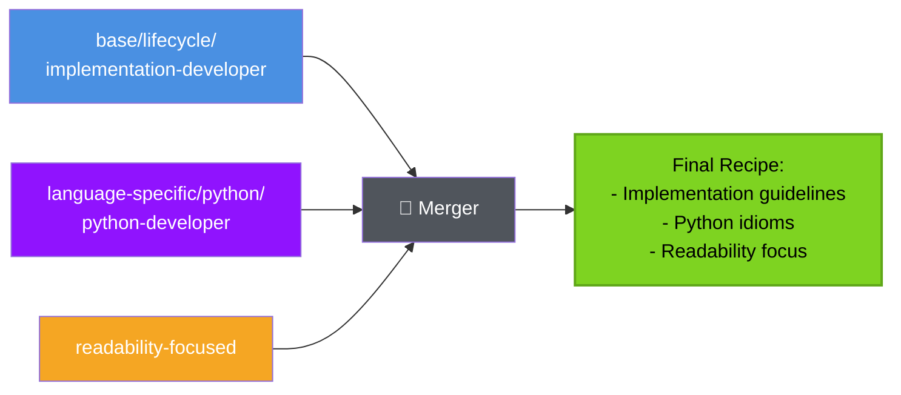
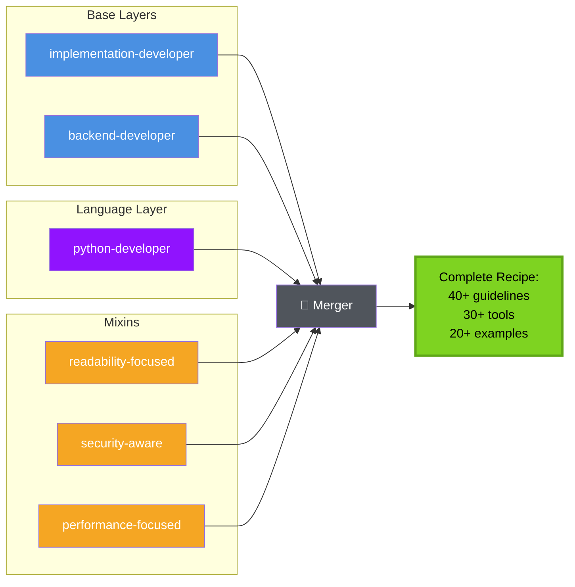
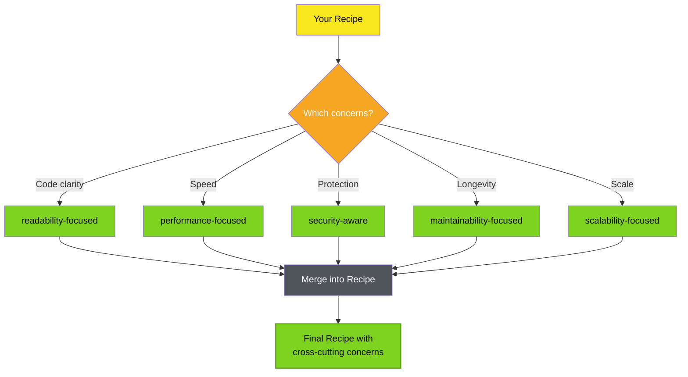
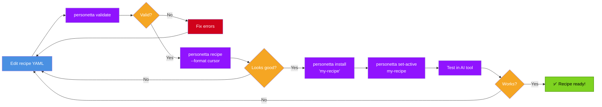

# Recipe Guide

Learn to create, customize, and compose recipes. This guide covers the recipe YAML format, composition patterns, and best practices.

---

## Table of Contents

- [Recipe Anatomy](#recipe-anatomy)
- [Creating Your First Recipe](#creating-your-first-recipe)
- [Composition Patterns](#composition-patterns)
- [Layer Reference](#layer-reference)
- [Mixin Reference](#mixin-reference)
- [Advanced Techniques](#advanced-techniques)
- [Testing Recipes](#testing-recipes)

---

## Recipe Anatomy

A recipe is a YAML file that defines a complete AI persona through composition:

```yaml
name: implement-python-backend-perf
description: >
  Implement Python backend code with emphasis on readability, security,
  performance, and maintainability.

compose:
  - base/lifecycle/implementation-developer
  - base/layer/backend-developer
  - language-specific/python/python-developer

mixins:
  - readability-focused
  - security-aware
  - performance-focused
  - maintainability-focused

# Optional overrides
tone: Professional and analytical
output_format: Structured design document

examples:
  - input: "Add caching to this API"
    output: "Evaluates Redis vs in-memory, documents trade-offs..."

verification:
  - "Code follows PEP 8"
  - "Tests pass - pytest tests/"
  - "Performance profiled with cProfile"
```

### Field Reference

```mermaid
graph TB
    Recipe[Recipe YAML File]
    
    Recipe --> Required
    Recipe --> Optional
    
    subgraph "Required Fields"
        R1[<b>name</b><br/>Unique identifier<br/>kebab-case]
        R2[<b>description</b><br/>What this recipe does<br/>1-2 sentences]
        R3[<b>compose</b><br/>List of base layers<br/>Path to YAML files]
    end
    
    subgraph "Optional Fields"
        O1[<b>mixins</b><br/>Cross-cutting concerns<br/>List of mixin names]
        O2[<b>tone</b><br/>AI personality<br/>String]
        O3[<b>output_format</b><br/>Response style<br/>String]
        O4[<b>examples</b><br/>Input/output pairs<br/>List of objects]
        O5[<b>verification</b><br/>Success criteria<br/>List of strings]
        O6[<b>tools</b><br/>Recommended tools<br/>List of objects]
        O7[<b>guidelines</b><br/>Additional rules<br/>List of strings]
    end
    
    Required --> R1
    Required --> R2
    Required --> R3
    
    Optional --> O1
    Optional --> O2
    Optional --> O3
    Optional --> O4
    Optional --> O5
    Optional --> O6
    Optional --> O7
    
    style Recipe fill:#F8E71C,color:#000,stroke:#C4B519,stroke-width:3px
    style Required fill:#D0021B,color:#fff
    style Optional fill:#4A90E2,color:#fff
    
    style R1 fill:#7ED321,color:#000
    style R2 fill:#7ED321,color:#000
    style R3 fill:#7ED321,color:#000
    
    style O1 fill:#9013FE,color:#fff
    style O2 fill:#9013FE,color:#fff
    style O3 fill:#9013FE,color:#fff
    style O4 fill:#9013FE,color:#fff
    style O5 fill:#9013FE,color:#fff
    style O6 fill:#9013FE,color:#fff
    style O7 fill:#9013FE,color:#fff
```



---

## Creating Your First Recipe

Let's create a recipe step by step:

### Step 1: Define the Recipe

```yaml
# data/recipes/my-first-recipe.yaml

name: my-first-recipe
description: >
  A simple recipe to demonstrate the basics.
```

### Step 2: Add Base Layers

Choose the workflow pattern (lifecycle) and domain (layer):

```yaml
compose:
  # Lifecycle: What activity are you doing?
  - base/lifecycle/implementation-developer    # Writing code
  # OR
  # - base/lifecycle/review-developer          # Reviewing code
  # - base/lifecycle/test-developer            # Writing tests
  # - base/lifecycle/design-architect          # Designing systems
  
  # Layer: What domain?
  - base/layer/backend-developer               # Backend services
  # OR
  # - base/layer/frontend-developer            # UI/UX
  # - base/layer/infrastructure-engineer       # DevOps/infra
```

### Step 3: Add Language Support

```yaml
  # Language-specific knowledge
  - language-specific/python/python-developer  # Python
  # OR
  # - language-specific/csharp/csharp-developer
  # - language-specific/powershell/powershell-scripter
  # - language-specific/javascript/javascript-developer
```

### Step 4: Add Mixins (Optional)

```yaml
mixins:
  - readability-focused      # Emphasize clear code
  - performance-focused      # Emphasize optimization
  # OR choose others:
  # - security-aware
  # - maintainability-focused
  # - scalability-focused
```

### Step 5: Test It

```bash
# Preview the composed recipe
personetta recipe my-first-recipe --format cursor

# Validate syntax
personetta validate --recipe my-first-recipe

# Install and test
personetta install 'my-first-recipe' --format cursor
personetta set-active my-first-recipe --format cursor
```

---

## Composition Patterns

### Pattern 1: Simple Implementation Recipe

**Use case:** Basic code implementation

```yaml
name: implement-simple
description: Basic code implementation recipe

compose:
  - base/lifecycle/implementation-developer
  - language-specific/python/python-developer

mixins:
  - readability-focused
```

**Composition flow:**



### Pattern 2: Multi-Layer Backend Recipe

**Use case:** Full-stack backend development

```yaml
name: implement-backend-full
description: Complete backend development recipe

compose:
  - base/lifecycle/implementation-developer
  - base/layer/backend-developer
  - language-specific/python/python-developer

mixins:
  - readability-focused
  - security-aware
  - performance-focused
```

**Composition flow:**



### Pattern 3: Specialized Performance Recipe

**Use case:** Performance-critical backend systems

```yaml
name: implement-python-backend-perf
description: High-performance Python backend implementation

compose:
  - base/lifecycle/implementation-developer
  - base/layer/backend-developer
  - language-specific/python/python-developer

mixins:
  - performance-focused        # PRIMARY focus
  - scalability-focused        # Secondary focus
  - readability-focused        # Tertiary focus
```

**Note:** Mixin order doesn't affect merge, but documents priority for readers.

### Pattern 4: Review Recipe

**Use case:** Code review focus

```yaml
name: review-python-backend-secure
description: Security-focused Python backend code review

compose:
  - base/lifecycle/review-developer        # Review workflow!
  - base/layer/backend-developer
  - language-specific/python/python-developer

mixins:
  - security-aware           # PRIMARY focus
  - readability-focused      # Secondary focus
  - performance-focused      # Tertiary focus
```

---

## Layer Reference

### Base Lifecycle Layers

Located in `data/base/lifecycle/`:

| Layer | Purpose | Key Guidelines |
|-------|---------|----------------|
| `implementation-developer` | Writing new code | Use tools first, plan before non-trivial work, verify before declaring done |
| `review-developer` | Reviewing code | Security audit, readability check, performance analysis |
| `test-developer` | Writing tests | Comprehensive coverage, edge cases, clear assertions |
| `design-architect` | System design | Diverge before converging, document decisions, plan with checkpoints |

> **Workflow disciplines (ingested).** Several cross-cutting work disciplines were
> folded natively into these lifecycle roles from external capability sources (see
> [ingest.md](ingest.md)), losing their original plugin identity: *plan-before-execute*
> and *verify-before-completion* on `implementation-developer`, *brainstorm-then-converge*
> and *plan-with-checkpoints* on `architect`, and *minimize-the-reproduction* /
> *read-the-failing-dependency* on `debugger`. They apply to every recipe that composes
> these roles — no extra opt-in required.

**Example: implementation-developer.yaml**
```yaml
name: implementation-developer
description: Core implementation workflow

guidelines:
  - "Use existing tools and libraries before writing custom code"
  - "Write tests alongside implementation code"
  - "Document non-obvious decisions with comments"
  - "Handle error cases explicitly"

should:
  - "Implement features completely and correctly"
  - "Follow established patterns in the codebase"
  - "Consider edge cases and error handling"

should_not:
  - "Implement without understanding requirements"
  - "Skip error handling to save time"
```

### Base Layer Layers

Located in `data/base/layer/`:

| Layer | Purpose | Key Guidelines |
|-------|---------|----------------|
| `backend-developer` | Server-side development | APIs, databases, business logic |
| `frontend-developer` | Client-side development | UI/UX, state management, rendering |
| `infrastructure-engineer` | DevOps and infrastructure | Deployment, monitoring, automation |

**Example: backend-developer.yaml**
```yaml
name: backend-developer
description: Backend development patterns

guidelines:
  - "Design clean API contracts with consistent naming"
  - "Structure business logic separately from transport layers"
  - "Implement proper authentication and authorization"
  - "Handle concurrency and resource management"

tools:
  - name: "curl"
    when: "Testing HTTP endpoints"
  - name: "Postman"
    when: "API testing and collection management"
```

### Language-Specific Layers

Located in `data/language_specific/<language>/`:

| Language | Layer | Key Guidelines |
|----------|-------|----------------|
| Python | `python-developer` | PEP 8, type hints, pytest |
| C# | `csharp-developer` | .NET conventions, xUnit, async, build/diagnostics/upgrades |
| C# (data) | `csharp-data` | EF Core: AsNoTracking, projections, reviewed migrations, resiliency |
| C# (web) | `csharp-aspnet` | ASP.NET Core: endpoints, ProblemDetails, middleware order, DI lifetimes |
| PowerShell | `powershell-scripter` | Best practices, Pester, modules |
| JavaScript | `javascript-developer` | ESNext, Jest, npm |
| T-SQL | `tsql-developer` | Query optimization, indexing |

> **Framework-deep C# conventions (ingested).** `csharp-data` and `csharp-aspnet`
> were re-authored natively into Personetta from external .NET conventions (see
> [ingest.md](ingest.md)). Compose `csharp-data` for Entity Framework Core data
> layers (used by the `implement-csharp-database` recipe) and `csharp-aspnet` for
> HTTP services (composed into `implement-csharp-backend`). Build, diagnostics, and
> upgrade conventions (Central Package Management, `dotnet-trace`/`dotnet-counters`,
> the .NET Upgrade Assistant) live in the general `csharp-developer` role.

**Example: python-developer.yaml**
```yaml
name: python-developer
description: Python language and ecosystem knowledge

guidelines:
  - "Follow PEP 8 style guide for Python code"
  - "Use type hints for function parameters and return values"
  - "Write docstrings for all public functions and classes"
  - "Use f-strings for string formatting"
  - "Prefer list comprehensions for simple transformations"

tools:
  - name: "pytest"
    when: "Testing Python code"
  - name: "black"
    when: "Auto-formatting Python code"
  - name: "mypy"
    when: "Type checking Python code"
  - name: "pylint"
    when: "Linting Python code"
```

---

## Mixin Reference

Mixins are cross-cutting concerns that apply regardless of workflow or language.

### Available Mixins

| Mixin | Purpose | Key Guidelines |
|-------|---------|----------------|
| `readability-focused` | Code clarity | Clear names, simple logic, good docs |
| `performance-focused` | Optimization | Profile first, algorithmic improvements, benchmarks |
| `security-aware` | Security best practices | Input validation, threat modeling, least privilege |
| `maintainability-focused` | Long-term health | Low coupling, single responsibility, refactorability |
| `scalability-focused` | Horizontal scaling | Stateless design, partitioning, eventual consistency |

### Mixin Composition



### Mixin Example: performance-focused

```yaml
name: performance-focused
description: Performance optimization emphasis

guidelines:
  - "Profile code before optimizing - don't guess bottlenecks"
  - "Analyze algorithmic complexity (O notation) for critical paths"
  - "Benchmark changes to verify performance improvements"
  - "Consider memory allocations and GC pressure"
  - "Use appropriate data structures for access patterns"

tools:
  - name: "cProfile"
    when: "Profiling Python code performance"
  - name: "memory_profiler"
    when: "Analyzing memory usage"
  - name: "py-spy"
    when: "Sampling profiler for production"

should:
  - "Identify hot paths with profiler data"
  - "Optimize algorithms before micro-optimizations"
  - "Set performance budgets for critical operations"

should_not:
  - "Optimize without measuring first"
  - "Sacrifice readability for premature optimization"
```

---

## Advanced Techniques

### Custom Guidelines

Add recipe-specific guidelines:

```yaml
name: my-recipe
# ... compose and mixins ...

# Additional guidelines beyond layers
guidelines:
  - "Use project-specific logging framework"
  - "Follow team's error handling conventions"
  - "Integrate with existing authentication system"
```

**Merge behavior:** Appended to guidelines from all layers.

### Custom Tools

Add project-specific tools:

```yaml
tools:
  - name: "internal-cli"
    when: "Deploying to staging environment"
    example: "internal-cli deploy --env staging"
  
  - name: "custom-linter"
    when: "Checking code style"
```

**Merge behavior:** Union with tools from all layers.

### Custom Examples

Add recipe-specific examples:

```yaml
examples:
  - input: "How do I authenticate API requests?"
    output: "Use the project's TokenAuthMiddleware..."
  
  - input: "Where should I put business logic?"
    output: "In the services/ directory, following the service pattern..."
```

**Merge behavior:** Appended to examples from all layers.

### Custom Verification

Add recipe-specific verification:

```yaml
verification:
  - "Integration tests pass - pytest tests/integration/"
  - "API documentation updated in docs/api/"
  - "Migration scripts added if schema changed"
```

**Merge behavior:** Appended to verification from all layers.

### Overriding Fields

Some fields use "first wins" strategy:

```yaml
# Override tone from base layers
tone: Casual and friendly

# Override output format
output_format: Concise bullet points
```

**Merge behavior:** Recipe value wins over base layer values.

---

## Testing Recipes

### Validation

```bash
# Validate syntax
personetta validate --recipe my-recipe

# Checks:
# ✓ Required fields present
# ✓ YAML syntax valid
# ✓ Referenced layers exist
# ✓ No circular dependencies
# ✓ Valid tool references
```

### Preview

```bash
# See composed output
personetta recipe my-recipe --format cursor

# Check for:
# - All expected guidelines present
# - Correct tool list
# - Proper examples
# - Right tone and format
```

### Test Installation

```bash
# Install just your recipe
personetta install 'my-recipe' --format cursor

# Activate it
personetta set-active my-recipe --format cursor

# Test in AI tool
# Ask: "What guidelines are you following?"
# Ask: "What tools can you use?"
# Ask: "What's your tone and output format?"
```

### Iteration Workflow



---

## Best Practices

### 1. Start Simple

```yaml
# Good: Start with minimal layers
compose:
  - base/lifecycle/implementation-developer
  - language-specific/python/python-developer

# Avoid: Too many layers at once
compose:
  - base/lifecycle/implementation-developer
  - base/layer/backend-developer
  - base/layer/frontend-developer  # Pick one domain
  - language-specific/python/python-developer
  - language-specific/javascript/javascript-developer  # Pick one language
```

### 2. Use Descriptive Names

```yaml
# Good: Clear purpose
name: implement-python-backend-perf

# Avoid: Vague names
name: my-recipe
name: recipe1
name: python-thing
```

### 3. Write Clear Descriptions

```yaml
# Good: Specific and actionable
description: >
  Implement Python backend code with emphasis on performance optimization.
  Includes profiling, algorithmic analysis, and benchmark patterns.

# Avoid: Too vague
description: "A Python recipe"
```

### 4. Choose Mixins Thoughtfully

```yaml
# Good: 2-3 focused mixins
mixins:
  - performance-focused    # Primary
  - readability-focused    # Secondary

# Avoid: All mixins (dilutes focus)
mixins:
  - readability-focused
  - performance-focused
  - security-aware
  - maintainability-focused
  - scalability-focused
```

### 5. Test Before Sharing

```bash
# Always validate
personetta validate --recipe my-recipe

# Always preview
personetta recipe my-recipe --format cursor

# Always test
personetta install 'my-recipe' --format cursor
personetta set-active my-recipe --format cursor
# Use in AI tool for real work
```

---

## Recipe Templates

### Template: Basic Implementation

```yaml
name: implement-LANGUAGE
description: Implement LANGUAGE code with focus on readability and correctness

compose:
  - base/lifecycle/implementation-developer
  - language-specific/LANGUAGE/LANGUAGE-developer

mixins:
  - readability-focused
```

### Template: Performance-Focused Backend

```yaml
name: implement-LANGUAGE-backend-perf
description: High-performance LANGUAGE backend implementation

compose:
  - base/lifecycle/implementation-developer
  - base/layer/backend-developer
  - language-specific/LANGUAGE/LANGUAGE-developer

mixins:
  - performance-focused
  - scalability-focused
  - readability-focused
```

### Template: Security-Focused Review

```yaml
name: review-LANGUAGE-secure
description: Security-focused LANGUAGE code review

compose:
  - base/lifecycle/review-developer
  - language-specific/LANGUAGE/LANGUAGE-developer

mixins:
  - security-aware
  - readability-focused
```

### Template: Comprehensive Test Writer

```yaml
name: test-LANGUAGE-comprehensive
description: Comprehensive test suite development for LANGUAGE

compose:
  - base/lifecycle/test-developer
  - language-specific/LANGUAGE/LANGUAGE-developer

mixins:
  - readability-focused
  - maintainability-focused
```

---

## Next Steps

- **Explore existing recipes** - See `data/recipes/` for examples
- **Understand merge strategies** - See [Core Concepts](concepts.md#merge-strategies)
- **Extend Personetta** - See [Extending Guide](extending.md)
- **Share your recipes** - Contribute to the community!

---

**Questions?** See [User Guide](user-guide.md) | [Troubleshooting](troubleshooting.md) | [GitHub Issues](https://github.com/your-org/personetta/issues)
