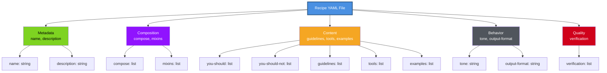
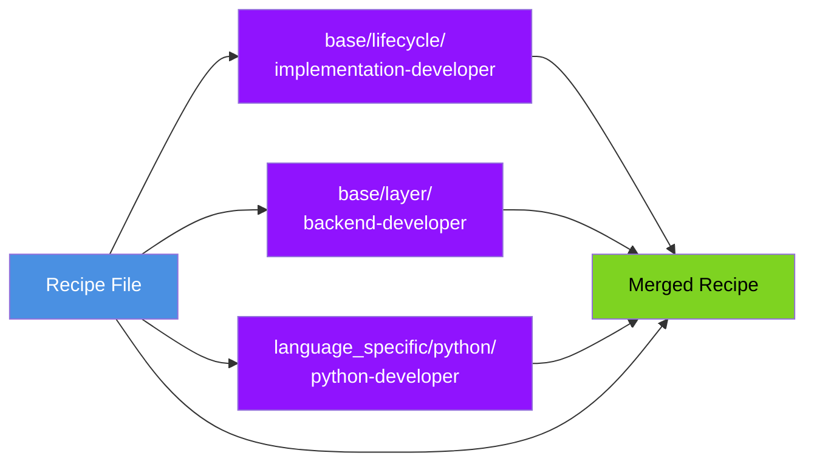
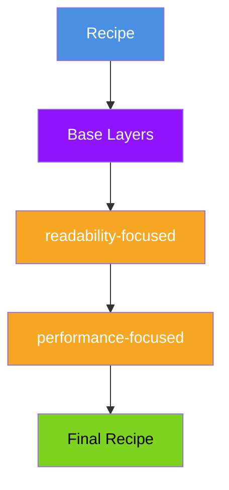
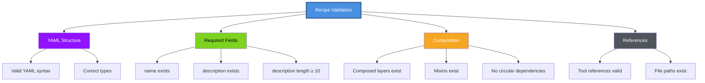

# Recipe Schema Reference

Complete schema documentation for Personetta recipe files. Use this as a reference when creating or validating recipes.

---

## Table of Contents

- [Schema Overview](#schema-overview)
- [Top-Level Fields](#top-level-fields)
- [Composition Fields](#composition-fields)
- [Content Fields](#content-fields)
- [Metadata Fields](#metadata-fields)
- [Examples](#examples)
- [Validation](#validation)

---

## Schema Overview

### Visual Structure



### Complete Schema (JSON Schema)

```json
{
  "$schema": "http://json-schema.org/draft-07/schema#",
  "type": "object",
  "required": ["name", "description"],
  "properties": {
    "name": {
      "type": "string",
      "pattern": "^[a-z0-9-]+$",
      "description": "Recipe identifier (lowercase, hyphens only)"
    },
    "description": {
      "type": "string",
      "minLength": 10,
      "description": "Clear description of recipe purpose"
    },
    "compose": {
      "type": "array",
      "items": {"type": "string"},
      "description": "Base layers to compose"
    },
    "mixins": {
      "type": "array",
      "items": {"type": "string"},
      "description": "Cross-cutting mixins"
    },
    "you-should": {
      "type": "array",
      "items": {"type": "string"},
      "description": "Responsibilities and actions"
    },
    "you-should-not": {
      "type": "array",
      "items": {"type": "string"},
      "description": "Anti-patterns and restrictions"
    },
    "guidelines": {
      "type": "array",
      "items": {"type": "string"},
      "description": "Specific guidance"
    },
    "tools": {
      "type": "array",
      "items": {
        "type": "object",
        "required": ["name"],
        "properties": {
          "name": {"type": "string"},
          "when": {"type": "string"},
          "example": {"type": "string"}
        }
      },
      "description": "Preferred tools"
    },
    "examples": {
      "type": "array",
      "items": {
        "type": "object",
        "required": ["input", "output"],
        "properties": {
          "input": {"type": "string"},
          "output": {"type": "string"}
        }
      },
      "description": "Example interactions"
    },
    "tone": {
      "type": "string",
      "description": "Response tone/personality"
    },
    "output-format": {
      "type": "string",
      "description": "Preferred output structure"
    },
    "verification": {
      "type": "array",
      "items": {"type": "string"},
      "description": "Checks to validate output"
    }
  }
}
```

---

## Top-Level Fields

### `name` (Required)

**Type:** String  
**Pattern:** `^[a-z0-9-]+$` (lowercase, hyphens only)  
**Purpose:** Unique identifier for the recipe

```yaml
# ✅ Good
name: implement-python-backend-secure

# ❌ Bad
name: Implement Python  # Uppercase, spaces
name: implement_python  # Underscores
```

### `description` (Required)

**Type:** String (multiline supported)  
**Min Length:** 10 characters  
**Purpose:** Clear explanation of recipe purpose and scope

```yaml
# ✅ Good
description: >
  Implement Python backend code with emphasis on readability,
  security, performance, and maintainability. Write clean,
  idiomatic Python following best practices and conventions.

# ❌ Bad
description: "Python code"  # Too vague, too short
```

---

## Composition Fields

### `compose` (Optional but Recommended)

**Type:** Array of strings  
**Purpose:** Base layers to inherit from  
**Merge Strategy:** Append (all layers merged in order)

```yaml
compose:
  - base/lifecycle/implementation-developer
  - base/layer/backend-developer
  - language_specific/python/python-developer
```

**Path Structure:**
- `base/lifecycle/` - Workflow patterns (implementation, review, testing)
- `base/layer/` - Domain patterns (backend, frontend, infrastructure)
- `base/mixins/` - Cross-cutting concerns (rarely in compose)
- `language_specific/{lang}/` - Language-specific patterns

**Resolution:**
- Paths are relative to `data/` directory
- `.yaml` extension is added automatically
- Files must exist or validation fails



### `mixins` (Optional)

**Type:** Array of strings  
**Purpose:** Add cross-cutting capabilities  
**Merge Strategy:** Append (added after base layers)

```yaml
mixins:
  - readability-focused
  - performance-focused
  - security-aware
```

**Available Mixins:**
- `readability-focused` - Code clarity emphasis
- `performance-focused` - Optimization guidance
- `scalability-focused` - Growth planning
- `maintainability-focused` - Long-term health
- `security-aware` - Security best practices

**Mixin Composition:**



---

## Content Fields

### `you-should` (Optional)

**Type:** Array of strings  
**Purpose:** Define responsibilities and expected behaviors  
**Merge Strategy:** Append + deduplicate

```yaml
you-should:
  - "Write clean, idiomatic code following language conventions"
  - "Add comprehensive tests for all new functionality"
  - "Document public APIs and non-obvious implementation details"
  - "Consider performance implications of design choices"
```

**Best Practices:**
- Start with verb (action-oriented)
- Be specific and actionable
- Avoid vague statements
- 1-2 lines per item

### `you-should-not` (Optional)

**Type:** Array of strings  
**Purpose:** Define anti-patterns and restrictions  
**Merge Strategy:** Append + deduplicate

```yaml
you-should-not:
  - "Commit commented-out code"
  - "Use global state or singletons without justification"
  - "Skip error handling in production code"
  - "Optimize prematurely without profiling data"
```

**Best Practices:**
- Be explicit about what NOT to do
- Explain WHY if not obvious
- Complement `you-should` items

### `guidelines` (Optional)

**Type:** Array of strings  
**Purpose:** Detailed guidance for specific situations  
**Merge Strategy:** Append + deduplicate

```yaml
guidelines:
  - "Use async/await for I/O operations to prevent blocking"
  - "Validate user input at API boundaries before processing"
  - "Cache expensive computations with TTL-based invalidation"
  - "Log errors with context (correlation IDs, stack traces)"
```

**Best Practices:**
- More specific than `you-should`
- Include context/conditions
- Reference tools or techniques
- Can be longer (2-3 lines)

### `tools` (Optional)

**Type:** Array of objects  
**Purpose:** Recommend specific tools for tasks  
**Merge Strategy:** Append + deduplicate by name

```yaml
tools:
  - name: "pytest"
    when: "Writing unit and integration tests"
    example: "pytest tests/ -v --cov=src/"
  
  - name: "black"
    when: "Code formatting"
    example: "black src/"
  
  - name: "mypy"
    when: "Type checking"
    example: "mypy src/ --strict"
```

**Fields:**
- `name` (required) - Tool name
- `when` (optional) - Use case
- `example` (optional) - Usage example

### `examples` (Optional)

**Type:** Array of objects  
**Purpose:** Show expected input/output patterns  
**Merge Strategy:** Append

```yaml
examples:
  - input: "Create a REST API endpoint"
    output: "Defines route, validates input, calls service layer, returns JSON response"
  
  - input: "Add caching"
    output: "Implements cache-aside pattern with TTL, includes cache invalidation strategy"
```

**Fields:**
- `input` (required) - User request
- `output` (required) - Expected AI response pattern

**Best Practices:**
- Show typical scenarios
- Include both simple and complex cases
- Demonstrate guideline application

---

## Metadata Fields

### `tone` (Optional)

**Type:** String  
**Purpose:** Set AI response personality/style  
**Merge Strategy:** Replace (last wins)

```yaml
# Options
tone: Concise and direct
tone: Friendly and explanatory
tone: Technical and precise
tone: Analytical and deliberate
```

### `output-format` (Optional)

**Type:** String  
**Purpose:** Preferred response structure  
**Merge Strategy:** Replace (last wins)

```yaml
# Options
output-format: Code-first with brief explanation
output-format: Structured markdown with sections
output-format: Bullet points with examples
output-format: Structured design document
```

---

## Quality Fields

### `verification` (Optional)

**Type:** Array of strings  
**Purpose:** Checklist to validate output quality  
**Merge Strategy:** Append + deduplicate

```yaml
verification:
  - "Code follows PEP 8 style guidelines"
  - "All functions have type hints"
  - "Tests cover happy path and edge cases"
  - "Documentation includes examples"
  - "No security vulnerabilities introduced"
```

**Best Practices:**
- Specific and measurable
- Can reference tools (e.g., "Passes mypy --strict")
- Both automated and manual checks
- Prioritize most important checks

---

## Examples

### Minimal Valid Recipe

```yaml
name: minimal-recipe
description: This is a minimal valid recipe with only required fields.
```

### Simple Recipe with Composition

```yaml
name: simple-python
description: Simple Python implementation recipe

compose:
  - base/lifecycle/implementation-developer
  - language_specific/python/python-developer

mixins:
  - readability-focused
```

### Complete Recipe

```yaml
name: implement-python-backend-secure
description: >
  Implement Python backend code with emphasis on readability,
  security, performance, and maintainability.

compose:
  - base/lifecycle/implementation-developer
  - base/layer/backend-developer
  - language_specific/python/python-developer

mixins:
  - readability-focused
  - performance-focused
  - security-aware

you-should:
  - "Write clean, idiomatic Python following PEP 8"
  - "Add comprehensive tests with pytest"
  - "Document public APIs with docstrings"
  - "Validate all user inputs"

you-should-not:
  - "Skip input validation"
  - "Use print() for logging"
  - "Commit secrets or credentials"

guidelines:
  - "Use type hints for all function signatures"
  - "Validate input at API boundaries before processing"
  - "Use structured logging with correlation IDs"
  - "Implement rate limiting for public endpoints"
  - "Handle errors gracefully with appropriate HTTP status codes"

tools:
  - name: "pytest"
    when: "Writing unit and integration tests"
    example: "pytest tests/ -v --cov=src/"
  
  - name: "black"
    when: "Code formatting"
    example: "black src/"
  
  - name: "ruff"
    when: "Linting and code quality"
    example: "ruff check src/"
  
  - name: "mypy"
    when: "Type checking"
    example: "mypy src/ --strict"

examples:
  - input: "Create a REST API endpoint"
    output: >
      Defines route with type hints, validates input with Pydantic,
      calls service layer, returns JSON with appropriate status code,
      includes error handling and logging

  - input: "Add authentication"
    output: >
      Implements JWT-based auth, validates tokens, checks permissions,
      returns 401/403 appropriately, includes rate limiting

tone: Concise and direct

output-format: Code-first with brief explanation

verification:
  - "Code follows PEP 8 (checked with black --check)"
  - "Type hints present (checked with mypy --strict)"
  - "Tests pass with >90% coverage"
  - "No security issues (checked with bandit)"
  - "Documentation includes examples"
```

---

## Validation

### Validating Your Recipe

```bash
# Validate single recipe
personetta validate --recipe my-recipe

# Validate all recipes
personetta validate --all

# Verbose validation (show all checks)
personetta validate --recipe my-recipe --verbose
```

### What Gets Validated



### Common Validation Errors

#### 1. Invalid Name Format

```yaml
# ❌ Error
name: Implement Python  # Contains uppercase and space

# ✅ Fix
name: implement-python
```

#### 2. Missing Required Field

```yaml
# ❌ Error
name: my-recipe
# Missing description

# ✅ Fix
name: my-recipe
description: This recipe implements Python features
```

#### 3. Non-existent Compose Layer

```yaml
# ❌ Error
compose:
  - base/lifecycle/nonexistent-layer

# ✅ Fix
compose:
  - base/lifecycle/implementation-developer
```

#### 4. Invalid YAML Syntax

```yaml
# ❌ Error
guidelines
  - "Guideline 1"  # Missing colon after guidelines

# ✅ Fix
guidelines:
  - "Guideline 1"
```

---

## Field Merge Strategies

When composing multiple layers, fields merge according to these rules:

| Field Type | Strategy | Details |
|------------|----------|---------|
| **Scalars** (name, description, tone) | Replace | Last value wins |
| **Lists** (guidelines, tools) | Append | All items combined |
| **Objects** (tools with same name) | Deep merge | Overlay wins on conflicts |

### Example Merge

**Base Layer:**
```yaml
guidelines:
  - "Write tests"
  - "Document code"
tools:
  - name: "pytest"
    when: "Testing"
```

**Overlay:**
```yaml
guidelines:
  - "Use type hints"
tools:
  - name: "mypy"
    when: "Type checking"
```

**Result:**
```yaml
guidelines:
  - "Write tests"
  - "Document code"
  - "Use type hints"
tools:
  - name: "pytest"
    when: "Testing"
  - name: "mypy"
    when: "Type checking"
```

---

## Best Practices

### 1. Start Simple

```yaml
# Start with minimal recipe
name: my-recipe
description: Brief description

compose:
  - base/lifecycle/appropriate-pattern
  - language_specific/language/language-developer
```

Then add fields as needed.

### 2. Leverage Composition

```yaml
# ✅ Good: Compose from existing layers
compose:
  - base/lifecycle/implementation-developer
  - language_specific/python/python-developer

# ❌ Bad: Duplicate everything in recipe
you-should:
  - "All Python-specific guidelines here"
  - "All implementation guidelines here"
  # (100+ lines of duplication)
```

### 3. Be Specific in Guidelines

```yaml
# ✅ Good
guidelines:
  - "Use async/await for I/O operations to prevent blocking the event loop"
  - "Validate input with Pydantic models at API boundaries"

# ❌ Bad
guidelines:
  - "Be careful with async"
  - "Validate inputs"
```

### 4. Test Your Recipe

```bash
# Preview output
personetta recipe my-recipe --format cursor

# Install and test
personetta install 'my-recipe' --format cursor
personetta set-active my-recipe --format cursor

# Ask AI to use the recipe
# Verify behavior matches expectations
```

---

## Schema Evolution

Personetta uses semantic versioning for schema changes:

- **Patch** (1.0.x) - Documentation, examples, clarifications
- **Minor** (1.x.0) - New optional fields, backward compatible
- **Major** (x.0.0) - Breaking changes (rare)

Current schema version: **1.0.0**

---

## Resources

- [Recipe Guide](recipe-guide.md) - Creating recipes
- [Core Concepts](concepts.md) - Understanding composition
- [Examples](examples.md) - Real-world recipes
- [CLI Reference](cli-reference.md) - Validation commands

---

**Need help?** See the [Recipe Guide](recipe-guide.md) for step-by-step instructions!
