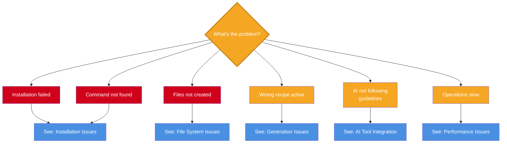
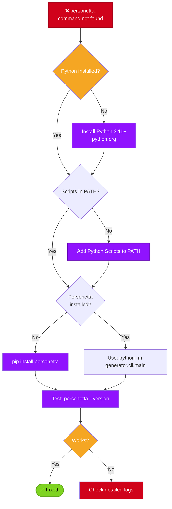
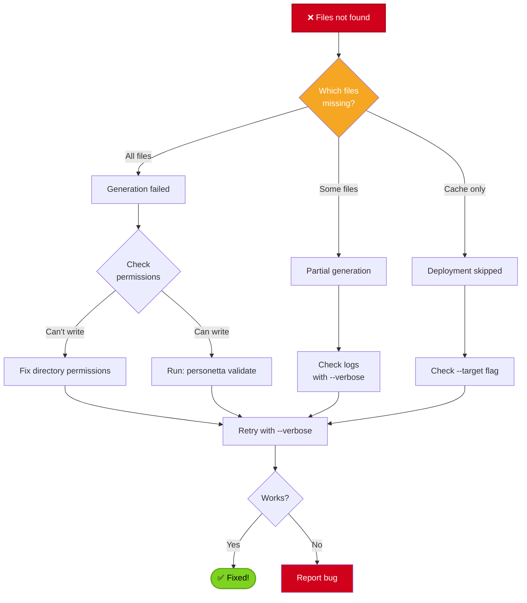
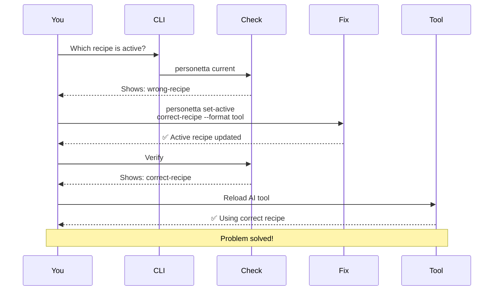
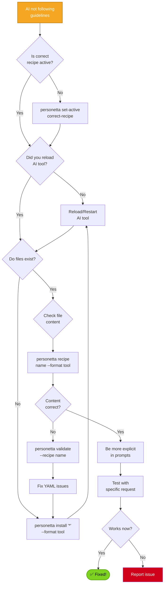

# Troubleshooting Guide

Solutions to common issues when using Personetta. Use the decision trees to quickly diagnose problems.

---

## Table of Contents

- [Quick Diagnostics](#quick-diagnostics)
- [Installation Issues](#installation-issues)
- [Generation Issues](#generation-issues)
- [File System Issues](#file-system-issues)
- [AI Tool Integration Issues](#ai-tool-integration-issues)
- [Performance Issues](#performance-issues)
- [Debug Mode](#debug-mode)

---

## Quick Diagnostics

Use this decision tree to quickly identify your issue category:



---

## Installation Issues

### Command Not Found: personetta



**Solutions:**

#### Quick Fix (Recommended)

**One command to fix everything:**

```powershell
.\scripts\Setup-Personetta.ps1
```

This will automatically:
1. Check if Python and personetta are installed
2. Detect if you're in a virtual environment
3. Find where the executable is located  
4. Add the Scripts folder to your PATH if needed
5. Configure PowerShell profile with helper functions
6. Tell you exactly what to do next

After running, **restart your terminal** if PATH was modified.

**Run diagnostics to identify specific issues:**

```powershell
# Comprehensive test suite with detailed diagnostics
.\tests\Test-SetupScript.ps1

# Quick validation (skips slow tests)
.\tests\Test-SetupScript.ps1 -Quick
```

The test suite will:
- ✓ Verify Python installation
- ✓ Check personetta package status
- ✓ Detect correct Scripts directory for your install type
- ✓ Verify PATH configuration
- ✓ Test command availability
- ✓ Provide exact fix commands for any issues found

See [tests/setup-tests.md](../tests/setup-tests.md) for detailed test documentation.

**Important: Virtual Environments**

If you're in a virtual environment (venv), the setup script will:
- Install personetta to the venv (not user site-packages)
- The `personetta` command will only work when the venv is activated

If you want global access (works everywhere), deactivate the venv first:
```powershell
deactivate
.\scripts\Setup-Personetta.ps1
```

**Alternative diagnostic-only script:**
```powershell
.\scripts\Ensure-GlobalCommand.ps1  # PATH check only, no install
```

#### Manual Steps

##### Windows
```powershell
# Check Python version
python --version  # Should be 3.11+

# Check if Scripts in PATH
$env:PATH -split ';' | Where-Object { $_ -like '*Python*Scripts*' }

# Add to PATH (temporary)
$env:PATH += ";$env:LOCALAPPDATA\Programs\Python\Python311\Scripts"

# Add to PATH (permanent)
[Environment]::SetEnvironmentVariable(
    "PATH",
    "$env:PATH;$env:LOCALAPPDATA\Programs\Python\Python311\Scripts",
    "User"
)

# Restart terminal after PATH change
```

#### Linux/Mac
```bash
# Check Python version
python3 --version  # Should be 3.11+

# Add to PATH (temporary)
export PATH="$HOME/.local/bin:$PATH"

# Add to PATH (permanent - bash)
echo 'export PATH="$HOME/.local/bin:$PATH"' >> ~/.bashrc
source ~/.bashrc

# Add to PATH (permanent - zsh)
echo 'export PATH="$HOME/.local/bin:$PATH"' >> ~/.zshrc
source ~/.zshrc
```

#### Alternative: Use Python Module
```bash
# Always works if package installed
python -m generator.cli.main --version
python -m generator.cli.main install '*' --format cursor

# Or use the installed console script
personetta --version
```

---

### Installation Fails with Errors

```mermaid
graph TB
    Error[❌ Installation failed] --> Verbose[Run with --verbose]
    Verbose --> CheckError{What error?}
    
    CheckError -->|Permission denied| Perms[Fix permissions]
    CheckError -->|Module not found| Deps[Install dependencies]
    CheckError -->|Schema validation| Schema[Check YAML syntax]
    CheckError -->|Network error| Network[Check connectivity]
    CheckError -->|Other| Other[See error logs]
    
    Perms --> Sudo{Can use sudo?}
    Sudo -->|Yes| UseSudo[sudo pip install...]
    Sudo -->|No| UserInstall[pip install --user...]
    
    Deps --> InstallDeps[pip install -e '.[dev]']
    Schema --> ValidateYAML[personetta validate]
    Network --> Offline[Download offline?]
    
    UseSudo --> Retry
    UserInstall --> Retry
    InstallDeps --> Retry
    ValidateYAML --> Retry
    Offline --> Retry
    Other --> Support[Open GitHub Issue]
    
    Retry[Retry installation]
    Support[Get help]
    
    style Error fill:#D0021B,color:#fff,stroke:#A80117,stroke-width:2px
    style CheckError fill:#F5A623,color:#fff
    style Perms fill:#F5A623,color:#fff
    style Deps fill:#F5A623,color:#fff
    style Schema fill:#F5A623,color:#fff
    style Network fill:#F5A623,color:#fff
    style Other fill:#D0021B,color:#fff
```

**Common error solutions:**

#### Permission Denied
```bash
# Option 1: User install
pip install --user personetta

# Option 2: Virtual environment
python -m venv .venv
source .venv/bin/activate  # Linux/Mac
.venv\Scripts\activate     # Windows
pip install personetta

# Option 3: System install (careful!)
sudo pip install personetta  # Linux/Mac only
```

#### Virtual Environment Error: "Can not perform a '--user' install"

**Error message:**
```
ERROR: Can not perform a '--user' install. User site-packages are not visible in this virtualenv.
```

**What it means:**
- You're inside a virtual environment (venv)
- `pip install --user` doesn't work in venvs
- Venvs already isolate packages, so --user is redundant

**Solution 1: Let Setup-Personetta handle it (recommended)**
```powershell
# The setup script now auto-detects venvs
.\scripts\Setup-Personetta.ps1
```

The script will:
- Detect the venv automatically
- Install without --user flag
- Warn you that personetta only works when venv is activated

**Solution 2: Deactivate venv and install globally**
```powershell
# Exit the venv
deactivate

# Install for global use
.\scripts\Setup-Personetta.ps1
```

Now `personetta` works everywhere, not just in the venv.

**Solution 3: Manual install in venv**
```bash
# Inside the venv, just omit --user
pip install -e ".[dev]"
```

**When to use each approach:**
- **Venv install:** Development work, testing, isolated environments
- **Global install:** Daily use, want `personetta` command everywhere

#### Missing Dependencies
```bash
# Install with all dependencies
pip install -e ".[dev]"

# Or install manually
pip install pyyaml jsonschema pytest pytest-cov
```

#### Schema Validation Failed
```bash
# Check which file has issues
personetta validate --verbose

# Common issues:
# - Missing required fields (name, description, compose)
# - Invalid YAML syntax (indentation, quotes)
# - References to non-existent layers
```

---

## Generation Issues

### Files Not Created



**Check list:**

```bash
# 1. Verify files expected location
# Cursor
ls ~/.cursor/rules/

# Copilot
ls ~/.copilot/instructions/

# Claude
ls ~/.claude/rules/

# Cline
ls ~/Documents/Cline/Rules/

# 2. Check cache
ls ~/.personetta/

# 3. Try with verbose
personetta install '*' --format cursor --verbose

# 4. Check permissions
# Linux/Mac
ls -la ~/.cursor/rules/
chmod 755 ~/.cursor/rules/

# Windows
Get-Acl ~/.cursor/rules/
```

### Wrong Recipe Active



**Commands:**

```bash
# Check what's currently active
personetta current --format cursor

# Set the correct recipe
personetta set-active implement-python --format cursor

# Verify it changed
personetta current --format cursor

# Reload your AI tool
# Cursor: Ctrl+Shift+P → "Reload Window"
# VS Code (Copilot): Ctrl+Shift+P → "Reload Window"
# Claude/Cline: Restart terminal
```

### Recipe Content Looks Wrong

```bash
# Preview the composed recipe
personetta recipe implement-python --format cursor

# Check for:
# - Missing guidelines
# - Wrong tone
# - Missing tools
# - Unexpected content

# If wrong, validate the source
personetta validate --recipe implement-python

# Force regeneration
personetta install 'implement-python' --format cursor --force
```

---

## File System Issues

### Files in Wrong Location

**Expected locations:**

| Tool | Expected Path |
|------|---------------|
| Cursor | `~/.cursor/rules/` |
| Copilot | `~/.copilot/instructions/` |
| Claude | `~/.claude/rules/` |
| Cline | `~/Documents/Cline/Rules/` |

**If files are elsewhere:**

```bash
# Check what --target was used
personetta current --verbose

# For global install (default)
personetta install '*' --format cursor --target global

# For project install
personetta install '*' --format cursor --target project
```

### Cache Corruption

```bash
# Symptoms:
# - set-active fails
# - Inconsistent recipe content
# - "File not found" errors

# Solution: Clear and rebuild cache
rm -rf ~/.personetta/

# Reinstall
personetta install '*' --format cursor

# Verify
ls ~/.personetta/cursor-recipes/
personetta list
```

### Stale Files

```bash
# Old recipe files not removed after removal command

# Solution: Clean install
rm -rf ~/.cursor/rules/personetta-*
rm -rf ~/.personetta/

# Fresh install
personetta install '*' --format cursor
```

---

## AI Tool Integration Issues

### AI Not Following Guidelines



**Checklist:**

```bash
# 1. Verify active recipe
personetta current

# 2. Check files exist
ls ~/.cursor/rules/personetta-*.md

# 3. Preview content
personetta recipe implement-python --format cursor | head -50

# 4. Reload tool
# Cursor: Cmd/Ctrl+Shift+P → Reload Window
# Copilot: Restart VS Code
# Claude: New terminal session
# Cline: New terminal session

# 5. Test with explicit prompt
# "You are acting as a Python implementation developer. 
#  Follow the guidelines in your active recipe. 
#  What guidelines are you following?"
```

### Cursor-Specific: User Rules Not Syncing

```bash
# Symptoms:
# - Agent doesn't see recipes in all workspaces
# - Rules for AI field is empty

# Check if sync was skipped
echo $PERSONETTA_SKIP_CURSOR_USER_SYNC

# If enabled, disable and reinstall
unset PERSONETTA_SKIP_CURSOR_USER_SYNC
personetta install '*' --format cursor

# If Cursor is open during sync:
# 1. Close Cursor completely
# 2. Run install command
# 3. Reopen Cursor
# 4. Run "Reload Window"
```

### Cursor-Specific: Skills Not Working

```bash
# Check skills exist
ls ~/.cursor/skills/

# Should see:
# - personetta-current.skill.md
# - personetta-list.skill.md
# - personetta-set-active.skill.md

# If missing, reinstall
personetta install '*' --format cursor

# Or copy manually
cp .cursor/skills/*.skill.md ~/.cursor/skills/
```

### Copilot-Specific: Instructions Not Loading

```bash
# Check files have correct format
cat ~/.copilot/instructions/personetta-active.instructions.md

# Should have YAML frontmatter:
---
name: 'Personetta - active persona'
applyTo: '**'
---

# If missing, reinstall
personetta install '*' --format copilot
```

---

## Performance Issues

### Slow Installation

```bash
# Install takes >30 seconds

# Causes:
# 1. Installing all 27+ recipes (normal)
# 2. Slow file I/O
# 3. Network issues (shouldn't affect local install)

# Solutions:
# Install only what you need
personetta install '*python*' --format cursor

# Use SSD if possible
# Check disk performance
# Windows: Get-PhysicalDisk | Select FriendlyName, MediaType
# Linux: lsblk -d -o name,rota
```

### Slow set-active

```bash
# set-active takes >2 seconds

# Should be instant (just copies from cache)

# Check cache exists
ls ~/.personetta/cursor-recipes/

# If missing or slow:
# 1. Check disk I/O
# 2. Check antivirus (may scan files)
# 3. Rebuild cache
rm -rf ~/.personetta/
personetta install '*' --format cursor
```

---

## Debug Mode

### Enable Verbose Logging

```bash
# All commands support --verbose
personetta install '*' --format cursor --verbose
personetta set-active implement-python --format cursor --verbose
personetta validate --verbose

# Shows:
# - File operations
# - Merge operations
# - Schema validation details
# - Error stack traces
```

### Enable Dry Run

```bash
# Preview without making changes
personetta install '*' --format cursor --dry-run

# Shows:
# - Which files would be created
# - Which recipes would be installed
# - No actual file operations
```

### Manual Inspection

```bash
# Check generated baseline
cat ~/.cursor/rules/personetta-baseline.md

# Check router
cat ~/.cursor/rules/personetta-router.md

# Check active recipe
cat ~/.cursor/rules/personetta-active.md

# Check cache
ls ~/.personetta/cursor-recipes/
cat ~/.personetta/cursor-active.json

# Validate manually
python -c "import yaml; yaml.safe_load(open('data/recipes/implement-python.yaml'))"
```

### Check Environment

```bash
# Python version
python --version

# Package version
personetta --version
pip show personetta

# Dependencies
pip list | grep -E '(pyyaml|jsonschema|pytest)'

# File system
df -h ~/.cursor/rules/  # Linux/Mac
Get-PSDrive C | Select Used, Free  # Windows
```

---

## Common Error Messages

### "Recipe not found in cache"

**Cause:** Cache missing or out of sync

**Solution:**
```bash
personetta install '*' --format cursor
```

### "Invalid YAML syntax"

**Cause:** Malformed YAML file

**Solution:**
```bash
# Find which file
personetta validate --verbose

# Common issues:
# - Wrong indentation (use spaces, not tabs)
# - Missing quotes around strings with colons
# - Unclosed brackets/braces
```

### "Schema validation failed"

**Cause:** Recipe doesn't match schema

**Solution:**
```bash
personetta validate --recipe recipe-name --verbose

# Check schema requirements:
# - Required fields: name, description, compose
# - Valid compose paths
# - Valid mixin names
```

### "Permission denied"

**Cause:** Can't write to target directory

**Solution:**
```bash
# Check permissions
ls -la ~/.cursor/rules/  # Linux/Mac
Get-Acl ~/.cursor/rules/  # Windows

# Fix permissions
chmod 755 ~/.cursor/rules/  # Linux/Mac

# Or use user install
personetta install '*' --format cursor --target project
```

---

## Getting Help

### Before Opening an Issue

1. **Check this guide** - Most issues covered here
2. **Run with --verbose** - Get detailed logs
3. **Try clean install** - Remove files and reinstall
4. **Check versions** - Ensure Python 3.11+ and latest personetta

### What to Include in Bug Reports

```bash
# 1. Version information
personetta --version
python --version
pip show personetta

# 2. Command that failed
personetta install '*' --format cursor --verbose

# 3. Error output (copy full output)

# 4. Environment
# - OS (Windows 10, macOS 14, Ubuntu 22.04, etc.)
# - AI tool version
# - Install location (global/project)

# 5. File listing
ls -la ~/.cursor/rules/
ls -la ~/.personetta/
```

### Resources

- [GitHub Issues](https://github.com/your-org/personetta/issues)
- [User Guide](user-guide.md) - Complete usage documentation
- [Core Concepts](concepts.md) - How it works
- [Developer Guide](developer-guide.md) - Contributing

---

**Still stuck?** Open an issue with the information above!
