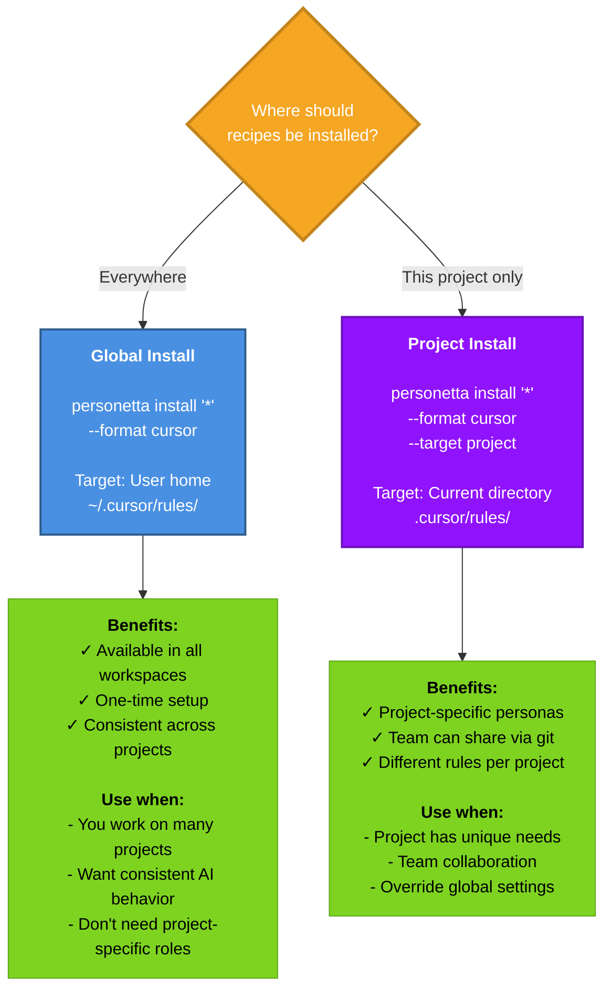
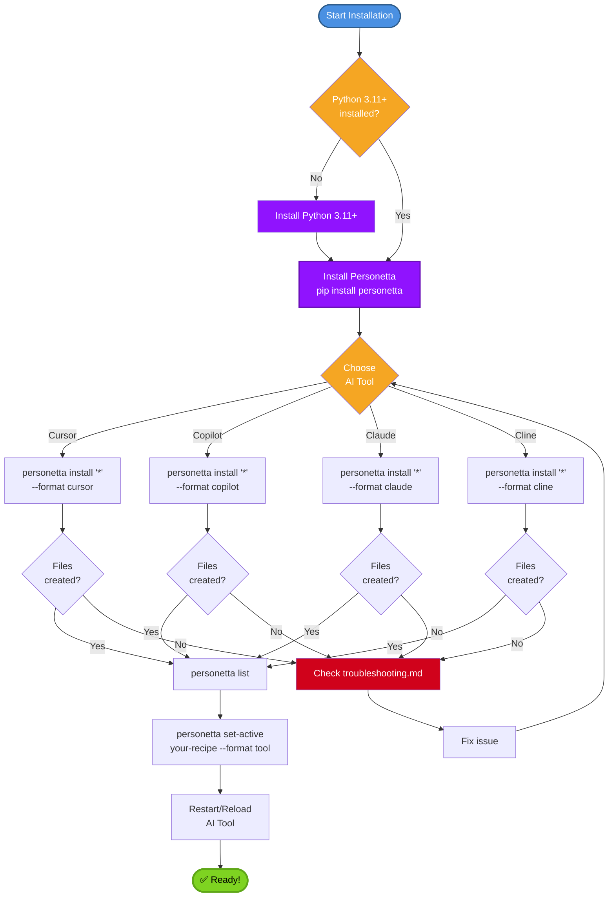
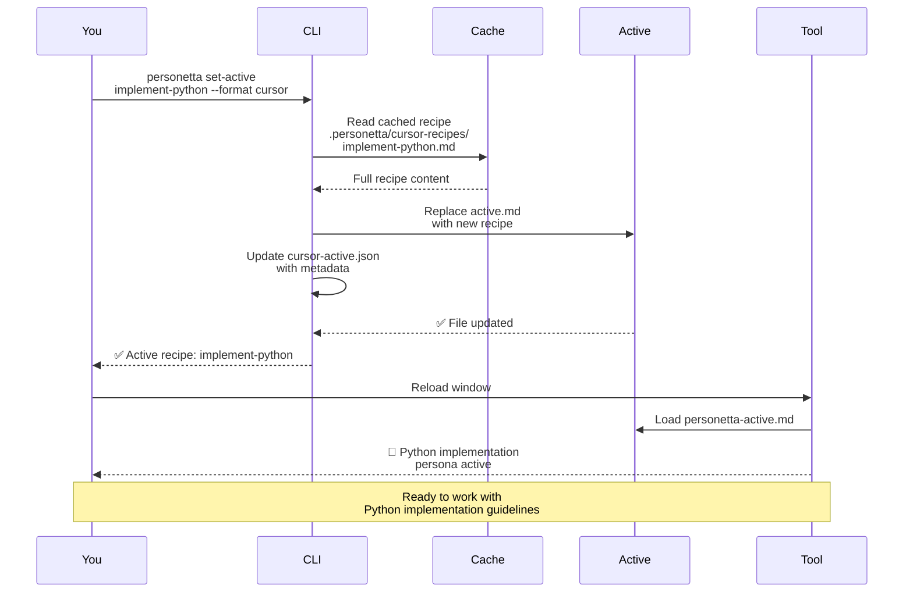
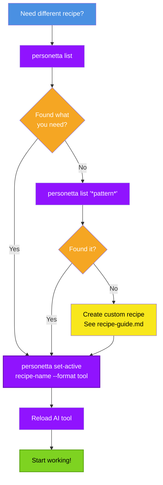
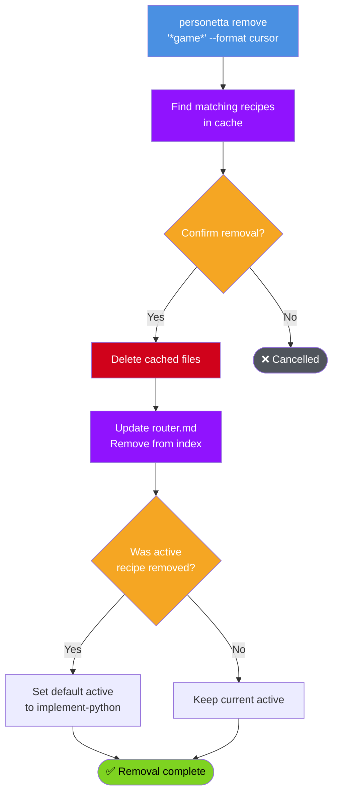

# User Guide

Complete guide to using Personetta for daily work. This covers all workflows, commands, and usage patterns.

---

## Table of Contents

- [Installation Workflows](#installation-workflows)
- [Daily Usage](#daily-usage)
- [Recipe Management](#recipe-management)
- [Advanced Features](#advanced-features)
- [Tool-Specific Features](#tool-specific-features)
- [Best Practices](#best-practices)

---

## Installation Workflows

### Global vs Project Installation



### Complete Installation Flow



---

## Daily Usage

### The Set-Active Workflow

This is your most common operation - switching between recipes:



### Recipe Discovery Flow



### Typical Daily Workflow


**Key insight:** Switch recipes as often as your task changes. There's no cost to switching!

---

## Recipe Management

### Listing Recipes

```bash
# List all recipes
personetta list

# List recipes matching pattern
personetta list '*python*'

# List multiple patterns
personetta list '*game*' 'test-*'
```

**Output format:**
```
Available recipes (34 total):

Design Recipes (3):
  design-csharp          Architect C# backend systems
  design-python          Architect Python backend systems
  design-powershell      Architect PowerShell infrastructure

Implementation Recipes (3):
  implement-csharp       Implement C# backend code
  implement-python       Implement Python backend code
  implement-powershell   Implement PowerShell scripts

...
```

### Installing Specific Recipes

```bash
# Install all recipes
personetta install '*' --format cursor

# Install only Python-related recipes
personetta install '*python*' --format cursor

# Install multiple patterns
personetta install 'implement-*' 'test-*' --format cursor

# Install a single recipe
personetta install 'implement-python' --format cursor
```

### Removing Recipes

```bash
# Remove all recipes
personetta remove '*' --format cursor

# Remove game-related recipes
personetta remove '*game*' --format cursor

# Remove multiple patterns
personetta remove 'design-*' 'document-*' --format cursor
```

**Removal flow:**



### Checking Current Recipe

```bash
# Show currently active recipe
personetta current

# For specific tool
personetta current --format cursor
```

**Output:**
```
Active recipe: implement-python
Format: cursor
Last activated: 2026-04-17 10:30:45
```

---

## Advanced Features

### Dry Run Mode

Preview changes without writing files:

```bash
# Preview installation
personetta install '*python*' --format cursor --dry-run

# Preview removal
personetta remove '*game*' --format cursor --dry-run
```

**Output shows:**
```
[DRY RUN] Would install 5 recipes:
  - implement-python
  - review-python
  - test-python
  - design-python
  - document-python

[DRY RUN] Would create files:
  - ~/.cursor/rules/personetta-baseline.md
  - ~/.cursor/rules/personetta-router.md
  - ~/.cursor/rules/personetta-active.md
  - ~/.personetta/cursor-recipes/ (5 files)
```

### Verbose Mode

See detailed operation logs:

```bash
personetta install '*' --format cursor --verbose
```

**Output includes:**
```
[DEBUG] Loading recipe: implement-python.yaml
[DEBUG] Resolving compose: base/lifecycle/implementation-developer
[DEBUG] Resolving compose: language-specific/python/python-developer
[DEBUG] Applying mixin: readability-focused
[DEBUG] Merging 3 layers...
[DEBUG] Writing to: ~/.cursor/rules/personetta-baseline.md
[DEBUG] Writing to: ~/.cursor/rules/personetta-router.md
...
```

### Validation

Validate YAML files before installation:

```bash
# Validate all recipes
personetta validate

# Validate specific recipe
personetta validate --recipe implement-python
```

**Checks:**
- YAML syntax
- Schema compliance
- Referenced layers exist
- No circular dependencies
- Tool references are valid

### Recipe Preview

See full composed output without installing:

```bash
# Preview recipe for Cursor
personetta recipe implement-python --format cursor

# Preview for different tool
personetta recipe implement-python --format copilot
```

**Use cases:**
- Debug recipe composition
- Compare different merge results
- Verify changes before installation

### Extending the Catalogue (discover → ingest → provision)

Beyond the shipped recipes, Personetta can pull in external conventions and
capabilities through a repeatable, **report-only** workflow:

> **discover → decide → ingest / provision → catalog**

```bash
# 1. Survey community indexes; see what is new vs already in Personetta
personetta discover

# 2. Re-author a useful convention/skill as native Personetta content (proposal report)
personetta ingest dotnet/skills
personetta ingest superpowers --out build/superpowers-proposal.md

# 3. Or install an external, non-persona capability (deploy-dark, opt-in)
personetta provision list
personetta provision enable claude-mem
personetta provision apply
```

`discover` and `ingest` never write Personetta content or install anything — they produce
reports for you to review. See [discovery.md](discovery.md), [ingest.md](ingest.md),
[recipe-naming.md](recipe-naming.md), and [provisions.md](provisions.md).

---

## Tool-Specific Features

### Cursor-Specific

#### User Rules Sync

Cursor install syncs to **Settings > Rules for AI**:

```bash
# Standard install (syncs User Rules)
personetta install '*' --format cursor

# Skip User Rules sync
PERSONETTA_SKIP_CURSOR_USER_SYNC=1 personetta install '*' --format cursor
```

**When Cursor is open during sync:**
- If DB is locked: Close Cursor, re-run command
- After sync: Run "Reload Window" in Cursor

#### Skills Installation

Agent skills copied to `~/.cursor/skills/` automatically:

```bash
# Skills install happens during normal install
personetta install '*' --format cursor

# Skip skills copy
PERSONETTA_SKIP_CURSOR_SKILLS=1 personetta install '*' --format cursor
```

**Available skills:**
- `/personetta-current` - Show active recipe
- `/personetta-list` - List all recipes  
- `/personetta-set-active` - Switch recipe

### Copilot-Specific

#### Custom Instructions Format

Copilot uses YAML frontmatter in `.instructions.md` files:

```markdown
---
name: 'Personetta - active persona'
description: 'Complete active recipe'
applyTo: '**'
---

# Recipe Content
...
```

#### Skills Installation

Copilot instructions under `~/.copilot/instructions/` with `applyTo: "**"` apply globally.

**Note:** Copilot skills are separate from instructions and not managed by Personetta.

### Claude-Specific

#### Session Memory

Claude loads rules from `~/.claude/rules/` each session.

```bash
# Standard install
personetta install '*' --format claude

# Skills copy to ~/.claude/skills/
# Skip with: PERSONETTA_SKIP_CLAUDE_SKILLS=1
```

### Cline-Specific

#### Global Rules Directory

Cline loads from `~/Documents/Cline/Rules/`:

```bash
# Standard install
personetta install '*' --format cline
```

---

## Best Practices

### 1. Use Global Install for Personal Work

```bash
# One-time setup for all your projects
personetta install '*' --format cursor
```

**Benefits:**
- Consistent AI behavior across projects
- No per-project setup
- Easy to switch recipes

### 2. Use Project Install for Team Projects

```bash
# In project root
personetta install '*python*' --format cursor --target project

# Commit to git
git add .cursor/rules/
git commit -m "Add Personetta Python recipes"
```

**Benefits:**
- Team shares same recipes
- Project-specific guidelines
- Version controlled

### 3. Switch Recipes Frequently

```bash
# Implementing → personetta set-active implement-python
# Reviewing → personetta set-active review-python
# Testing → personetta set-active test-python
# Planning → personetta set-active design-python
```

**Why:** Each recipe optimizes AI for that specific task.

### 4. Use Patterns for Focused Installs

```bash
# Only install what you need
personetta install '*python*' --format cursor

# Keep it focused
personetta install 'implement-*' 'test-*' --format cursor
```

**Benefits:**
- Faster cache generation
- Cleaner recipe list
- Easier to find recipes

### 5. Validate Before Large Changes

```bash
# Always validate after editing YAML
personetta validate

# Preview before installing
personetta install '*' --format cursor --dry-run
```

### 6. Use Verbose Mode for Debugging

```bash
# See exactly what's happening
personetta install '*python*' --format cursor --verbose
```

### 7. Keep Recipes Updated

```bash
# Periodically reinstall to get updates
personetta install '*' --format cursor
```

**When to reinstall:**
- After pulling recipe updates from git
- After creating new recipes
- After modifying existing recipes
- Monthly maintenance

---

## Common Patterns

### Pattern 1: Full Stack Developer

```bash
# Install backend, frontend, and test recipes
personetta install 'implement-*' 'test-*' --format cursor

# Morning: Backend work
personetta set-active implement-python --format cursor

# Afternoon: Frontend work
personetta set-active implement-javascript --format cursor

# Evening: Write tests
personetta set-active test-python --format cursor
```

### Pattern 2: Code Reviewer

```bash
# Install review recipes only
personetta install 'review-*' --format cursor

# Review Python PR
personetta set-active review-python --format cursor

# Review C# PR
personetta set-active review-csharp --format cursor
```

### Pattern 3: Technical Lead

```bash
# Install design and review recipes
personetta install 'design-*' 'review-*' --format cursor

# Architecture planning
personetta set-active design-python --format cursor

# Code review
personetta set-active review-python --format cursor
```

### Pattern 4: Game Developer

```bash
# Install game-specific recipes
personetta install '*game*' 'implement-*unity*' --format cursor

# Design game mechanics
personetta set-active design-game-mechanics --format cursor

# Implement in Unity
personetta set-active implement-game-unity --format cursor

# Test gameplay
personetta set-active test-game-unity --format cursor
```

---

## Troubleshooting

For detailed troubleshooting, see [Troubleshooting Guide](troubleshooting.md).

**Quick fixes:**

| Problem | Solution |
|---------|----------|
| Command not found | Add Python Scripts to PATH |
| Files not created | Check permissions, use `--verbose` |
| Wrong recipe active | Run `personetta current` to verify |
| AI not following guidelines | Reload/restart AI tool |
| Cache out of sync | Run `personetta install '*' --format tool` |

---

## Command Reference

See complete command documentation in [CLI Reference](cli-reference.md).

**Quick reference:**

```bash
# Installation
personetta install '<pattern>' --format <tool> [--target <global|project>]

# Activation
personetta set-active <recipe> --format <tool> [--target <global|project>]

# Management
personetta list ['<pattern>'] [<pattern2>...]
personetta remove '<pattern>' --format <tool>
personetta current [--format <tool>]

# Utilities
personetta validate [--recipe <name>]
personetta recipe <name> --format <tool>
```

---

## Next Steps

- **Create custom recipes** - [Recipe Guide](recipe-guide.md)
- **Understand internals** - [Core Concepts](concepts.md)
- **Extend Personetta** - [Extending Guide](extending.md)
- **See all diagrams** - [Visual Diagrams](diagrams.md)

---

**Questions?** See [Troubleshooting](troubleshooting.md) | [GitHub Issues](https://github.com/your-org/personetta/issues)
